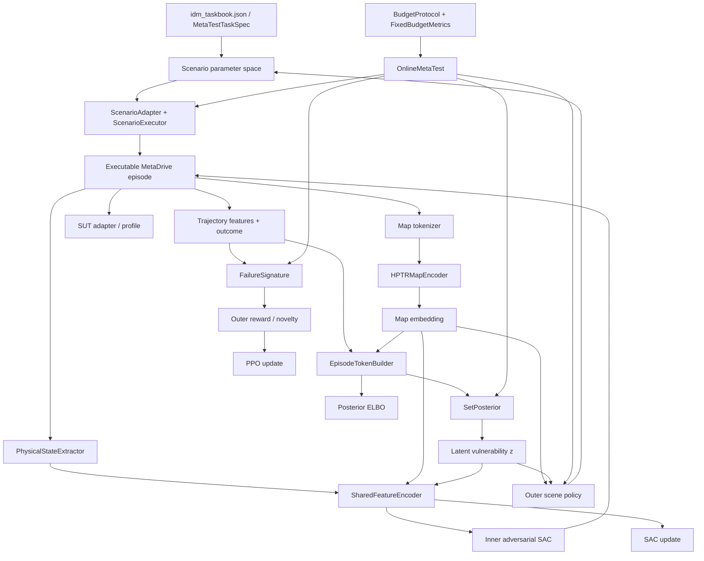

# META_LEARNING 工程梳理与可执行修改建议

gpu环境在系统的：
conda activate metadrive

> 审查目标：方法实现完整性与逻辑清晰度、代码简洁性与可读性、文件组织与命名，以及“只做必要实验”的实验策略。

---

## 1. 总体结论

当前工程**不是“缺少主要方法模块”**，而是已经形成了较完整的 MVR 方法骨架：

- 逻辑场景任务与参数空间；
- MetaDrive 场景适配与物理执行；
- 地图 tokenization 与 map encoder；
- SUT profile/adapter；
- Outer scene policy；
- Inner adversarial SAC；
- episode-level context token；
- latent posterior；
- failure signature / novelty / reward；
- staged training；
- online few-shot meta-test；
- fixed-budget evaluation；
- checkpoint/provenance；
- contract tests 与 Gate 验证框架。

因此，下一阶段**不应继续横向增加模块、算法或大量实验**。更重要的是把当前实现收敛成一个“论文方法与代码一一对应、只有一个主流程、配置真实生效、预算含义一致、结果口径一致”的科研代码库。

当前最需要处理的不是“再加什么”，而是以下 6 个闭环问题：

1. **训练阶段顺序目前主要靠 README 约定，没有被代码真正强制。**
2. **`mvr.yaml` 中 failure 阈值与实际 failure 判定存在断链，修改配置不会完整改变运行行为。**
3. **active MVR 仍直接依赖 frozen legacy PEARL 的 `RoutePolyline`，模块边界不干净。**
4. **不同 training stage 中 `episode_budget` 的物理含义并不一致。**
5. **公开命名存在开发阶段术语和不一致：`P0`、`Gate A`、G1–G8、`inner_calibration` 等并存。**
6. **当前实验设置能够支持“未见 IDM controller profile 上的 few-shot vulnerability mining”，但不能支持“未见地图泛化”或“独立 ADS 泛化”等更强主张。**

建议在这些问题修复前，**不要增加新的 RL baseline、模拟器、SUT 类型或大规模参数敏感性实验**。

---

## 2. 当前方法实现链条

当前代码可以整理为如下方法闭环。



### 2.1 方法实现完整性判断

| 环节 | 当前状态 | 判断 |
|---|---|---|
| Task / SUT split | `idm_taskbook.json` 已区分 meta-train / validation / meta-test | **完整** |
| 逻辑场景参数化 | merge / cut-in / roundabout 有统一 parameter space 与 adapter | **完整** |
| 场景动作到物理仿真 | `ScenarioExecutor` 有 map hash、spawn、speed、route 等运行时检查 | **较完整** |
| 地图表征 | tokenizer + HPTR-style encoder | **完整** |
| Inner physical state | 10-D 显式物理状态 | **完整** |
| Inner adversarial policy | option-conditioned SAC | **完整** |
| episode context | 完整 trajectory + outcome 构造 episode token | **完整** |
| SUT vulnerability posterior | Set posterior + held-out target loss | **完整** |
| Outer scene policy | map + latent → hybrid scene action | **完整** |
| Online few-shot protocol | `OnlineMetaTest` 统一训练/评估在线逻辑 | **完整且设计较好** |
| staged training | stage/freezing 已实现 | **实现存在，但顺序契约未闭合** |
| failure criteria | signature/reward/analyzer 已实现 | **存在配置断链，必须修** |
| fixed-budget evaluation | 20 episode、K=0/1/2/4 已实现 | **基本完整** |
| common baseline evaluation | legacy baseline 与 MVR 口径仍分离 | **论文比较前需收口** |
| executable gates | 有 G1–G8 函数和 Gate A 实验 | **命名与自动执行方式需收口** |
| independent ADS generalization | 当前仅 IDM/rule-based profile | **未实现，也不应额外宣称** |
| unseen-map generalization | train/val/test 同一 family 使用相同 map hash | **当前没有证据支撑** |

**核心判断：方法主体已经够了。现在更值得做的是“减法 + 契约闭环”。**

---

# 3. P0：必须优先修改的问题

以下修改应在正式跑论文主实验之前完成。

---

## P0-1. 强制唯一的训练流水线，解决阶段顺序歧义

### 当前问题

`mvr/README.md` 写的是：

```text
inner_pretrain → posterior → outer
```

但代码中实际还存在：

```text
INNER_CALIBRATION
```

并且：

- `mvr.yaml` 有 `inner_calibration` 配置；
- `train_inner_calibration.py` 有独立入口；
- `_restore()` 对 calibration 的输入 checkpoint 有特殊约束；
- `TrainingStage` 明确包含该阶段。

这表明 **inner calibration 不是一个纯粹的废弃字段**。

另一方面：

- `StagedWorkflow.activate()` 只控制参数的 `requires_grad`；
- 它并不验证前置 stage；
- `train_outer.py` 可以不指定 `--resume`，直接从随机模型开始训练 Outer。

因此，“必须按顺序训练”目前是**文档约束，而不是可执行约束**。

### 建议

首先只做一个科学选择：

#### 推荐方案

如果 Inner 在最终方法中确实需要使用 posterior latent `z`，则将唯一正式训练流程明确为：

```text
inner_pretrain
    ↓
posterior
    ↓
inner_latent_calibration
    ↓
outer
    ↓
meta_test evaluation
```

并把 `inner_calibration` 重命名为：

```text
inner_latent_calibration
```

使名称直接说明“为什么要有这个阶段”。

如果论文方法实际上不需要 calibration，则反过来：

- 删除 `INNER_CALIBRATION`；
- 删除 YAML section；
- 删除训练函数；
- 删除 wrapper；
- 删除相关 checkpoint 分支；
- README 只保留三阶段流程。

**不要保留一个“代码里存在、README 又省略”的半正式阶段。**

### 代码修改

建议新增：

```text
mvr/training/pipeline.py
```

由它负责：

1. 创建模型；
2. 强制 stage 顺序；
3. 强制前一阶段 checkpoint；
4. checkpoint compatibility 检查；
5. 保存统一的 stage manifest；
6. 进入下一阶段。

最终只有一个正式训练入口：

```text
mvr/scripts/train_mvr.py
```

用户不应再手动分别调用四个 stage wrapper。

### 删除

若采用统一 pipeline，建议删除：

```text
mvr/scripts/train_inner.py
mvr/scripts/train_posterior.py
mvr/scripts/train_inner_calibration.py
mvr/scripts/train_outer.py
```

这些文件现在都只是几行转发代码，不增加科研可读性。

### 验收条件

至少新增以下 contract tests：

```text
test_outer_cannot_start_without_required_checkpoint
test_posterior_requires_inner_pretrain_checkpoint
test_inner_latent_calibration_requires_posterior_checkpoint
test_pipeline_records_stage_order
```

---

## P0-2. 建立唯一的 `FailureCriteria`，消除配置与实现断链

### 当前问题

`mvr/configs/mvr.yaml` 中定义了：

```yaml
failure:
  severity_thresholds:
    ttc_s: 5.0
    distance_m: 10.0
    closing_speed_mps: 20.0
  severity_bins: 5
```

但是主流程中：

- `failure/analyzer.py` 直接写死 `5.0` 和 `10.0`；
- `FailureSignatureBuilder()` 又使用自己的默认 `5/10/20`；
- `InnerRiskReward` 又写了一遍 `5/10/20`；
- training/evaluation 构造 `HierarchicalRunner` 时没有传入 `failure` config。

结果是：

> **修改 YAML failure threshold，并不会完整改变实际 failure 判定与 reward。**

这属于科研代码中的方法契约问题，而不仅是风格问题。

### 建议

新增一个唯一的数据结构：

```python
@dataclass(frozen=True)
class FailureCriteria:
    ttc_s: float
    distance_m: float
    closing_speed_mps: float
    severity_bins: int
```

建议放在：

```text
mvr/failure/criteria.py
```

并由配置一次性构造：

```python
criteria = FailureCriteria.from_config(config["failure"])
```

随后只允许以下模块读取这个对象：

```text
HierarchicalRunner
 ├── InnerRiskReward
 └── analyze_rollout
      └── FailureSignatureBuilder
```

### 必须删除

代码中所有重复的：

```text
5.0
10.0
20.0
5 bins
```

除非它们是明确命名的唯一常量来源。

### 验收测试

新增一个非常重要但很小的测试：

```text
test_failure_threshold_config_changes_failure_decision
```

例如：

1. 同一个 outcome；
2. `ttc_s=5.0` 判为 near miss；
3. 改成 `ttc_s=1.0` 后不再判为 near miss；
4. 同时确认 Inner reward 使用同一 criteria。

只需要这个测试，不需要额外实验。

---

## P0-3. active MVR 必须彻底解除对 legacy PEARL 的运行时依赖

### 当前问题

当前：

```python
# mvr/simulator.py
from archives.pearl_learning.src.routes import RoutePolyline
```

而 `mvr/state.py` 又使用：

```python
from .simulator import RoutePolyline
```

这与 `mvr/__init__.py` 中“PEARL 是独立 frozen legacy baseline”的描述矛盾。

当前实际依赖关系是：

```text
active MVR
    ↓
legacy PEARL
```

这会造成：

- baseline 不能真正冻结/独立；
- 将来删除或移动 PEARL 会破坏主方法；
- 主方法复现必须隐式加载 legacy package；
- method provenance 变得不清楚。

### 建议

把 active MVR 实际需要的 route geometry 移入 active domain：

```text
mvr/scenario/route_geometry.py
```

然后：

```text
mvr/state.py
```

改为直接导入：

```python
from .scenario.route_geometry import RoutePolyline
```

完成后删除：

```text
mvr/simulator.py
```

### 关于 PEARL

**不要为了这次清理去大规模改 frozen PEARL。**

最稳妥的方式是：

- active MVR 拥有自己的经过测试的 route geometry contract；
- PEARL 继续保持冻结；
- 如果两者代码完全相同，也不要为了“DRY”重新把 active 绑回 legacy。

科研代码中，“baseline 可冻结、active 可独立运行”比消除这一点小规模重复更重要。

### 验收条件

```bash
grep -R "pearl_learning" mvr
```

应无运行时代码命中。

---

## P0-4. 统一 `episode_budget` 的物理含义

### 当前问题

同一个名字 `episode_budget` 在不同训练阶段有不同语义。

#### Inner

```yaml
inner:
  episode_budget: 20
```

`_train_inner()` 总共运行约 20 个 simulator episodes。

#### Posterior

```yaml
posterior:
  episode_budget: 20
```

代码按 K+1 的 episode group 消耗，总体按 20 physical episodes 分割。

#### Inner calibration

```yaml
inner_calibration:
  episode_budget: 8
  support_episodes: 1
```

当前每个 calibration iteration 实际运行：

```text
support_count + 1 = 2 physical episodes
```

因此 8 个循环对应约：

```text
16 physical simulator episodes
```

#### Outer

```yaml
outer:
  episode_budget: 20
```

当前 `_train_outer()` 是：

```python
for task in tasks:
    run(task, budget)
```

当前 meta-train taskbook 有：

```text
4 IDM profiles × 3 scenario families = 12 tasks
```

因此 `episode_budget: 20` 实际会运行：

```text
20 × 12 = 240 physical simulator episodes
```

### 建议原则

工程中只保留一个规则：

> **任何叫 `episode_budget` 的字段都必须表示真实 simulator episode 数量。**

如果某一字段故意表示“每 task 数量”，就必须显式命名：

```yaml
outer:
  episodes_per_task: 20
```

如果 calibration 的 8 表示 K+1 group 数量，就命名：

```yaml
inner_latent_calibration:
  groups: 8
```

更推荐的方案仍然是让正式论文配置统一使用 physical simulator budget。

### 建议额外记录

每个 training checkpoint summary 固定写：

```json
{
  "simulator_episodes_consumed": ...,
  "optimizer_updates": ...,
  "stage": ...
}
```

不要只写笼统的 `"episodes"`。

### 验收条件

看到任意 YAML 字段名，就可以在不读实现的情况下知道：

- 是 global budget；
- per-task budget；
- 还是 optimization group 数。

---

## P0-5. 清理公共 API 与 Gate 命名

### 3.5.1 `__all__` 当前存在直接覆盖

当前 `mvr/__init__.py`：

```python
__all__ = ("FailureSignature", "MetaTestTaskSpec")
...
__all__ = ("HierarchicalMetaTester",)
```

第二次赋值会覆盖第一次。

建议改为一次定义：

```python
__all__ = (
    "FailureSignature",
    "HierarchicalMetaTester",
    "MetaTestTaskSpec",
)
```

或者更克制：

```python
__all__ = ("HierarchicalMetaTester",)
```

并删除前面两个无意义的顶层 import。

不要做“导入了但没有真正导出”的半公开 API。

---

### 3.5.2 只保留一套 Gate 命名

当前同时存在：

```text
G1 ... G8
Gate A
P0
P0-B/C
```

其中：

- README 对外说 G1–G8；
- `audits.py` 额外返回 `gate: "A"`；
- `results/` 当前保存 `gate_a_idm_failure_landscape_2026-08-22.json`；
- tests/docstring 中还存在 `P0` 术语。

这些是开发过程编号，不应该继续成为最终论文代码 API。

### 推荐

把现有 Gate A 的 failure-landscape heterogeneity 直接收敛为：

```text
G3: SUT failure-landscape heterogeneity
```

可以用现有更具体的指标替换当前过于抽象的：

```python
gate_heterogeneity(within_sut_score, cross_sut_score)
```

最终只保留：

```text
G1 Map representation
G2 Scenario execution
G3 SUT heterogeneity
G4 Inner controllability
G5 Context identifiability
G6 Posterior utility
G7 Outer utility
G8 Fixed-budget end-to-end utility
```

### 现有 Gate A 结果

已有 heterogeneity audit：

```text
192 episodes
valid_rate = 1.0
failure_rate ≈ 0.229
mean_failure_disagreement = 0.1875
pass = true
```

这个结果已经足够作为方法前提检查。

**不建议为了 Gate A/G3 再扩大很多 profile、配置数量或随机种子。**

把当前结果迁移/重命名即可。

---

## P0-6. 明确论文可支持的 claim，不要用额外实验弥补过强表述

### 当前 SUT split

当前 meta-test 使用：

```text
idm_late_response
```

它确实是 held-out controller profile。

因此可以支持：

> few-shot adaptation / vulnerability mining on an unseen controller profile.

但当前不能支持：

> generalization to arbitrary independent ADS / learned ADS / production ADS.

这一点当前 README 已经写得比较克制，应保持。

---

### 当前 map split

taskbook 中同一 scenario family 的：

- meta-train；
- meta-validation；
- meta-test；

使用相同的 `map_id` / `map_hash`。

例如 merge 始终是同一 `merge-default` map hash。

因此当前实验可以证明：

> 方法显式利用 map representation 作为条件。

但不能证明：

> 方法泛化到 unseen maps / unseen road topology。

### 两种处理方式

#### 推荐：不增加实验，收窄 claim

如果论文的主要创新不是“unseen-map generalization”，就直接写：

> map-conditioned hierarchical meta-testing.

不要写：

> generalizes to unseen maps.

此时**完全没有必要增加大规模 map 实验**。

#### 只有在论文明确把 unseen-map generalization 作为核心贡献时

才增加最小必要证据：

- 每个 family 1 个 held-out map；或
- 只选一个代表性 family 做严格 held-out-map 实验。

不要扩成十几张地图和大规模地图敏感性实验。

---

# 4. 推荐的文件组织

目标不是“大重构”，而是让目录直接对应论文方法。

## 4.1 根目录建议

```text
META_LEARNING/
├── README.md
├── AGENTS.md
├── environment.yml
├── .gitignore
│
├── docs/
│   ├── method.md
│   ├── experiments.md
│   ├── references.md
│   └── style.md
│
├── mvr/
├── archives/pearl_learning/
├── archives/sac_scenario_mining/
│
└── results/
```

### 明确删除

```text
.idea/
```

应加入：

```gitignore
.idea/
```

---

### `ref_code/` 建议删除出主分支

当前：

```text
ref_code/metadrive-scenario/
```

本质是完整 vendored reference project，不是 MVR 方法源码。

建议：

1. 从主分支删除；
2. 保留在历史 Git commit / archive branch 即可；
3. 新建：

```text
docs/references.md
```

只记录：

- upstream repository；
- commit/version；
- license；
- 实际借鉴了哪些接口/思想。

这样比把完整第三方参考代码放在科研仓库根目录更清楚。

---

### 不建议现在把两个 frozen baseline 强行移动到 `baselines/`

虽然：

```text
baselines/pearl/
baselines/sac/
```

从视觉上更整齐，但当前：

- baseline manifest 已冻结路径和 hash；
- results 已使用现有路径；
- README 和命令也已经固定；
- 大规模移动没有新的科学价值。

因此本轮建议：

> **保留 `archives/pearl_learning/` 与 `archives/sac_scenario_mining/` 归档路径，主方法仍保留在 mvr/。**

这符合“克制重构”的原则。

---

## 4.2 `mvr/` 推荐结构

```text
mvr/
├── README.md
├── __init__.py
├── model.py
├── physical_state.py
├── provenance.py
│
├── configs/
│   ├── mvr.yaml
│   └── idm_taskbook.json
│
├── context/
│   ├── episode_token.py
│   ├── outcome_schema.py
│   ├── set_posterior.py
│   ├── trajectory_encoder.py
│   └── trajectory_features.py
│
├── map/
│   ├── schema.py
│   ├── relations.py
│   ├── metadrive_tokenizer.py
│   └── hptr_encoder.py
│
├── policy/
│   ├── scene_policy.py
│   ├── adversarial_sac.py
│   └── shared_features.py
│
├── scenario/
│   ├── adapters/
│   ├── route_geometry.py
│   ├── parameter_space.py
│   ├── catalog.py
│   ├── task_spec.py
│   ├── taskbook.py
│   ├── executor.py
│   ├── applied.py
│   ├── layout.py
│   ├── option.py
│   └── roles.py
│
├── sut/
│   ├── registry.py
│   ├── profiles.py
│   └── idm_policy.py
│
├── failure/
│   ├── criteria.py
│   ├── signature.py
│   ├── analyzer.py
│   ├── inner_reward.py
│   ├── reward.py
│   └── novelty.py
│
├── training/
│   ├── pipeline.py
│   ├── trainers.py
│   ├── stages.py
│   ├── workflow.py
│   ├── online_meta_test.py
│   ├── posterior_data.py
│   ├── replay.py
│   ├── updates.py
│   └── checkpoint.py
│
├── evaluation/
│   ├── protocol.py
│   ├── metrics.py
│   ├── baselines.py
│   └── run.py
│
├── validation/
│   └── gates.py
│
├── scripts/
│   ├── train_mvr.py
│   ├── evaluate_mvr.py
│   └── validate_mvr.py
│
└── tests/
```

### 这个结构的核心原则

- `scenario/`：定义“测试场景是什么、怎么落到物理世界”；
- `map/`：只处理地图；
- `sut/`：只处理被测控制器接口；
- `policy/`：神经策略本身；
- `context/`：episode context 与 posterior；
- `failure/`：危险/失效定义；
- `training/`：训练机制；
- `evaluation/`：预算与指标；
- `validation/`：方法前置 Gate；
- `scripts/`：只保留公开命令入口，不放核心实现。

---

# 5. 命名清理建议

不要为了“统一”而改所有文件。只改确实会误导读者的名称。

| 当前名称 | 建议名称 | 优先级 | 原因 |
|---|---|---:|---|
| `inner_calibration` | `inner_latent_calibration` | 高 | 直接说明该阶段目的 |
| `Gate A` | `G3 / sut_heterogeneity` | 高 | 统一唯一 Gate 体系 |
| `P0`, `P0-B/C` | 删除，改为功能语义 | 高 | 开发里程碑不应进入论文代码 |
| `state.py` | `physical_state.py` | 中 | 当前实际只描述 Inner 物理状态 |
| `audits.py` | `validation/gates.py` | 中 | “audit”太泛，实际是方法 Gate |
| `training_cli.py` | 拆成 `training/pipeline.py` + `evaluation/run.py` | 高 | 当前职责过多 |
| `sobol_like()` | `low_discrepancy_samples()` | 中 | 当前实现并不是真正 Sobol，避免方法名误导 |
| `audit_failure_landscape_heterogeneity.py` | 合入 `validate_mvr.py` | 中 | 减少一次性脚本 |
| `failure/metrics.py` | `evaluation/metrics.py` | 中 | discovery metrics 属于 evaluation |
| `simulator.py` | 删除 | 高 | 当前只是 legacy forwarding wrapper |
| `mvr/` | 暂时保留 | 低 | MVR 已作为正式方法包名统一为 `mvr/`，无需保留兼容层 |
| `map/` | 保留 | - | 足够清楚，不需要为了形式改成复杂名称 |
| `model.py` | 保留 | - | 在单一 active package 内是常见且清晰的名称 |

---

# 6. 代码简洁性与可读性：具体修改

## 6.1 `training_cli.py` 应拆，但不要拆碎

当前文件同时负责：

- argparse；
- YAML；
- taskbook；
- device / seed；
- model factory；
- optimizer；
- checkpoint restore/save；
- replay；
- Inner training；
- calibration；
- posterior training；
- Outer training；
- evaluation。

这是当前 active MVR 中最明显的“职责过载”。

### 推荐只拆成三处

```text
training/pipeline.py
training/trainers.py
evaluation/run.py
```

不要进一步拆成十几个 manager/controller/helper。

---

## 6.2 减少重复 `ADAPTERS`

当前 training 与 failure-landscape audit 都各自创建：

```python
{
    "merge": MergeScenarioAdapter(),
    "cutin": CutInScenarioAdapter(),
    "roundabout": RoundaboutScenarioAdapter(),
}
```

建议在：

```text
scenario/adapters/__init__.py
```

或：

```text
scenario/catalog.py
```

提供一个：

```python
def default_adapters() -> dict[str, ScenarioAdapter]:
    ...
```

所有主流程共用。

---

## 6.3 配置只保留真正生效的字段

当前建议重点核查：

```yaml
outer:
  information_gain_weight: 0.0

evaluation:
  confidence_level: 0.95
  bootstrap_samples: 10000
```

在当前 MVR 主训练/评估入口中没有看到这些字段被实际消费。

处理原则：

### 如果暂时不用

直接删除。

### 如果论文必须报告

再实现对应统计逻辑后恢复。

不要保留“未来可能用”的 YAML 字段。

---

## 6.4 3 个 seed 时，不建议用 10,000 次 bootstrap 制造虚假精细度

当前正式 evaluation seed 是：

```yaml
[11, 22, 33]
```

对于 `n=3`：

- 保留每个 seed 的原始值；
- 主表报告 mean ± std；
- 图中画出三个 seed 点。

已经足够透明。

没有必要为了“看起来统计完整”增加复杂 bootstrap。

如果未来增加到更多独立 runs，再考虑 CI。

这不属于新增实验需求。

---

## 6.5 固定架构数字要么成为配置，要么成为有名字的常量

当前 `HierarchicalMetaTester` 中仍有：

```text
latent_dim = 16
token_dim = 128
option embedding = 16
Inner SAC feature dim = 256
```

不要把所有数字都塞进 YAML。

推荐规则：

- **论文需要调节/比较的超参数** → YAML；
- **方法固定结构常量** → 模块顶层具名常量。

例如：

```python
DEFAULT_LATENT_DIM = 16
EPISODE_TOKEN_DIM = 128
OPTION_EMBEDDING_DIM = 16
INNER_FEATURE_DIM = 256
```

比隐藏在构造器中的 magic number 更可读。

---

## 6.6 不引入 Hydra/OmegaConf/复杂 registry framework

当前工程规模不需要配置框架升级。

只需要一个轻量的：

```python
load_and_validate_config()
```

检查：

- 必需 section；
- 未知 key；
- 正数 budget；
- K 合法；
- profile split 非空；
- failure criteria 合法。

即可。

---

## 6.7 保留 `OnlineMetaTest` 作为唯一在线 few-shot 实现

这是当前结构中值得保留的部分。

训练和评估都复用：

```text
OnlineMetaTest.run()
```

这是好的“单一事实来源”。

不要再写：

```text
online_train_loop.py
online_eval_loop.py
fewshot_runner.py
adaptation_runner.py
```

等重复协议。

---

# 7. 实验：只保留最必要的证据

## 7.1 先区分“工程验证”和“论文实验”

以下不应该被当作论文实验数量膨胀：

```text
G1–G8
unit tests
headless MetaDrive integration tests
checkpoint compatibility
failure criteria contract
map hash contract
budget accounting
```

这些是方法实现验证。

它们只需要机器可读结果，不需要每个 Gate 都做一张论文图。

---

## 7.2 推荐的最小主实验

### E1. 主结果：固定预算 failure discovery

统一条件：

```text
meta-test split
episode budget = 20
K = 0 / 1 / 2 / 4
3 independent seeds
```

### 主指标

建议只选一个 primary：

```text
Failure Discovery AUC
```

辅助指标最多保留：

```text
Cumulative unique failures @ 20
Tests to first valid failure
Invalid rate
```

`unique_failures_per_episode` 可作为补充，不必再单独做大量图。

---

## 7.3 主比较方法：不要做 baseline zoo

全场景主比较最多建议：

1. **MVR Full**
2. **Low-discrepancy / Random scenario search**
3. **MVR without posterior adaptation (`z = prior / zero`)**

如果论文明确把另外两个组件作为核心贡献，再增加对应消融：

4. **MVR without map condition**
5. **MVR without learned Inner adversary / hierarchy**

但原则是：

> **每一个 ablation 必须对应论文中的一条明确 contribution。**

如果文章最终只强调“few-shot meta adaptation + hierarchical mining”，就不要为了形式增加第三、第四个消融。

---

## 7.4 关于 map ablation

当前没有 unseen-map split。

因此：

- 如果文章只声称 map-conditioned：做 `no-map` ablation 即可；
- 如果文章声称 unseen-map generalization：必须增加最小 held-out-map 证据；
- 不要既增加多 map 泛化，又增加大规模 map sensitivity。

二选一即可。

---

## 7.5 Legacy SAC 怎么用

当前 SAC：

- 固定 `SrS`；
- merge-only；
- IDM SUT；
- 自己的 critical/failure 口径中使用了 `min_ttc <= 1.5s`；
- active MVR 使用的是另一套 failure criteria。

因此：

> **不要把现有 SAC README 中的百分比直接和 MVR 主表数字放在同一列比较。**

### 最小做法

只在 **merge subset** 做一次 common-protocol comparison：

- 相同 SUT；
- 相同 held-out cases 或可对应的场景；
- 相同 `FailureCriteria`；
- 相同 episode budget；
- 相同 failure discovery metrics。

已有 SAC checkpoint/结果能复用就复用。

不要为了“公平”去给 SAC 新增 cut-in / roundabout 方法功能。

---

## 7.6 PEARL 怎么用

当前 PEARL 已冻结，而且当前明确：

```text
没有可报告的有效 PEARL 性能结果
```

因此只有在论文确实需要一个经典 meta-RL baseline 时，才做：

- 按 frozen contract 重训；
- merge-only；
- 使用公共评估口径；
- 一次完成正式结果。

不要：

- 再扩 PEARL 功能；
- 改成支持所有 MVR scenario；
- 为 PEARL 增加新的网络结构；
- 做大量 PEARL 超参数搜索。

---

## 7.7 明确不建议增加的实验

除非审稿意见明确要求，否则不要增加：

- TD3 / DDPG / DQN / PPO / A2C 等一长串 RL baseline；
- 5–10 种 reward function；
- 10 个以上随机种子；
- 多组 episode budget sweep；
- `K=0,1,2,...,20` 全扫描；
- latent dimension 大规模网格；
- reward weight 大规模 sensitivity；
- 多个自动驾驶模拟器；
- 多个不同 ADS 平台；
- 十几张地图；
- 每个 scenario family 单独重复一整套主表；
- 同一结论用多个高度相关指标重复证明。

---

# 8. 实验主张边界：建议直接写进 README 和论文

## 可以主张

在当前代码和实验边界下，合理的表述是：

> MVR performs map-conditioned, hierarchical, few-shot vulnerability-oriented scenario mining for held-out controller profiles under a fixed simulator-episode budget.

更具体地说：

- unseen **IDM controller profile**；
- merge / cut-in / roundabout；
- fixed MetaDrive map for each family；
- fixed all-in testing budget；
- episode-level context adaptation。

---

## 暂时不要主张

除非增加必要证据，否则不要写：

```text
generalizes to unseen ADS
generalizes to arbitrary autonomous driving systems
generalizes to unseen road networks
generalizes across simulators
works on real-world ADS
```

这不是削弱论文，而是让 claim 与证据严格对应。

---

# 9. Gate 体系：建议从“8 个小实验”改成“一个验证入口”

当前 `audit_gates.py` 的工作方式是：

```text
输入手工/外部准备的 scalar JSON
→ 调一个 gate function
→ 输出 pass/fail
```

这还不是真正意义上的 end-to-end executable evidence。

但也不建议为 G1–G8 分别再写 8 套复杂实验脚本。

### 推荐

只保留：

```text
python -m mvr.scripts.validate_mvr --config ...
```

内部：

### 适合 unit/integration test 的 Gate

直接由 tests 保证：

```text
G1 map representation
G2 scenario execution
G4 inner controllability contract 中的执行一致性部分
```

### 真正数据依赖的 Gate

从统一结果文件计算：

```text
G3 SUT heterogeneity
G5 identifiability
G6 posterior utility
G7 outer utility
G8 fixed-budget utility
```

最终输出一个：

```json
{
  "G1": {"pass": true, ...},
  "G2": {"pass": true, ...},
  ...
  "G8": {"pass": true, ...}
}
```

而不是保存 8 种不同脚本与输入格式。

---

# 10. Git 与结果目录清理

## 10.1 `.idea/` 必须从 Git 移除

执行：

```bash
git rm -r --cached .idea
```

`.gitignore` 添加：

```gitignore
.idea/
```

---

## 10.2 当前 `.gitignore` 与 README 的结果保留原则存在冲突

当前 `.gitignore` 注释明确倾向于：

> experiment reports、logs、model checkpoints、pickles 等都默认 tracked。

而根 README 又写：

> 中间 validation、逐 episode、top-k、smoke checkpoint、临时 checkpoint 不长期保留。

应只保留一个规则。

### 推荐规则

默认忽略：

```gitignore
.idea/
runs/
checkpoints/
*.log
*.pt
*.pth
*.pkl
```

长期保留：

```text
config
manifest
taskbook/casebook hash
final metrics JSON/CSV
必要的 final figure
replay 所需的小型 manifest/action
```

如果最终论文确实需要公开一个大 checkpoint：

- Git LFS；
- 或 GitHub Release；

不要因此让所有中间 checkpoint 都进入主仓库。

---

## 10.3 `results/` 建议

保持简单：

```text
results/
├── validation/
│   └── g3_sut_heterogeneity.json
│
├── mvr/
│   └── final/
│       ├── manifest.json
│       ├── metrics.json
│       └── per_seed.json
│
├── archives/pearl_learning/
└── archives/sac_scenario_mining/
```

正式 MVR result manifest 至少记录：

```text
git commit
config hash
taskbook hash
checkpoint hash
environment versions
random seeds
evaluation budget
failure criteria
```

---

# 11. README 应怎样重新组织

## 根 `README.md`

只回答 5 个问题：

1. 这个项目研究什么？
2. 哪个目录是 active method？
3. 两个 legacy baseline 是什么？
4. 如何从零复现？
5. 当前哪些结果可以被正式报告？

不要在根 README 展开几十个实现细节。

---

## `mvr/README.md`

建议固定以下结构：

```text
1. Method overview
2. One architecture diagram
3. Task/SUT/map definition
4. Canonical training pipeline
5. Online meta-test protocol
6. Fixed-budget evaluation
7. Validation gates
8. Reproduction commands
9. Supported / unsupported claims
```

### 必须给出真正可执行的正式命令

最终最好只有：

```bash
python -m mvr.scripts.validate_mvr \
  --config mvr/configs/mvr.yaml

python -m mvr.scripts.train_mvr \
  --config mvr/configs/mvr.yaml \
  --output results/mvr/run_001

python -m mvr.scripts.evaluate_mvr \
  --config mvr/configs/mvr.yaml \
  --checkpoint results/mvr/run_001/final.pt \
  --output results/mvr/run_001/evaluation.json
```

比“用户自己依次调用四个 train_xxx.py”更适合论文复现。

---

# 12. 环境复现：只增加一个文件

当前环境版本主要存在于 legacy baseline manifest 中，例如：

```text
Python 3.10
PyTorch 2.5.0+cu118
Gymnasium 0.29.1
MetaDrive 0.4.3
```

根目录没有看到统一的 `environment.yml` / `requirements.txt`。

建议只新增：

```text
environment.yml
```

不要同时维护：

```text
environment.yml
requirements.txt
requirements-dev.txt
setup.py
poetry.lock
Pipfile
```

多个重复依赖源。

一个 Conda 文件对当前项目已经足够。

---

# 13. 建议的修改顺序（按 commit 执行）

## Commit 1 — `Fix MVR method contracts`

只做科学正确性：

- [ ] 建立 `FailureCriteria`
- [ ] failure config 真正接入 analyzer / signature / Inner reward
- [ ] 明确正式 stage sequence
- [ ] 强制 checkpoint stage transition
- [ ] 统一 simulator episode budget 语义
- [ ] 修复 `__all__`
- [ ] 补最小 contract tests

**这一 commit 不改大目录结构。**

---

## Commit 2 — `Simplify MVR training entry points`

- [ ] `training_cli.py` 拆为 `training/pipeline.py`、`training/trainers.py`、`evaluation/run.py`
- [ ] 新建 `train_mvr.py`
- [ ] 新建/保留单一 `evaluate_mvr.py`
- [ ] 删除四个 stage forwarding scripts
- [ ] 合并重复 `ADAPTERS`
- [ ] 删除未使用 config keys

---

## Commit 3 — `Decouple active MVR from legacy code`

- [ ] `RoutePolyline` 进入 active `scenario/route_geometry.py`
- [ ] 删除 `mvr/simulator.py`
- [ ] 确保 `mvr` 不 import `pearl_learning`
- [ ] 保持 PEARL 本体 frozen

---

## Commit 4 — `Unify validation and naming`

- [ ] Gate A → G3
- [ ] `audits.py` → `validation/gates.py`
- [ ] 合并 `audit_failure_landscape_heterogeneity.py`
- [ ] 删除 `P0` / `P0-B/C` 开发编号
- [ ] `inner_calibration` → `inner_latent_calibration`
- [ ] `sobol_like` → `low_discrepancy_samples`
- [ ] 重命名行为不清楚的 test files

---

## Commit 5 — `Clean repository and reproduction docs`

- [ ] 删除 `.idea/`
- [ ] 删除 `ref_code/` 主分支副本
- [ ] 新增 `docs/references.md`
- [ ] 新增 `environment.yml`
- [ ] 修改 `.gitignore`
- [ ] 更新根 README
- [ ] 更新 `mvr/README.md`

---

## Commit 6 — `Add minimal common evaluation`

只增加论文真正需要的：

- [ ] MVR full
- [ ] low-discrepancy/random
- [ ] no-posterior adaptation
- [ ] 只有 contribution 明确要求时才加入 no-map / no-inner
- [ ] legacy SAC 仅做 merge-only common-protocol comparison
- [ ] PEARL 仅在论文确实需要时按 frozen protocol 正式重跑

然后再跑最终论文实验。

---

# 14. 最小实验矩阵建议

推荐主表不要超过如下规模。

| Method | Full 3 families | Few-shot K | Common failure criteria | 作用 |
|---|---:|---:|---:|---|
| Low-discrepancy / Random | ✓ | 0 | ✓ | 非学习搜索基准 |
| MVR without posterior | ✓ | 0 | ✓ | 验证 meta adaptation |
| MVR Full | ✓ | 0/1/2/4 | ✓ | 主方法 |
| MVR without map | 可选 | 0/1/2/4 | ✓ | 仅当 map 是核心 contribution |
| MVR without Inner | 可选 | 0/1/2/4 | ✓ | 仅当 hierarchy 是核心 contribution |
| Legacy SAC | merge only | N/A | 必须统一后才比较 | secondary baseline |
| PEARL | merge only | K | 必须统一后才比较 | 只有需要 meta-RL baseline 时 |

### 推荐主图

只需要：

1. **Failure discovery curve vs. simulator episodes**
2. **K=0/1/2/4 的 AUC / unique failures 汇总**

### 推荐主表

只需要：

```text
AUC
Unique failures @ 20
Tests to first valid failure
Invalid rate
```

不要再为同一结果生成大量类似图表。

---

# 15. 最终验收 checklist

## 方法闭环

- [ ] README 中只有一个正式 training stage sequence
- [ ] 代码强制该 sequence
- [ ] `inner_latent_calibration` 的必要性有一句明确解释
- [ ] 不可能从随机初始化直接跑正式 Outer
- [ ] posterior target 与 support 保持严格分离
- [ ] K-shot support 全部计入 20 episode budget

## 配置

- [ ] `mvr.yaml` 每个字段都有真实消费者
- [ ] 没有“写在 YAML 但代码完全不用”的字段
- [ ] failure thresholds 只有一个来源
- [ ] budget 字段名能准确反映物理 simulator episode 数

## active / legacy 边界

- [ ] `grep -R "pearl_learning" mvr` 没有 active runtime dependency
- [ ] PEARL 与 SAC 不新增 active MVR 功能
- [ ] legacy baseline 的历史结果与新结果严格区分

## 命名

- [ ] `grep -R "P0" mvr` 无方法 API/测试名称遗留
- [ ] 不再同时存在 Gate A 和 G1–G8
- [ ] `sobol_like` 不再误用 Sobol 名称
- [ ] `__all__` 只有一次定义

## 仓库

- [ ] `.idea/` 不被 Git 跟踪
- [ ] `ref_code/` 不在 active 主分支
- [ ] 有单一 `environment.yml`
- [ ] 临时 logs/checkpoints 不长期提交
- [ ] `results/` 只保留可追溯的 durable evidence

## 复现

以下命令均能从仓库根目录执行：

```bash
conda run -n metadrive python -m pytest mvr/tests -q
conda run -n metadrive python -m pytest archives/pearl_learning/tests -q
conda run -n metadrive python -m compileall -q mvr archives/pearl_learning archives/sac_scenario_mining
```

重构完成后还应有：

```bash
python -m mvr.scripts.validate_mvr --config mvr/configs/mvr.yaml
python -m mvr.scripts.train_mvr --config mvr/configs/mvr.yaml --output <run-dir>
python -m mvr.scripts.evaluate_mvr --config mvr/configs/mvr.yaml --checkpoint <ckpt> --output <json>
```

---

# 16. 最优先的 10 个实际动作

如果只打算先做最重要的一轮修改，建议按以下 10 条执行：

1. **把 `inner_pretrain → posterior → inner_latent_calibration → outer` 变成代码强制的唯一正式 pipeline。**
2. **新增 `FailureCriteria`，让 YAML failure 阈值真正控制 analyzer、signature 和 Inner reward。**
3. **统一/重命名所有 training budget，使其真实反映 simulator episode 消耗。**
4. **移除 active `mvr → pearl_learning` 的 RoutePolyline 依赖，并删除 `simulator.py` forwarding wrapper。**
5. **修复 `mvr/__init__.py` 中被覆盖的 `__all__`。**
6. **把 Gate A 合并成 G3，最终只保留 G1–G8 一套概念。**
7. **拆掉 `training_cli.py` 的多重职责，只保留一个 `train_mvr.py` 与一个 `evaluate_mvr.py`。**
8. **删除未使用 YAML 配置和 `P0` 等内部开发命名。**
9. **移除 `.idea/` 和 `ref_code/`，增加单一 `environment.yml`。**
10. **在以上修改完成后，只跑“主方法 + random/low-discrepancy + no-posterior + 必要 contribution ablation”的最小实验集。**

---

# 17. 最终建议

当前项目最值得坚持的方向是：

> **少加功能，少加入口，少加 baseline；把每个方法概念只实现一次，把每个配置只定义一次，把每个预算只解释一种含义，把每个 claim 只对应一组必要证据。**

从目前代码状态看，继续增加实验的边际价值低于以下工作：

1. 方法契约修正；
2. active/legacy 解耦；
3. 训练 pipeline 收口；
4. failure criterion 收口；
5. common evaluation 口径收口；
6. README 与命名收口。

完成这些后，工程会更接近一份可供论文审稿人直接检查的“方法实现”，而不是一个持续演化的研究工作区。
