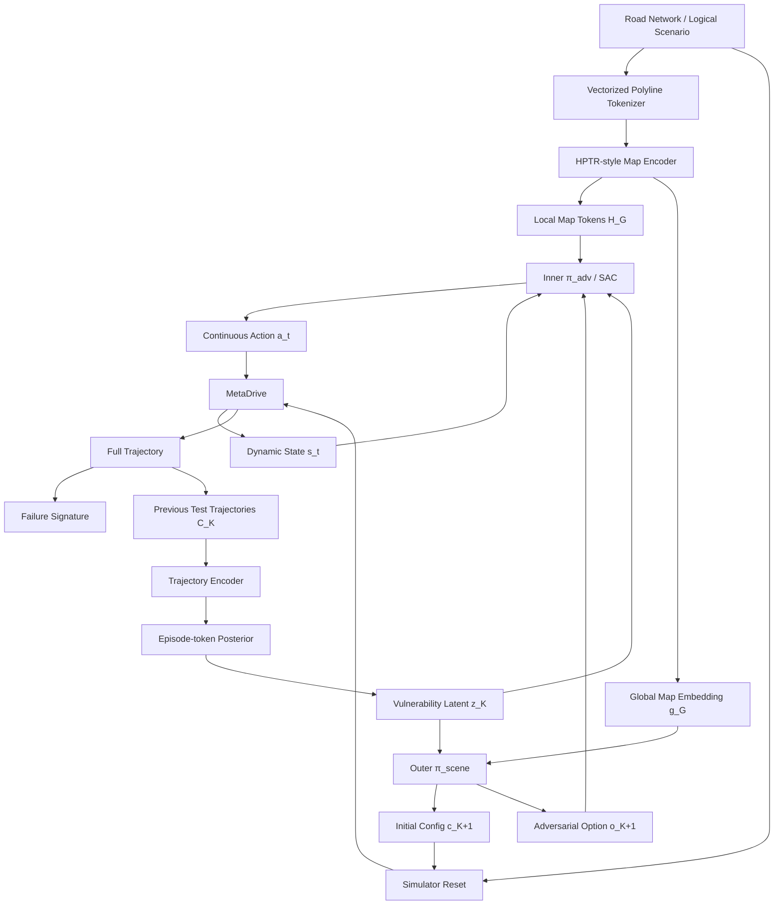

# META_LEARNING 技术路线重构、代码迁移与测试计划

gpu在系统的
conda activate metadrive 

> **目标**：停止围绕旧 PEARL/merge-only 路线继续增量修补，重构为面向 unseen SUT 的地图感知、双时间尺度、few-shot 自适应失效场景挖掘框架。

---

## 0. 执行摘要

当前研究问题应重新定义为：

> **面对训练阶段未见过的黑盒自动驾驶系统（SUT），在 Merge、Cut-in、Roundabout 等逻辑场景族中，仅执行少量昂贵测试，就快速推断该 SUT 的脆弱性，并在固定总测试预算内自适应地选择危险场景配置与连续对抗动作，从而更快发现更多不同的有效失效。**

任务索引可写为：

\[
\tau=(\mathrm{SUT},\mathrm{ScenarioFamily}),
\]

但需要严格区分：

- **地图/逻辑场景结构是已知条件，不是 latent；**
- **SUT 的 vulnerability / failure landscape 才是 few-shot 需要推断的未知变量。**

新的方法不建议训练两个彼此独立、从零同步更新的 SAC，而采用：

\[
\boxed{\text{共享表征}+\text{Outer Scene Head}+\text{Inner Adversarial SAC Head}}
\]

其中：

- `π_scene`：episode 级低频决策，回答 **Where / under what condition to test?**
- `π_adv`：0.1 s 级高频连续控制，回答 **How to adversarially interact?**
- 两者共享地图表示和 few-shot latent `z_K`；
- Outer 输出的初始配置直接作为 `env.reset()` 的输入，同时输出 high-level adversarial intent/option；
- Inner 在该初始条件下输出连续时序动作；
- Meta-test 时默认冻结共享网络参数，只更新 posterior `q(z|C_K)`，避免针对新 SUT 重新训练数千/数万步 SAC。

当前仓库正适合进行路线切换：旧 checkpoint、训练日志、评估指标和机制 pilot 已退役，`results/pearl_learning/` 当前仅保留冻结 taskbook/casebook 输入；但源码、配置和测试仍包含大量旧 PEARL/merge-only 技术分支。因此现在应做**源码层技术路线切换**，而不是继续追加实验配置。

---

## 1. 当前代码的根本结构性问题

### 1.1 Task 仍被定义成 merge 几何/逻辑类型

当前 `pearl_learning/src/task_spec.py` 仅支持：

```text
on_ramp_merge
lane_drop_merge
bottleneck_merge
y_merge
```

这与最终目标“不同自动驾驶算法 × Merge/Cut-in/Roundabout 等不同逻辑场景”不一致。

新的 Task 应从“几何实例 identity”转向“黑盒 SUT 的失效分布”，而地图结构作为显式观测条件。

### 1.2 地图表示仍是手工 MLP descriptor

当前 `scenario_encoder.py` 仍使用：

```text
[lane-drop one-hot,
 bottleneck one-hot,
 merge_length/100]
```

再经过 MLP。该表示无法自然处理：

- 可变 lane 数；
- successor/predecessor；
- left/right；
- merge/split；
- conflict/crossing；
- Roundabout 多入口/多出口；
- Cut-in 的局部 lane relation。

因此这一分支应被成熟的 vectorized HD-map / lane-polyline encoder 取代。

### 1.3 Context 仍以 transition 为独立 evidence

当前 `context_encoder.py` 的主契约仍是 transition Product-of-Gaussians：

\[
(s,a,r,s') \rightarrow \text{Gaussian factor}.
\]

一个 episode 中多个高度相关 transition 被视为多个独立 evidence，不符合“few test scenarios”的物理语义。

新路线改为：

\[
\boxed{\text{one complete test trajectory} \rightarrow \text{one context token}}
\]

因此 `K=4` 才真正表示 4 次模拟测试。

### 1.4 SUT 目前在通用 adapter 中被硬编码为 IDM

当前 `pearl_learning/src/adapters/base.py` 的 `_spawn_idm()` 直接实例化 `IDMPolicy`。这与“测试不同自动驾驶算法”的最终目标直接冲突。

必须建立独立 `SUTAdapter`/registry，把：

- IDM；
- rule-based；
- PPO/SAC；
- imitation policy；
- 外部 ADS/controller；

统一成黑盒测试接口，且 SUT ID 不输入模型。

---

## 2. 新方法的最终架构



### 2.1 Outer 的职责

\[
(c_{K+1},o_{K+1})
\sim
\pi_{\mathrm{scene}}(\cdot\mid g_G,z_K,H_K)
\]

`c` 为场景初始配置，例如：

- spawn lane / route；
- SUT/adversary 初始纵向位置；
- 初始速度；
- relative arrival gap；
- traffic density；
- family-specific 参数。

`o` 为高层对抗意图，例如：

- target conflict zone；
- target arrival-gap；
- interaction mode；
- 目标 maneuver。

Outer 输出直接用于：

```python
env.reset(map=G, scenario_config=c)
```

因此，**Outer 获得的初始场景参数就是 Inner 强化学习的初始条件**。

### 2.2 Inner 的职责

\[
a_{k,t}
\sim
\pi_{\mathrm{adv}}
(a\mid s_{k,t},H_G,z_{k-1},o_k,e(c_k)).
\]

Inner 保留逐时刻动态对抗能力，不把测试退化成纯 initial-condition optimization。

Meta-test 时固定的是共享参数 `θ_adv`，而不是行为。由于 `z`、地图和 `o` 会变化，同一网络会立即产生不同的对抗策略。

### 2.3 为什么双层不会自动使仿真成本翻倍

一次完整 simulator episode 同时提供：

- 1 个 Outer transition；
- T 个 Inner step-level transitions；
- 1 个 trajectory context token；
- 1 个 failure signature。

因此新结构增加的是学习头和 credit assignment，而不是把模拟次数机械翻倍。

训练必须分阶段，禁止从零同步训练两个独立 SAC：

```text
Inner pretraining
    ↓
Posterior / vulnerability identification
    ↓
Outer training（Inner frozen / slow update）
    ↓
Light alternating joint tuning
```

---

## 3. 地图编码：采用成熟方案，而不是自研简单 GNN

### 3.1 推荐方案

主推荐采用 **HPTR-style Heterogeneous Polyline Transformer** 的地图/场景 encoder 思路，只移植 encoder，不搬 motion forecasting decoder。

理由：

1. vectorized polyline 表示适合道路几何；
2. 可处理异构 polyline/token；
3. relative-pose attention 适合跨地图坐标系泛化；
4. 能表达 Merge/Cut-in/Roundabout 的可变拓扑；
5. 可同时提供 local tokens 给 Inner、global embedding 给 Outer；
6. 静态 map tokenization 可以缓存，工程成本可控。

备选：

- MTR-style polyline/local-attention encoder；
- QCNet 的 query-centric / SE(2)-aware 编码思想可作为后续增强，但第一版不建议完整迁移其预测栈。

### 3.2 Map 数据结构

建议统一生成：

```python
@dataclass(frozen=True)
class MapPolyline:
    polyline_id: str
    polyline_type: str
    points_xy: Tensor
    headings: Tensor
    curvature: Tensor
    lane_width: Tensor
    speed_limit: Tensor
    attributes: dict
```

显式关系：

```text
successor / predecessor
left / right
merge / split
conflict / crossing
route-membership
```

输出：

\[
H_G=\{h_1,\dots,h_N\},\qquad
g_G=\mathrm{Pool}(H_G).
\]

### 3.3 缓存策略

需区分：

- **始终可缓存**：道路解析、polyline 采样点、拓扑关系、raw canonicalized tokens；
- **Map Encoder 可训练时**：不可长期缓存最终 embedding；
- **Encoder 冻结或 Meta-test 时**：可缓存 `H_G/g_G`。

当前已有 `map_hash` 思路应保留并扩展。

---

## 4. 新 Task / SUT / Scenario Contract

### 4.1 Generic TaskSpec

```python
@dataclass(frozen=True)
class MetaTestTaskSpec:
    task_id: str
    split: str
    sut_ref: str
    scenario_family: str
    map_id: str
    map_hash: str
    scenario_template_id: str
    parameter_space_id: str
    seed: int
```

约束：

- `sut_ref` 只用于 runner 实例化 SUT；
- **禁止把 `sut_ref` / algorithm ID 输入 policy 或 posterior**；
- map/scenario family 是已知信息；
- `z` 只能从 SUT 在测试中的行为轨迹推断。

### 4.2 SUTAdapter

```python
class SUTAdapter(Protocol):
    def reset(self, env, task, config, seed): ...
    def attach(self, env, vehicle): ...
    def observe(self, env, vehicle): ...
    def step(self, observation): ...
    def metadata(self) -> dict: ...
```

第一批至少支持：

```text
IDMSUTAdapter
RuleBasedSUTAdapter
RLPolicySUTAdapter
ExternalSUTAdapter
```

---

## 5. Context / Posterior 重设计

### 5.1 one trajectory → one token

\[
\tau_k \xrightarrow{E_{\mathrm{traj}}} h_k
\]

构造：

\[
c_k=
[g_G,e(c_k),e(o_k),h_k,y_k],
\]

再得到：

\[
q_\phi(z\mid C_K)
=
q_\phi(z\mid\{c_1,\ldots,c_K\}).
\]

第一版推荐 DeepSets 或轻量 Set Transformer。

### 5.2 Trajectory Encoder 输入

重点是 SUT 的反应行为，而不是简单复制 reward：

- relative state；
- braking/acceleration response；
- lane/route behavior；
- TTC/PET/min-distance time series；
- conflict-zone entry timing；
- yielding/aggressiveness proxy；
- episode validity / failure flags。

### 5.3 Prior

第一版使用统一：

\[
p(z)=\mathcal N(0,I)
\]

地图显式输入 policy，不再让 map-conditioned prior 代替 few-shot 推断。地图条件 prior 仅作为后续 ablation。

---

## 6. Failure Discovery 目标

主目标必须从“query critical rate”转成：

\[
\boxed{\text{固定总测试预算下累计发现多少不同的有效失效}}
\]

建立 `FailureSignature`：

```python
@dataclass(frozen=True)
class FailureSignature:
    failure_type: str
    scenario_family: str
    conflict_zone_id: str | None
    severity_vector: tuple[float, ...]
    valid: bool
```

Outer reward 可写为：

\[
r_k^{outer}
=
w_fF_k+w_nN_k+w_sS_k-w_iI_k
+\beta_k\mathrm{InfoGain}_k.
\]

其中：

- `F`：valid failure；
- `N`：novel failure mode/region；
- `S`：severity；
- `I`：invalid penalty；
- `InfoGain`：第二阶段再加入，用于主动辨识。

Inner reward：

\[
r_t^{inner}=r_{risk}+\lambda_or_{option}-\lambda_vr_{invalid}.
\]

---

## 7. 推荐的新 active package

不要继续在 `pearl_learning/` 中堆新逻辑。建议：

```text
meta_testing/
├── configs/
├── map/
│   ├── schema.py
│   ├── metadrive_tokenizer.py
│   ├── relations.py
│   ├── hptr_encoder.py
│   ├── pooling.py
│   └── cache.py
├── sut/
│   ├── base.py
│   ├── registry.py
│   ├── idm.py
│   ├── rule_based.py
│   ├── rl_policy.py
│   └── external.py
├── scenario/
│   ├── task_spec.py
│   ├── parameter_space.py
│   ├── option.py
│   ├── executor.py
│   └── adapters/
│       ├── base.py
│       ├── merge.py
│       ├── cutin.py
│       └── roundabout.py
├── context/
│   ├── trajectory_encoder.py
│   ├── episode_token.py
│   ├── set_posterior.py
│   └── replay.py
├── policy/
│   ├── shared_features.py
│   ├── scene_policy.py
│   ├── adversarial_sac.py
│   ├── critics.py
│   └── action_decoder.py
├── failure/
│   ├── critical.py
│   ├── signature.py
│   ├── novelty.py
│   └── metrics.py
├── training/
│   ├── inner_pretrain.py
│   ├── outer_train.py
│   ├── joint_train.py
│   └── runner.py
├── evaluation/
│   ├── budget_protocol.py
│   ├── evaluator.py
│   ├── baselines.py
│   └── reports.py
└── tests/
    ├── unit/
    ├── simulator/
    ├── gates/
    └── integration/
```

新建 package 的原因是：新方法已不再等价于 vanilla PEARL，继续使用 `pearl_learning` 作为 active 主包会造成严重语义和历史配置污染。


---

## 8. 当前代码迁移矩阵

> 状态：`KEEP/EXTRACT` = 核心逻辑值得迁移；`REFACTOR` = 保留概念但重写接口；`LEGACY BASELINE` = 冻结用于对比；`DELETE-LATER` = 新实现通过 Gate 后从 active main 删除，Git 历史/归档分支保留。

| 当前路径/分支 | 当前作用 | 建议 | 新位置/替代 | 删除前置条件 |
|---|---|---|---|---|
| `pearl_learning/src/task_spec.py` | merge-only task contract | REFACTOR → DELETE-LATER | `meta_testing/scenario/task_spec.py` | Generic TaskSpec + 三类 family contract tests 通过 |
| `pearl_learning/src/taskbook.py` | PEARL frozen task input | LEGACY BASELINE | 新 task registry/manifest | 旧 baseline manifest 可复现 |
| `casebook.py`, `casebook_v2.py` | 固定 case 输入 | LEGACY/部分思想复用 | `scenario/parameter_space.py` | fixed-budget protocol 完成 |
| `scenario_encoder.py` | 3 维 merge descriptor + MLP | DELETE-LATER | `map/hptr_encoder.py` | Map Gate 通过 |
| `context_encoder.py` | transition PoG posterior | LEGACY → DELETE-LATER | trajectory encoder + set posterior | G5/G6 通过 |
| `pearl_agent.py` | PEARL-SAC monolith | LEGACY BASELINE | scene head + adversarial SAC | 新 runner 正式跑通 |
| `pearl_trainer.py` | old meta-training loop | LEGACY BASELINE | `training/*` | 新训练流程可复现 |
| `task_env.py` | merge-centric task env | REFACTOR | `scenario/executor.py` | 三 family simulator contract 通过 |
| `adapters/base.py` | MetaDrive role/route/conflict | KEEP/EXTRACT + REFACTOR | `scenario/adapters/base.py` | 先移除 `_spawn_idm` 硬编码 |
| `adapters/*.py` | merge adapters | KEEP/EXTRACT | `scenario/adapters/merge.py` | generic adapter contract 通过 |
| `maps.py` | bottleneck/Y-merge maps | KEEP AS FIXTURE | map/scenario fixtures | 通用 tokenizer 能正确解析 |
| `routes.py` | route geometry | KEEP/EXTRACT | scenario/map utils | 等价性测试通过 |
| `critical.py` | critical event logic | KEEP/EXTRACT | `failure/critical.py` | golden-event tests 通过 |
| `reward.py` | old low-level reward | REFACTOR | Inner/Outer reward 分离 | reward contract tests |
| `observation.py` | merge-specific dynamic obs | REFACTOR | `policy/shared_features.py` | 多 family schema 通过 |
| `replay.py` | replay support | KEEP CONCEPT/REWRITE | inner replay + episode-token replay | leakage tests 通过 |
| `collector.py` | trajectory collection | REFACTOR | hierarchical runner | one-rollout/multi-consumer tests |
| `metrics.py` | old metrics | KEEP useful primitives | `failure/metrics.py` | fixed-budget metrics validated |
| `io.py` | hashing/I/O | KEEP/EXTRACT | common utils | hash regression tests |
| `checkpoint.py` | checkpoint | REFACTOR | hierarchical checkpoint schema | schema tests |
| `causal_audit.py`, `mechanism_audit.py`, `posterior_adaptation_analysis.py`, `transferability*.py` | 历史机制诊断 | ARCHIVE/DELETE-LATER | 新 Gate scripts | 新 Gate 覆盖必要诊断 |
| `moe.py` + routed-MoE 分支 | 历史结构尝试 | LEGACY/DELETE-LATER | 暂不进入主方法 | archive branch 已建立 |
| `configs/merge_method_flow_gate3_*` | 历史 Gate3/FiLM 分支 | ARCHIVE/DELETE-LATER | 新 stage configs | 新 config schema 稳定 |
| `configs/*logical_order*` | 隐藏顺序机制实验 | ARCHIVE/DELETE-LATER | 不迁入主方法 | provenance 保存 |
| `tests/test_contract.py` | 大型旧契约测试 | SPLIT/EXTRACT | 新 unit/simulator tests | 新 contract 覆盖 |
| old flow/MoE/prior tests | 旧路线 tests | LEGACY/DELETE-LATER | 新 integration/gates | 新端到端 smoke 通过 |

### 8.1 不应直接删除的资产

在新框架彻底跑通前必须保留：

- 可构造真实 MetaDrive 路网的 adapter/map/route 代码；
- critical/validity 判定；
- hash/provenance/seed/checkpoint 逻辑；
- 当前冻结 taskbook/casebook，作为旧 baseline 可追溯输入；
- 一份能够重跑当前 PEARL 的最小代码/config 快照。

---

## 9. 安全删除协议

### 9.1 分支策略

禁止在 `main` 上边重构边删除。建议先建立：

```text
archive/pre-hierarchical-map-aware-meta-rl-2026-08-21
refactor/hierarchical-map-aware-meta-rl
```

同时生成机器可读 manifest：

```yaml
baseline:
  commit: 5908d145ca505f0304236c0f10d9a423b5891ee6
  python_env: ...
  metadrive_version: ...
  torch_version: ...
  config_hashes: ...
  frozen_input_hashes: ...
  test_command: conda run -n metadrive python -m pytest pearl_learning/tests -q
```

### 9.2 每个待删除模块必须满足六条条件

1. active runtime import graph 无引用；
2. active config `extends`、CLI entry 无引用；
3. README/docs 已指向新路径；
4. 替代模块 unit + simulator contract tests 全通过；
5. legacy baseline 可从 archive commit/branch 重现；
6. 删除放在专用 PR/commit，禁止和算法功能变更混在一起。

### 9.3 删除顺序

```text
历史无效结果（仓库已基本完成）
→ 历史 configs/scripts
→ mechanism/audit branches
→ old scenario MLP/prior
→ old PEARL trainer/agent
→ old task_env/task_spec
→ 最后取消 pearl_learning 作为 active package
```

基础 simulator/route/critical 逻辑必须先抽取，再删除旧副本。

---

## 10. 分阶段代码与训练计划

### Phase 0 — Baseline Freeze

**目标**：以后任何删除均可追溯。

任务：

- 固定当前 SHA、环境、依赖、input hash；
- 生成 import/config/CLI dependency graph；
- 给旧 PEARL 标 `legacy`，停止增加新方法功能；
- 新建 `meta_testing/` 骨架和 config schema。

通过标准：

- 当前 legacy tests 可运行；
- baseline manifest 可机器读取；
- 所有现有文件分类为 KEEP / REFACTOR / LEGACY / DELETE-LATER。

### Phase 1 — Generic SUT + Scenario Contract

**首先解决“当前只能测 IDM + merge”的问题。**

任务：

- 引入 `SUTAdapter`/registry；
- 从通用 MetaDrive adapter 中移出 IDM；
- 建立通用 `ScenarioAdapter`；
- 实现 Merge、Cut-in、Roundabout；
- 建立 family-specific parameter space 和统一 normalized action interface。

通过标准：

- 三类 family 均可从随机合法 configuration reset；
- 至少两类 SUT adapter 可在同一地图运行；
- SUT ID 不进入模型输入。

### Phase 2 — Map Tokenizer + HPTR-style Encoder

任务：

- road network → polyline tokens；
- typed topology relations；
- relative-pose attention；
- local `H_G` + global `g_G`；
- raw-token cache 与 frozen-embedding cache。

通过 G1/G2 后才能进入大规模 RL。

### Phase 3 — Inner Universal Adversarial Policy Pretraining

训练分布：

```text
SUT_train × {Merge, Cut-in, Roundabout} × random valid configurations
```

目标：

\[
\pi_{\mathrm{adv}}(a_t\mid s_t,H_G,z,o)
\]

先学会跨地图、跨初始条件地实现 high-level option 和有效动态对抗。

此阶段不训练 Outer。早期可先令 `z=0`，验证 map/option-conditioned controllability。

### Phase 4 — Trajectory Encoder + Vulnerability Posterior

任务：

- full-trajectory encoder；
- one-episode-one-token；
- `q(z|C_K)`；
- K=0/1/2/4 online update；
- 暂时冻结 Inner 主干，避免 target drift。

目标：先证明少量真实测试能区分不同 SUT vulnerability。

### Phase 5 — Outer Scene Policy

目标：

\[
(c,o)\sim\pi_{\mathrm{scene}}(g_G,z,H)
\]

第一版控制动作空间难度：

- route/conflict zone 从合法候选集合选择；
- continuous config 归一化；
- 先验证 family-valid hybrid action；
- graph pointer head 可在基础 Gate 通过后开启。

### Phase 6 — Light Joint Training

只在前五阶段 Gate 全通过后启用：

- Map Encoder 冻结或低学习率；
- Inner 慢更新；
- Outer 正常更新；
- Posterior 独立 optimizer；
- alternating update；
- context/query/inner replay 严格防数据泄漏；
- 固定 validation tasks 监控 co-adaptation。

### Phase 7 — Fixed-budget Meta-test + Legacy Prune

full method 在同一总预算下稳定优于 baselines 后：

- 完成正式 unseen-SUT 评估；
- 固定论文 config；
- README 切换到新方法；
- legacy PEARL 从 active main 移除；
- 旧实现仅保留在 archive branch/tag。

---

## 11. 科学 Gate：不通过就停止下一阶段

### G0 — Reproducibility Gate

验证 commit/config/input hash/seed/environment 全记录，legacy baseline tests 可复现。

**FAIL：禁止大规模重构。**

### G1 — Map Representation Gate

验证：

- Merge/Cut-in/Roundabout 均可编码；
- lane/polyline/connectivity 无缺失；
- 刚体平移/旋转后，相对结构表示符合预期；
- encoder 冻结时 cache/uncached 数值等价。

**FAIL：禁止进入 RL。**

### G2 — Scenario Execution Gate

验证：

- Outer config 被 `env.reset()` 精确应用；
- route/spawn/speed/traffic 参数合法；
- option/conflict zone 正确；
- invalid configuration fail-fast；
- 三 family normalized action 具有明确语义。

**FAIL：禁止训练 Outer。**

### G3 — Failure-Landscape Heterogeneity Gate（最重要）

在固定 family/map 下，对不同 SUT 做受控场景采样，估计：

\[
f_{A,G}(x)\quad vs\quad f_{B,G}(x).
\]

需要看到至少一种稳定证据：

- top-risk region 跨 SUT 明显不同；
- risk ranking 不同；
- 针对 SUT-A 优化的策略迁移到 SUT-B 后下降；
- cross-transfer matrix 有稳定 diagonal preference。

**FAIL 的含义**：Task/SUT 选取仍不适合 Meta-RL。此时换 SUT/Task，不调 PEARL 超参数。

### G4 — Inner Controllability Gate

相同 initial config 下切换 option，应得到可重复、显著不同的交互轨迹；在不同地图中也能实现 option。

**FAIL：Outer 没有可靠的下层执行器。**

### G5 — Few-shot Identifiability Gate

要求：

\[
D(z_A,z_B) > D(z_A^{seed1},z_A^{seed2})
\]

并且 K 从 1→2→4 时 separation 总体改善。

不要把 `||z-prior||` 当作辨识成功。

### G6 — Posterior Causal Utility Gate

对真实 SUT-A 比较：

```text
correct z_A
swapped z_B
zero/random z
```

分别验证：

```text
z → π_scene
z → π_adv
z → failure outcome
```

要求正确 posterior 有实质性优势。

**FAIL：posterior 即使可分，policy 也不需要它。**

### G7 — Outer Utility Gate

固定同一 Inner controller 比较：

```text
Random/Sobol
CEM
Bayesian Optimization
Outer no-z
Outer with-z
```

要求 Outer 的收益确实来自更好的测试选择。

### G8 — All-in Budget Profitability Gate

严格定义：

\[
B_{\mathrm{total}}=B_{\mathrm{probe}}+B_{\mathrm{adaptive}}.
\]

K-shot probe 必须计入总 simulator budget。

只有 full method 的累计 unique failure 曲线/AUC 在相同总测试次数下稳定更优，才能声称节省测试资源。

### G9 — OOD Generalization Gate

优先级：

1. unseen SUT + seen scenario families；
2. unseen SUT + held-out geometry/template；
3. 最后才研究 unseen scenario family。


---

## 12. 正式实验矩阵

### 12.1 SUT split

建议第一轮至少：

```text
Meta-train: SUT-A, SUT-B, SUT-C, SUT-D
Validation: SUT-E
Meta-test: SUT-F, SUT-G (completely unseen)
```

SUT 不能只靠不同随机种子冒充不同算法。优先使用真实行为范式不同的：

- IDM/rule-based baseline；
- 不同规划/控制算法；
- PPO/SAC；
- imitation/learned controller；
- 不同 checkpoint 仅作为补充。

### 12.2 Scenario families

第一阶段：

```text
Merge
Cut-in
Roundabout
```

每个 family 内包含多种 geometry/template：

- Merge：merge length、lane count、on-ramp/y-merge、conflict geometry；
- Cut-in：lane count、initial gap、curvature、cut-in side/trigger；
- Roundabout：radius、entry count、lane count、entry/exit pairing。

### 12.3 Baselines

所有 baseline 使用相同 simulator budget，尽量共享相同 Inner controller，以隔离 Outer/Meta adaptation 的真实贡献：

1. Random / Sobol configurations；
2. CEM；
3. Bayesian Optimization；
4. Inner SAC + random configuration；
5. pooled universal adversarial SAC（no `z`）；
6. Outer no-`z` + same Inner；
7. `z -> Outer only`；
8. `z -> Inner only`；
9. legacy/current PEARL；
10. full hierarchical map-aware Meta-RL。

### 12.4 关键 Ablations

- HPTR-style map encoder vs handcrafted MLP descriptor；
- trajectory-token posterior vs transition-product posterior；
- no Outer option，只输出 initial config；
- no Outer；
- Inner no-`z`；
- `z` 只进 Outer / 只进 Inner / 同时进入两者；
- frozen Inner vs light joint fine-tuning；
- unit prior vs map-conditioned prior（后期）；
- map cache on/off 的等价性和 wall-clock。

---

## 13. 主评价指标

主图横轴必须为：

\[
\boxed{\text{Executed Simulator Scenarios}}
\]

主图纵轴：

\[
\boxed{\text{Cumulative Unique Valid Failures}}
\]

正式报告：

- Failure Discovery AUC under budget B；
- tests-to-first-valid-failure；
- tests-to-5/10 unique failures；
- unique failures / simulator episode；
- failure diversity / coverage；
- severity distribution；
- invalid scenario rate；
- posterior between-SUT vs within-SUT separation；
- posterior intervention effect；
- wall-clock/GPU cost 作为独立工程指标。

**不要**再以 query critical rate alone 作为主结论，也不能把 support/probe cost 从测试预算中移除。

---

## 14. 新测试代码计划

### 14.1 Unit tests

```text
test_task_spec_generic.py
test_sut_registry.py
test_map_polyline_tokenizer.py
test_map_relations.py
test_hptr_shapes_and_masks.py
test_map_se2_transform.py
test_map_cache.py
test_scenario_action_decoder.py
test_trajectory_encoder_masks.py
test_episode_token_posterior.py
test_empty_context_prior.py
test_posterior_permutation_invariance.py
test_z_conditioning_gradients.py
test_failure_signature.py
```

### 14.2 Simulator contract tests

```text
test_merge_executor.py
test_cutin_executor.py
test_roundabout_executor.py
test_outer_config_reset_exactness.py
test_option_realization.py
test_sut_blackbox_contract.py
test_route_and_conflict_geometry.py
test_failure_event_golden_cases.py
```

### 14.3 Scientific audit scripts

```text
audit_failure_landscape_heterogeneity.py
audit_inner_option_controllability.py
audit_fewshot_identifiability.py
audit_posterior_intervention.py
audit_outer_search_utility.py
audit_all_in_budget_profitability.py
```

### 14.4 Integration smoke

每次 PR 小预算验证：

```text
2 SUT × 2 families × 2 maps × 2 episodes
```

Smoke 只用于验证流程/invariant，不产生论文性能结论。

---

## 15. 训练流程伪代码

```python
for task in sample_meta_tasks():
    G = task.map

    raw_tokens = map_tokenizer(G)
    H_G, g_G = map_encoder(raw_tokens)

    C = []
    z = posterior.prior()

    for k in range(test_budget_per_meta_episode):
        # Outer: 一次完整测试前决策
        scene_config, option = scene_policy(
            g_G, z, history_summary(C)
        )

        env = executor.reset(
            task=task,
            scenario_config=scene_config,
            sut_adapter=sut_registry.create(task.sut_ref),
        )

        trajectory = []

        # Inner: 0.1 s 级动态动作
        while not env.done:
            s_t = env.observe()
            a_t = adversarial_policy(
                s_t, H_G, z, option, scene_config
            )
            s_next, r_inner, done, info = env.step(a_t)

            inner_replay.add(
                s_t, a_t, r_inner, s_next, done
            )
            trajectory.append(
                (s_t, a_t, s_next, info)
            )

        outcome = failure_analyzer(trajectory)

        # one physical test -> one context token
        h_episode = trajectory_encoder(trajectory)
        token = make_episode_token(
            g_G,
            scene_config,
            option,
            h_episode,
            outcome,
        )
        C.append(token)

        # 每一次测试后立即 adaptation
        z = posterior(C)

        outer_replay.add(
            history_before=...,
            action=(scene_config, option),
            reward=outer_reward(outcome, C),
            history_after=...,
        )

    # 按 Phase 决定更新哪些模块：
    # Phase 3: Inner only
    # Phase 4: Posterior only / Inner frozen
    # Phase 5: Outer only / Inner frozen or slow
    # Phase 6: controlled alternating joint updates
```

---

## 16. 推荐 PR/Commit 顺序

### PR-0 `baseline-freeze-and-deprecation`

- baseline manifest；
- legacy 标记；
- dependency inventory；
- 不改变算法行为。

### PR-1 `generic-sut-and-scenario-contract`

- `SUTAdapter`；
- generic TaskSpec；
- scenario adapter protocol；
- IDM 从通用 adapter 解耦。

### PR-2 `vectorized-map-and-hptr-encoder`

- map tokenizer；
- typed relations；
- HPTR-style encoder；
- cache；
- G1 tests。

### PR-3 `merge-cutin-roundabout-executors`

- 三 family adapters；
- parameter spaces；
- normalized action decoder；
- G2 tests。

### PR-4 `trajectory-context-and-vulnerability-posterior`

- trajectory encoder；
- episode token；
- set posterior；
- G5 diagnostics。

### PR-5 `latent-conditioned-inner-adversarial-policy`

- Inner SAC 接入 map + z + option；
- option controllability；
- G4/G6-inner。

### PR-6 `outer-scene-policy-and-hierarchical-runner`

- Outer policy；
- hierarchical collector/replay；
- G6-outer/G7。

### PR-7 `fixed-budget-evaluation`

- cumulative unique failure metrics；
- baselines；
- same-budget protocol；
- G8/G9。

### PR-8 `legacy-prune`

只在新方法全部 Gate 通过后：

- 删除 old mechanism configs/scripts；
- 删除 old MLP scenario prior；
- 删除 old trainer/agent active entry；
- README 切换到新方法；
- legacy 仅存在 archive branch/tag。

---

## 17. Stop Conditions：防止重新陷入“堆实验修补”

### Stop-A — SUT failure landscape 高度一致

如果不同 SUT 的危险区域、最优测试策略高度重合，则当前 SUT 集合不适合证明 Meta-RL。

**动作：换 SUT/Task，而不是调网络。**

### Stop-B — Few-shot posterior 不可辨识

如果完整 trajectory token 在 K=1/2/4 仍无法区分 vulnerability：

**动作：检查 probe 信息量、SUT 异质性、trajectory representation，而不是增加 latent 维度。**

### Stop-C — `z` 可区分但 policy 不使用

如果 posterior swap 不改变 Outer/Inner 行为和 failure outcome：

**结论：optimal testing policy 对 SUT 基本不变，Meta-RL 缺少必要性。**

### Stop-D — Outer 不优于 BO/CEM

如果 episode-level 场景选择本质上接近静态黑盒优化，BO/CEM 在相同预算下稳定更好：

**动作：重新审视 sequential state、novelty 和 identify–exploit 是否构成真正 RL 问题。**

### Stop-E — K-shot 成本不盈利

如果把 probe/support 全部计入总测试预算后，full model 不优于 no-adaptation：

**不能声称节省测试资源。**

---

## 18. 第一轮最低可行研究版本（MVR）

第一轮建议只实现：

```text
3 scenario families: Merge / Cut-in / Roundabout
4 train SUT + 1 validation SUT + >=1 unseen test SUT
HPTR-style map encoder
1 universal Inner adversarial SAC
1 episode-level Outer scene policy
trajectory-level posterior
unit prior
fixed family-valid route candidates
continuous scene config + small categorical option set
K=0/1/2/4 online posterior checkpoints
all-in budget evaluation
```

第一轮明确不做：

```text
unseen scenario-family 主 Claim
完整 QCNet forecasting stack
MoE/routed experts
map-conditioned prior
full-network test-time fine-tuning
multi-adversary 扩展
复杂 information-gain objective
```

只有 MVR 证明下列三项后才继续复杂化：

\[
\boxed{
\text{Task distinguishable}
\land
\text{Policy adaptation necessary}
\land
\text{All-in budget profitable}
}
\]

---

## 19. 第一轮最终验收链

新的技术路线必须形成下面的完整证据链：

\[
\boxed{
\text{SUT failure landscapes differ}
\Rightarrow
\text{few tests identify vulnerability}
\Rightarrow
z\text{ changes Outer/Inner decisions}
\Rightarrow
\text{same-budget failure discovery improves}
}
\]

具体必须同时看到：

1. **SUT 可分**：failure landscape 与 posterior separation 都有证据；
2. **地图编码有效**：同一 encoder 支持三类逻辑场景与 held-out geometry；
3. **动态对抗没有丢失**：Inner 仍输出逐时刻动作；
4. **Outer 确有价值**：同一 Inner 下，adaptive scene selection 优于有竞争力 baseline；
5. **Few-shot 有因果作用**：correct posterior 优于 swapped/zero posterior；
6. **资源结论成立**：所有 probe/support 计入预算后仍发现更多 unique valid failures。

只有这六点同时成立，才说明新的 Meta-RL 框架真正回答了原始研究动机。

---

## 20. 当前仓库审阅依据

本计划基于：

```text
SafeDL/META_LEARNING
main@5908d145ca505f0304236c0f10d9a423b5891ee6
```

重点审阅/核对：

```text
README.md
results/pearl_learning/README.md
pearl_learning/README.md
pearl_learning/src/task_spec.py
pearl_learning/src/scenario_encoder.py
pearl_learning/src/context_encoder.py
pearl_learning/src/adapters/base.py
pearl_learning/src/maps.py
pearl_learning/src/pearl_agent.py
pearl_learning/src/pearl_trainer.py
pearl_learning/src/task_env.py
pearl_learning/src/routes.py
pearl_learning/src/critical.py
pearl_learning/src/replay.py
pearl_learning/configs/*
pearl_learning/tests/*
```

审阅得到的关键事实：

- 当前结果目录没有可用于当前方法性能结论的 PEARL 结果；
- 旧 checkpoint/metrics 已因方法契约变化被退役；
- 当前 active PEARL contract 仍是 transition-product recent-context；
- Task/schema/source tree 仍明显围绕 merge-only 逻辑；
- 当前代码已有相当有价值的 route/conflict/MetaDrive adapter/hash 基础设施；
- 因而正确策略是**抽取基础设施、替换研究核心**，而不是把仓库全部推倒重写，也不是继续在旧 PEARL 上增加分支。

---

## 21. 最终路线建议

### 代码层

采用“双轨迁移”：

```text
旧 pearl_learning
    ↓
冻结为 legacy baseline
    ↓
抽取 simulator / route / critical / hash 等可靠基础设施

新 meta_testing
    ↓
Generic SUT abstraction
    ↓
HPTR-style map encoder
    ↓
trajectory-level vulnerability posterior
    ↓
Outer scene policy + Inner adversarial SAC
    ↓
fixed-budget evaluation
```

### 方法层

把 Meta-RL latent 从：

```text
“地图/几何 task identity”
```

改成：

```text
“unseen SUT vulnerability”
```

地图作为显式已知结构输入；`π_scene` 负责构造值得测试的危险初始条件和 interaction intent，`π_adv` 在该条件下执行连续动态对抗。

### 实验层

不要优先跑更长训练，而要优先证明：

\[
\boxed{
\text{Task distinguishable}
\land
\text{Policy adaptation necessary}
\land
\text{All-in budget profitable}
}
\]

任一项不成立，都应回到 SUT/Task/测试目标设计，而不是继续增加网络结构、context 变体和超参数实验。
