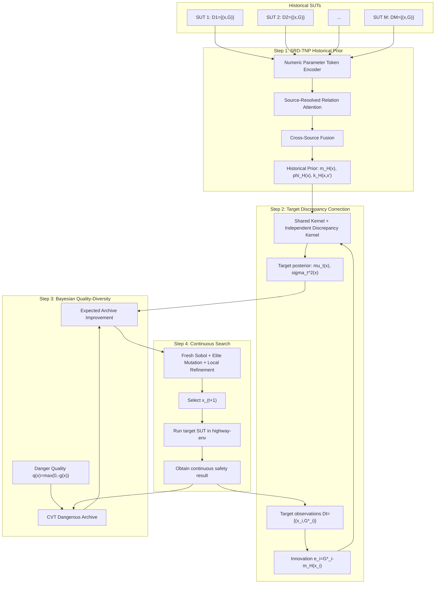

# SRD-TNP-BQD 技术方案 V1
## 面向历史多 SUT 迁移、目标反馈校正与危险多样化场景发现

> **方法暂名**：SRD-TNP-BQD  
> **SRD-TNP**：Source-Resolved Discrepancy Transformer Neural Process  
> **BQD**：Bayesian Quality-Diversity Testing  
> **仿真环境**：highway-env  
> **首轮功能场景**：S01 Cut-In  
> **目标**：在不固定具体场景库的前提下，利用多个 historical SUT 的“场景参数—连续安全结果”历史记录，对新的 target SUT 进行有限预算测试，发现一组**危险性高且参数条件多样**的场景。

---

# 1. 研究问题

给定同一个逻辑场景空间：

\[
x=(x_1,\ldots,x_d)\in\Omega.
\]

在首轮 S01 中：

\[
x=(d_0,v_{lead},T_{lc},t_0),
\]

分别对应初始间隙、切入车辆速度、换道时间尺度、事件开始时间。

第 \(j\) 个 historical SUT 已经积累：

\[
\mathcal D_j=\{(x_{j,i},G_j(x_{j,i}))\}_{i=1}^{N_j}.
\]

只要求每条记录包含：

- 场景参数 \(x\)；
- 连续安全结果 \(G(x)\)。

不要求不同 SUT 使用同一批具体场景，也不要求所有历史测试由同一种测试算法产生。

新的 target SUT 使用同一个逻辑场景与参数空间，但测试点由方法在线生成，不预先固定为某个具体场景库。

目标是在预算 \(B\)（首轮建议 \(B=50\)）内，得到：

\[
oxed{	ext{危险性高}}
\quad+\quad
oxed{	ext{参数条件多样}}
\]

的真实测试场景集合。

---

# 2. 核心 Insight

## Insight 1：历史结果有价值，但不是 target 的答案

历史 SUT 与 target SUT 处于同一逻辑场景空间，因此历史响应存在可迁移结构。

但是：

\[
G_*(x)
eq G_j(x)
\]

一般并不恒成立。

所以既不能完全丢弃历史，也不能直接把历史最危险点当成 target 的最危险点。

---

## Insight 2：target 与历史先验的差异本身是重要测试信息

如果历史认为某点安全：

\[
m_H(x)=1.5,
\]

但 target 实测：

\[
G_*(x)=-0.4,
\]

则说明历史在该局部明显失效。

因此 target response 写成：

\[
oxed{
G_*(x)=m_H(x)+\Delta_*(x)
}
\]

其中 \(m_H\) 是历史可迁移部分，\(\Delta_*\) 是 target-specific discrepancy。

---

## Insight 3：测试预算要同时服务危险性和多样性

只追求最危险点会反复落入同一个局部 basin。

只追求多样性又可能浪费预算在安全区域。

因此最终优化对象不是单点最危险，而是：

\[
oxed{	ext{Diverse Dangerous Scenario Archive}}
\]

即在不同参数区域中分别维护高危险代表。

---

# 3. 整体框架：4 个步骤

1. **历史多 SUT 响应先验学习**  
   使用改进的 Transformer Neural Process，从不对齐历史记录中学习 target 的历史安全先验。

2. **目标反馈差异校正**  
   target 每执行一次真实测试，就显式计算其与历史先验的差异，并更新目标安全响应后验。

3. **Bayesian Quality-Diversity 搜索**  
   危险程度作为 quality，归一化场景参数作为 diversity descriptor，计算候选对当前危险档案的预期改进。

4. **连续场景生成与闭环执行**  
   每轮重新在连续参数空间中生成候选，选择最值得执行的一个，真实执行后回到步骤 2。

---

# 4. 方法框架图



---

# 5. Step 1：SRD-TNP 历史先验网络

## 5.1 与 BSA-TNP 的关系

BSA-TNP 提供可借鉴的结构：

- context / query 分离；
- Kernel Regression Block；
- relation-biased attention；
- Neural Process 式条件预测。

但本文需要解决的是多个不同 SUT 的不对齐历史记录，以及 target 的独立差异，因此设计新的：

# SRD-TNP
## Source-Resolved Discrepancy Transformer Neural Process

主要改动：

1. **Source-Resolved Encoding**：每个 historical SUT 先独立编码；
2. **Response-Relation Attention**：attention 同时利用参数关系与历史连续安全响应关系；
3. **Cross-Source Fusion**：在候选位置融合不同历史 SUT；
4. **Valid Kernel Readout**：网络产生可用于概率条件更新的表示，而不是直接把 attention matrix 当协方差；
5. **Independent Target Discrepancy**：target 新差异拥有独立传播通道。

---

# 6. 数值输入与标准化

模型核心输入只有：

\[
(x,G).
\]

场景参数归一化：

\[
	ilde x_r=rac{x_r-l_r}{u_r-l_r}.
\]

连续安全指标统一为：

\[
g(x)=rac{G(x)-G_{crit}}{s_G}.
\]

约定：

\[
g(x)<0
\]

表示达到预先定义的危险条件。

所有 SUT 使用同一个 \(G_{crit}\) 和 \(s_G\)，不能按 SUT 分别标准化。

---

# 7. Numeric Parameter Token Encoder

每个参数作为独立数值 token：

\[
p_r=E_{value}(	ilde x_r)+E_{axis}(r).
\]

连续安全值：

\[
e_g=E_G(g).
\]

一条 historical observation：

\[
z_{j,i}
=
E_{record}(p_1,\ldots,p_d,e_g,e_{obs}).
\]

一个待选 candidate：

\[
q(x)=E_{query}(p_1,\ldots,p_d,e_{unobs}).
\]

candidate 没有 target safety result，不能把未知结果当作 0；实现中即使张量位置填零，也必须通过 observation-state mask 区分。

---

# 8. Source-Resolved Relation Attention

第 \(j\) 个 historical SUT：

\[
C_j=\{z_{j,1},\ldots,z_{j,N_j}\}.
\]

不同 SUT 分开进入相同参数的 source encoder。

历史记录 \(a,b\) 之间的 attention logit：

\[
L_{ab}
=
rac{Q_a^	op K_b}{\sqrt d}
+
B^X_{ab}
+
B^G_{ab}.
\]

参数关系偏置：

\[
B^X_{ab}
=
-rac12
\sum_r
rac{(	ilde x_{a,r}-	ilde x_{b,r})^2}{\ell_{x,r}^2}.
\]

响应关系偏置：

\[
B^G_{ab}
=
-rac{(g_a-g_b)^2}{2\ell_g^2}.
\]

因此历史传播由三部分共同决定：

\[
oxed{
learned\ attention
+
parameter\ relation
+
response\ relation
}
\]

这落实了“历史经验应在场景相似且响应规律相关的位置传播”。

---

# 9. Inducing Tokens：控制历史数据规模

每个 SUT 可以有数百或数千条记录。

使用 \(P\) 个 learned inducing tokens：

\[
U_j\in\mathbb R^{P	imes d_h}.
\]

推荐首轮：

\[
P=32	ext{ 或 }64.
\]

流程：

\[
C_j

ightarrow
U_j	ext{ reads }C_j

ightarrow
C_j	ext{ reads }U_j.
\]

复杂度由近似 \(O(N_j^2)\) 降为 \(O(N_jP)\)。

候选网络规模：

| 模块 | 初始配置 |
|---|---:|
| hidden size | 128 |
| attention heads | 4 |
| relation blocks | 3 |
| inducing tokens / SUT | 32 或 64 |
| FFN hidden | 256 |
| dropout | 0.1 |
| normalization | Pre-LN |

这些值只用于开发，必须在 historical validation 上冻结。

---

# 10. Query-to-Source Prediction

candidate \(x\) 分别读取各 source：

\[
h_j(x)=QueryRead(q(x),C'_j).
\]

输出：

\[
\hat g_j(x)=f_{head}(h_j(x))
\]

和 source-level scale：

\[
s_j(x)>0.
\]

形成：

\[
r_H(x)
=
[\hat g_1(x),\ldots,\hat g_M(x)].
\]

称为 **Historical Response Profile**。

注意 \(\hat g_j(x)\) 是模型预测，不是该 historical SUT 在该点的真实测试结果。

---

# 11. Cross-Source Fusion

每个 source 对 candidate 的初始贡献：

\[
w_j^0(x)
=
\operatorname{softmax}_j
f_{source}
(h_j(x),\hat g_j(x),s_j(x)).
\]

历史先验均值：

\[
oxed{
m_H(x)
=
\sum_jw_j^0(x)\hat g_j(x)
}
\]

同时得到融合表示：

\[
\phi_H(x)
=
f_{fusion}
(h_1(x),\ldots,h_M(x),r_H(x)).
\]

source 权重可以随场景位置变化，不解释为“某历史 SUT 正确的概率”。

---

# 12. Response-Aware Historical Kernel

为了让历史关联只在合理位置传播，定义：

\[
oxed{
k_H(x,x')
=
a_	heta(x)a_	heta(x')
k_X(x,x')
k_\phi(x,x')
}
\]

其中：

\[
k_X
=
Matcute ern_{5/2}(	ilde x,	ilde x';\ell_X),
\]

表示参数空间局部关系；

\[
k_\phi
=
\exp
\left(
-rac{\|\phi_H(x)-\phi_H(x')\|^2}{2\ell_\phi^2}

ight),
\]

表示 learned historical response relation。

正幅度：

\[
a_	heta(x)=softplus(f_a(\phi_H(x)))+\epsilon.
\]

这个构造比直接使用 attention matrix 更适合作为 covariance，因为它由合法基础核乘积组成。

---

# 13. Step 2：Target Feedback Discrepancy Correction

历史网络在 target session 开始后冻结。

新增一个独立 target discrepancy process：

\[
\delta_*(x)
\sim
GP(0,k_\delta).
\]

定义：

\[
k_\delta(x,x')
=
\sigma_\delta^2
Matcute ern_{5/2}
(	ilde x,	ilde x';\ell_\delta).
\]

它不依赖 historical response embedding。

因此：

\[
oxed{
g_*(x)=m_H(x)+u_H(x)+\delta_*(x)
}
\]

其中：

\[
u_H\sim GP(0,k_H),
\]

\[
\delta_*\sim GP(0,k_\delta).
\]

总 prior covariance：

\[
oxed{
C_0(x,x')=k_H(x,x')+k_\delta(x,x').
}
\]

意义：

- \(k_H\)：历史可迁移关联；
- \(k_\delta\)：target 出现新差异时的独立表达通道。

---

# 14. Target 反馈更新

target 已执行：

\[
D_t=\{(x_i,g_i^*)\}_{i=1}^t.
\]

innovation：

\[
oxed{
e_i=g_i^*-m_H(x_i)
}
\]

定义：

\[
K_t=C_0(X_t,X_t)+\sigma_n^2I.
\]

后验均值：

\[
oxed{
\mu_t(x)
=
m_H(x)
+
C_0(x,X_t)K_t^{-1}e_t
}
\]

后验方差：

\[
oxed{
v_t(x)
=
C_0(x,x)
-
C_0(x,X_t)K_t^{-1}C_0(X_t,x).
}
\]

工程中使用 Cholesky solve，不显式求逆。

由于 \(t\le 50\)，target 侧条件更新规模很小。

---

# 15. 为什么新差异会被重视

如果：

\[
m_H(x_i)=1.2,
\quad
g_i^*=-0.6,
\]

则：

\[
e_i=-1.8.
\]

这一大残差直接进入 posterior update，而不是被埋在大网络内部。

可以进一步分解：

\[
\Delta_H(x)
=
k_H(x,X_t)K_t^{-1}e_t,
\]

\[
\Delta_\delta(x)
=
k_\delta(x,X_t)K_t^{-1}e_t.
\]

因此：

\[
\mu_t(x)=m_H(x)+\Delta_H(x)+\Delta_\delta(x).
\]

可直接审计历史通道与 target-specific discrepancy 通道分别贡献多少修正。

定义 standardized innovation：

\[
z_i
=
rac{g_i^*-m_H(x_i)}
{\sqrt{C_0(x_i,x_i)+\sigma_n^2}}.
\]

\(|z_i|\) 大表示该 target result 相对历史先验非常异常。首轮把它用于诊断，而不额外塞进搜索目标。

---

# 16. Step 3：Bayesian Quality-Diversity Testing

首轮 S01 直接使用归一化场景参数作为 diversity descriptor：

\[
b(x)=	ilde x\in[0,1]^4.
\]

因此“多样性”明确指：

> 危险场景在逻辑参数条件上的分布多样性。

不需要语言描述、事故阶段或额外行为标签。

---

# 17. CVT Dangerous Archive

在四维归一化参数空间中生成 \(K\) 个 CVT centroids。

建议首轮开发：

\[
K=16	ext{ 或 }24.
\]

candidate \(x\) 所属 cell：

\[
c(x)
=
rg\min_k
\|	ilde x-z_k\|_2.
\]

centroid 固定，但 cell 内有连续无限多个候选，因此它不是固定场景库。

---

# 18. Dangerous Quality

定义：

\[
oxed{
q(x)=\max(0,-g(x))
}
\]

所以：

- \(g\ge0\)：不进入危险 archive；
- \(g<0\)：进入对应 cell；
- 越危险，\(q\) 越大。

第 \(k\) 个 cell 的 elite：

\[
q_{k,t}^{best}
=
\max_{x_i\in D_t,c(x_i)=k}q(x_i).
\]

空 cell：

\[
q_{k,t}^{best}=0.
\]

总 archive 质量：

\[
oxed{
J_t=\sum_{k=1}^{K}q_{k,t}^{best}.
}
\]

它同时奖励：

- 填补新的危险 cell；
- 在已有 cell 中发现更危险的场景。

安全但“很新”的场景不会直接提高 \(J_t\)。

---

# 19. Expected Archive Improvement

候选 \(x\) 属于 cell：

\[
k=c(x).
\]

当前 target posterior：

\[
g_*(x)\mid D_t
\sim
\mathcal N(\mu_t(x),s_t^2(x)).
\]

实际 archive improvement：

\[
I(x)
=
\left[
[-g_*(x)]_+
-
q_k^{best}

ight]_+.
\]

定义：

\[
oxed{
EAI_t(x)=\mathbb E_t[I(x)].
}
\]

令：

\[
T_k=-q_k^{best},
\qquad
z=
rac{T_k-\mu_t(x)}{s_t(x)}.
\]

则：

\[
oxed{
EAI_t(x)
=
(T_k-\mu_t(x))\Phi(z)
+
s_t(x)\phi(z)
}
\]

其中 \(\Phi\) 和 \(\phi\) 为标准正态 CDF/PDF。

这避免手工写：

\[
lpha Risk+eta Diversity+\gamma Uncertainty.
\]

危险性、多样性和不确定性通过 archive incumbent 与 posterior distribution 自动进入同一个 acquisition。

---

# 20. Step 4：连续场景生成，不固定具体 target 场景库

每轮都在：

\[
x\in\Omega
\]

中重新生成 candidate。

推荐三种临时候选：

### A. Global Sobol
每轮生成例如：

\[
N_G=2048
\]

个新的 scrambled Sobol points。

### B. Elite Mutation
围绕当前 dangerous elites 做高斯扰动：

\[
x'=x_e+\epsilon,
\]

然后投影到合法范围。

### C. Local Acquisition Refinement
从 EAI 较高的若干起点出发，对：

\[
\max_{x\in\Omega}EAI_t(x)
\]

做少量梯度优化；如果实现不稳定，可使用 CMA-ES 作为无梯度对照。

这些候选只用于当轮搜索，不组成永久场景库。

---

# 21. 完整在线算法

```text
Input:
    Shared logical parameter space Ω
    Historical SUT datasets D1...DM
    New target SUT
    Budget B=50

Offline:
    Train SRD-TNP on historical SUTs
    Freeze neural parameters and kernel hyperparameters
    Build fixed CVT centroids in normalized parameter space

Online:
    target_data = {}
    dangerous_archive = empty

    for t = 1 ... B:

        1. SRD-TNP gives historical prior:
           m_H(x), phi_H(x), k_H(x,x')

        2. Condition on target_data:
           obtain mu_t(x), v_t(x)

        3. Generate fresh candidates:
           Sobol + elite mutation + local refinement

        4. For every candidate:
           find CVT cell
           read current cell elite
           compute EAI_t(x)

        5. Select:
           x_t = argmax EAI_t(x)

        6. Execute target SUT in highway-env:
           G_t = simulator(target, x_t)

        7. Convert to normalized safety response:
           g_t

        8. Add (x_t, g_t) to target_data

        9. If g_t < 0:
           update dangerous archive

        10. Continue
```

---

# 22. SRD-TNP 训练方式

采用 **Leave-One-SUT-Out Episodic Training**。

每个训练 episode：

1. 从 historical SUT 中选一个作为 pseudo-target；
2. 其余 SUT 作为 historical sources；
3. 每个 source 随机提供自己的不对齐记录集合；
4. pseudo-target 只暴露少量 support observations；
5. SRD-TNP 生成 historical prior；
6. discrepancy process 根据 support 做条件更新；
7. 用 pseudo-target 剩余真实记录监督 posterior prediction。

训练目标不是“记住某个 SUT”，而是：

> 学会如何从多个历史函数构造一个新 SUT 的先验，并利用少量 target 结果快速校正。

support size 建议覆盖：

\[
0,1,2,3,5,8,10,15,20,30,40,49.
\]

同时随机改变：

- source 可见记录数量；
- source 测试点坐标；
- source 数量；
- historical sampling pattern。

---

# 23. 训练损失

主要 posterior likelihood：

\[
\mathcal L_{target}
=
-\log
p(
g_Q
\mid
D_{source},
D_{support}
).
\]

增加 source reconstruction：

\[
\mathcal L_{source}
=
rac1M
\sum_j
rac1{|Q_j|}
\sum_{x\in Q_j}
(\hat g_j(x)-g_j(x))^2.
\]

最终：

\[
oxed{
\mathcal L
=
\mathcal L_{target}
+
\lambda_s\mathcal L_{source}.
}
\]

第一版不继续堆叠过多 auxiliary losses。

---

# 24. 与 BSA-TNP 的关键差异

| 项目 | BSA-TNP | SRD-TNP |
|---|---|---|
| 任务 | stochastic process inference | historical multi-SUT testing transfer |
| context | 一个过程的观测集合 | 多个不同 historical SUT 的观测集合 |
| source separation | 非核心问题 | 每个 SUT 单独编码后再融合 |
| relation | 时空/群不变偏置 | parameter + continuous response relation |
| target feedback | 新 context 后重新前向 | 显式 innovation + discrepancy posterior |
| covariance | 原实现可输出 diagonal predictive distribution | shared valid kernel + independent discrepancy kernel |
| downstream | prediction | dangerous Bayesian QD search |
| target points | 给定 query locations | 连续场景空间中每轮主动生成 |

因此 SRD-TNP 不是对 BSA-TNP 的简单改名。

---

# 25. 与 BOP-Elites 的关键差异

BOP-Elites 的核心是：

> 用 Bayesian Optimization 提高 Quality-Diversity 中昂贵真实评估的样本效率。

本文保留这个理论，但修改为：

1. descriptor 已知：
   \[
   b(x)=	ilde x;
   \]
2. quality 是危险程度：
   \[
   q(x)=[-g(x)]_+;
   \]
3. surrogate 由 SRD-TNP historical prior + target discrepancy posterior 提供；
4. 只把真实执行后达到危险阈值的场景加入 archive；
5. 搜索空间是 highway-env S01 的连续逻辑参数空间。

可以称为：

# Danger-Constrained Bayesian Quality-Diversity Testing

---

# 26. 首轮实验协议

## 环境

highway-env。

## 场景

S01 Cut-In。

## 共享内容

历史与 target 使用：

- 相同逻辑场景；
- 相同参数定义；
- 相同参数范围；
- 相同 fixed context；
- 相同连续 safety measure；
- 相同执行契约。

## 不要求相同

- historical concrete scene coordinates；
- historical testing algorithm；
- 每个 historical SUT 的具体场景库；
- target fixed candidate bank。

## target budget

\[
oxed{B=50}
\]

真实调用 highway-env 执行 target SUT 才消耗 target budget。

---

# 27. 评价指标

开放连续搜索下，主指标不再依赖“固定完整 target 池”。

### Dangerous Count
\[
N_{danger}@5,@10,@20,@30,@50.
\]

### Dangerous Archive Coverage
\[
Coverage@B
=
rac{\#	ext{occupied dangerous CVT cells}}{K}.
\]

### QD Score
\[
QDScore@B
=
\sum_kq_{k,B}^{best}.
\]

### Dangerous Quality
报告：

\[
\max q,
\]

和 elite mean quality。

### Surrogate Evaluation
另外在独立 evaluator design 上报告：

- MAE；
- RMSE；
- NLL；
- predictive interval coverage。

这个 evaluator set 不作为 selector 的固定 candidate pool。

---

# 28. 核心消融

1. **No Historical Transfer**  
   target-only GP / surrogate。

2. **No Source Separation**  
   所有 historical records 直接混合。

3. **No Response-Aware Kernel**  
   仅 physical kernel。

4. **No Independent Discrepancy**  
   去掉 \(k_\delta\)。

5. **Risk-Only BO**  
   不做 QD archive，只找最低安全裕度。

完整方法：

\[
oxed{
SRD	ext{-}TNP
+
Target\ Discrepancy
+
Bayesian\ QD
}
\]

---

# 29. 推荐代码模块

```text
methods/srd_tnp/
    srd_data.py
    parameter_tokenizer.py
    relation_attention.py
    source_encoder.py
    source_fusion.py
    prior_kernel.py
    target_discrepancy.py
    target_posterior.py
    episodic_train.py

methods/bayesian_qd/
    cvt_archive.py
    danger_quality.py
    expected_archive_improvement.py
    candidate_emitters.py
    acquisition_optimizer.py
    target_search_loop.py
```

---

# 30. 实施顺序

## P0：确定连续安全指标
必须先确定：

- safety measure 定义；
- threshold；
- finite / invalid handling；
- 与碰撞结果的关系；
- 所有 SUT 是否使用一致计算方法。

## P1：整理 historical data contract
统一为：

```text
sut_id
scenario_parameters
continuous_safety_measure
valid
execution_contract
```

模型核心训练输入只使用：

```text
scenario_parameters
continuous_safety_measure
```

`sut_id` 只负责数据分组。

## P2：Target-only GP + Bayesian QD
先验证 EAI + continuous search 能运行。

## P3：SRD-TNP historical prior
检验 leave-one-SUT-out prediction 是否优于 pooled / physical baselines。

## P4：Target discrepancy correction
检验 few-shot feedback 是否降低 held-out target error，特别是 source-target disagreement 区域。

## P5：完整 B=50 在线搜索
最后连接：

\[
SRD	ext{-}TNP
+
Discrepancy
+
BQD.
\]

---

# 31. 论文候选贡献

如果实验支持，可形成三项贡献。

### Contribution 1：Source-Resolved Historical Neural Prior
针对不对齐 multi-SUT testing data，将每个 historical SUT 作为独立响应函数编码，再在 candidate 位置进行跨源融合。

### Contribution 2：Response-Aware Transfer with Independent Target Discrepancy
历史信息仅在参数关系和 learned response relation 均支持时强传播，同时 target-specific discrepancy 拥有独立物理核，不被历史相似性完全约束。

### Contribution 3：Danger-Constrained Bayesian Quality-Diversity Testing
把连续安全响应作为 quality，把逻辑场景参数作为 diversity descriptor，使用 Expected Archive Improvement 在连续场景空间中主动生成危险且多样的测试场景。

---

# 32. 哪些不是本文原创

不能把以下内容单独写成创新：

- Transformer；
- Neural Process；
- BSA-TNP / KRBlock；
- Gaussian Process；
- Deep Kernel Learning；
- CVT / MAP-Elites；
- BOP-Elites；
- Expected Improvement。

本文真正需要证明的是：

> 对历史 multi-SUT testing 问题进行 source separation、response-aware transfer、independent target discrepancy 与 dangerous Bayesian QD 的统一设计，是否能在相同目标测试预算下获得更危险且更具参数多样性的真实场景。

---

# 33. 参考资料与链接

## BSA-TNP

Jenson et al., 2026, **Scalable Spatiotemporal Inference with Biased Scan Attention Transformer Neural Processes**, AISTATS 2026.

论文：  
https://proceedings.mlr.press/v300/jenson26a.html

代码：  
https://github.com/MLGlobalHealth/dl4bi

参考内容：

- Kernel Regression Block；
- context / query 分离；
- relation-biased attention；
- scalable Neural Process。

---

## Deep Kernel Learning

Wilson et al., 2016, **Deep Kernel Learning**.

https://proceedings.mlr.press/v51/wilson16.html

参考内容：

> 神经网络学习表示，核方法在表示空间建立概率关联。

---

## GPyTorch

官方文档：  
https://docs.gpytorch.ai/en/stable/

GPU GP regression 示例：  
https://docs.gpytorch.ai/en/stable/examples/02_Scalable_Exact_GPs/Simple_GP_Regression_CUDA.html

参考：

- GP conditioning；
- custom kernels；
- covariance operators；
- GPU inference。

---

## BOP-Elites

Kent et al., 2024, **Bayesian Optimization of Elites**.

IEEE：  
https://ieeexplore.ieee.org/document/10472301

作者代码：  
https://github.com/kentwar/BOPElites

pyribs 示例：  
https://docs.pyribs.org/en/stable/examples/bop_elites.html

---

## pyribs / CVTArchive

pyribs：  
https://pyribs.org/

CVTArchive：  
https://docs.pyribs.org/en/stable/api/ribs.archives.CVTArchive.html

---

# 34. 最终一句话技术表述

> **本文首先使用 Source-Resolved Discrepancy Transformer Neural Process，从多个 historical SUT 的不对齐“场景参数—连续安全响应”记录中学习可迁移的历史安全先验；随后利用少量 target SUT 真实反馈，通过独立目标差异过程显式修正历史失配；最后将目标安全响应后验嵌入 Bayesian Quality-Diversity optimization，在 highway-env 的连续 S01 逻辑场景空间中主动生成能够最大化危险档案预期改进的场景，从而在有限预算下发现一组危险程度高且参数条件多样的测试场景。**

---

# 35. 最终四步摘要

\[
oxed{
1.\ 历史多SUT响应先验学习
}
\]

\[
oxed{
2.\ target真实反馈差异校正
}
\]

\[
oxed{
3.\ 危险性-多样性Bayesian QD选例
}
\]

\[
oxed{
4.\ 连续场景生成、真实执行与闭环更新
}
\]

这四步构成下一轮 S01 代码设计与实验协议的主规格。
