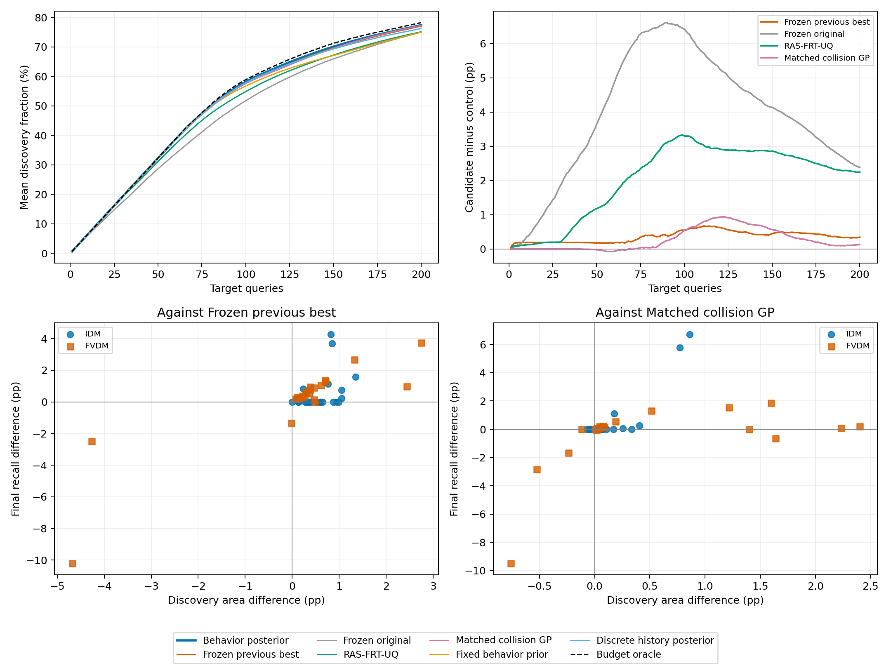

# 行为后验方法的完整独立确认

共同主指标验收：**未通过**。

48 个新系统参数配置，每配置两个 2048 场景池，五个冻结网络种子。每方法每次运行 200 次不重复查询。统计单位为系统配置，先在配置内平均十个内部重复，再报告配置均值 ± 样本标准差。速度和最终召回分别验收。

## 完整方法比较

| 方法 | 归一化发现面积 (%) | 最终召回 (%) | F10 | F30 | F50 | F100 | F150 | F200 | 遗漏数 | 找全比例 (%) | 预算上界达到率 (%) |
|---|---:|---:|---:|---:|---:|---:|---:|---:|---:|---:|---:|
|行为后验候选|50.513 ± 24.577|77.342 ± 27.136|10.000 ± 0.000|30.000 ± 0.000|49.985 ± 0.101|94.829 ± 9.140|126.319 ± 29.238|151.054 ± 49.975|109.185 ± 155.181|45.417 ± 49.118|98.986 ± 2.257|
|此前六源冻结最佳|50.147 ± 24.550|76.996 ± 27.314|9.848 ± 0.340|29.848 ± 0.340|49.837 ± 0.338|93.777 ± 8.646|124.892 ± 27.884|149.769 ± 48.577|110.471 ± 155.896|39.792 ± 47.107|98.379 ± 2.254|
|原始冻结方法|46.581 ± 22.494|74.954 ± 26.925|9.679 ± 0.537|27.760 ± 1.548|45.648 ± 2.493|86.025 ± 9.852|118.638 ± 26.243|145.196 ± 46.031|115.044 ± 155.478|26.250 ± 39.927|95.851 ± 4.697|
|RAS-FRT-UQ|48.456 ± 24.076|75.094 ± 27.668|9.908 ± 0.253|29.823 ± 0.385|48.754 ± 1.217|89.808 ± 8.356|119.879 ± 25.207|144.367 ± 44.431|115.873 ± 157.827|33.958 ± 42.010|95.567 ± 4.840|
|同信息碰撞得分 GP|50.238 ± 24.573|77.212 ± 27.283|10.000 ± 0.000|30.000 ± 0.000|50.000 ± 0.000|94.027 ± 9.398|125.129 ± 28.421|150.448 ± 49.049|109.792 ± 155.253|46.667 ± 48.787|98.756 ± 2.450|
|固定行为先验排序|49.161 ± 24.149|74.979 ± 26.330|10.000 ± 0.000|30.000 ± 0.000|49.992 ± 0.058|93.144 ± 9.996|121.456 ± 28.350|146.231 ± 47.658|114.008 ± 153.392|26.458 ± 39.920|96.324 ± 5.357|
|十六历史行为后验|50.084 ± 24.511|76.187 ± 27.088|10.000 ± 0.000|30.000 ± 0.000|49.969 ± 0.126|94.423 ± 9.302|124.923 ± 28.678|148.508 ± 48.830|111.731 ± 154.297|43.333 ± 48.172|97.640 ± 5.436|

总失效数 N 从完整场景池事后计算，未交给选择器。空池统一记面积 0、召回 1。预算上界达到率为 F200/min(200,N)，空池记 1；总遗漏数包含超过预算的失效。曲线中的空池累计发现比例记 0，因此含空池时，曲线终点与表中召回约定有差别。

## 八项预登记主比较

配对差以百分点表示。八项精确双侧符号翻转检验使用 Holm 校正，轮内阈值 0.0125；区间在控制器类型内以系统配置重采样 20000 次。

| 对照 | 指标 | 候选减对照 | 配对 95% CI | 精确 p | Holm p |
|---|---|---:|---:|---:|---:|
|此前六源冻结最佳|发现面积|+0.36583|[+0.01808, +0.65449]|0.027864878|0.083594634|
|此前六源冻结最佳|最终召回|+0.34596|[-0.24477, +0.82664]|0.23843652|0.47687303|
|原始冻结方法|发现面积|+3.93219|[+3.21262, +4.68977]|7.1054274e-15|5.6843419e-14|
|原始冻结方法|最终召回|+2.38838|[+1.47385, +3.39116]|3.0531737e-07|1.8319042e-06|
|RAS-FRT-UQ|发现面积|+2.05658|[+1.63269, +2.49738]|1.0686563e-11|7.4805939e-11|
|RAS-FRT-UQ|最终召回|+2.24798|[+1.37017, +3.15722]|4.4531298e-06|2.2265649e-05|
|同信息碰撞得分 GP|发现面积|+0.27445|[+0.11101, +0.45384]|0.0019966694|0.0079866776|
|同信息碰撞得分 GP|最终召回|+0.12959|[-0.44377, +0.66728]|0.69081232|0.69081232|

未通过的验收条件：

- 此前六源冻结最佳的发现面积未满足正向且显著。
- 此前六源冻结最佳的最终召回未满足正向且显著。
- 相对此前六源冻结最佳的最终召回区间下限未高于零。
- 同信息碰撞得分 GP的最终召回未满足正向且显著。
- 相对同信息碰撞得分 GP的最终召回区间下限未高于零。

## 预算内可找全的场景池

以下为 N≤200 的池上的描述性结果，空池计为已找全。按池及网络重复汇总，不替代以系统配置为统计单位的主检验。

| 方法 | 内部运行数 | 找全比例 (%) | 平均最终召回 (%) | 平均剩余遗漏 |
|---|---:|---:|---:|---:|
|行为后验候选|250|87.200|99.354|0.932|
|此前六源冻结最佳|250|76.400|99.518|0.744|
|原始冻结方法|250|50.400|97.816|3.220|
|RAS-FRT-UQ|250|65.200|98.733|1.888|
|同信息碰撞得分 GP|250|89.600|99.848|0.228|
|固定行为先验排序|250|50.800|97.431|3.820|
|十六历史行为后验|250|83.200|98.948|1.468|

## 控制器类型与目标差异

| 类型 | 方法 | 发现面积 (%) | 最终召回 (%) | F200 |
|---|---|---:|---:|---:|
|IDM|行为后验候选|65.251 ± 19.870|91.735 ± 19.287|122.592 ± 46.716|
|IDM|此前六源冻结最佳|64.681 ± 19.903|91.203 ± 19.618|121.250 ± 44.641|
|IDM|原始冻结方法|60.490 ± 18.623|90.103 ± 19.893|119.058 ± 42.094|
|IDM|RAS-FRT-UQ|62.894 ± 19.753|90.631 ± 20.151|119.679 ± 42.307|
|IDM|同信息碰撞得分 GP|65.122 ± 19.954|91.151 ± 19.660|121.179 ± 44.507|
|IDM|固定行为先验排序|64.158 ± 19.879|89.216 ± 19.675|117.829 ± 41.481|
|IDM|十六历史行为后验|64.744 ± 20.260|89.945 ± 20.955|118.154 ± 40.607|
|FVDM|行为后验候选|35.775 ± 19.652|62.949 ± 26.465|179.517 ± 35.079|
|FVDM|此前六源冻结最佳|35.613 ± 19.866|62.788 ± 26.804|178.287 ± 33.642|
|FVDM|原始冻结方法|32.672 ± 16.835|59.804 ± 24.632|171.333 ± 33.647|
|FVDM|RAS-FRT-UQ|34.019 ± 18.955|59.557 ± 25.583|169.054 ± 31.180|
|FVDM|同信息碰撞得分 GP|35.355 ± 19.324|63.274 ± 27.003|179.717 ± 33.875|
|FVDM|固定行为先验排序|34.163 ± 18.088|60.741 ± 24.628|174.633 ± 35.174|
|FVDM|十六历史行为后验|35.424 ± 19.203|62.428 ± 25.792|178.862 ± 36.063|

每个目标的单元格为“面积百分比 / 召回百分比”。

| 目标 |行为后验候选|此前六源冻结最佳|原始冻结方法|RAS-FRT-UQ|同信息碰撞得分 GP|固定行为先验排序|十六历史行为后验|
|---|---:|---:|---:|---:|---:|---:|---:|
|idm_00|76.264 / 100.000|75.918 / 100.000|71.439 / 98.901|74.245 / 100.000|76.276 / 100.000|75.205 / 99.890|76.266 / 100.000|
|idm_01|62.343 / 100.000|61.471 / 100.000|55.796 / 96.348|58.739 / 99.466|62.088 / 99.934|58.788 / 91.074|61.673 / 99.597|
|idm_02|45.582 / 89.596|44.763 / 85.325|41.645 / 79.861|42.439 / 81.330|44.722 / 82.877|43.698 / 75.229|42.399 / 72.318|
|idm_03|79.850 / 100.000|79.251 / 100.000|74.565 / 100.000|77.874 / 100.000|79.742 / 100.000|79.416 / 99.631|79.456 / 100.000|
|idm_04|63.672 / 100.000|62.623 / 99.247|57.819 / 99.109|59.089 / 100.000|63.716 / 100.000|60.674 / 93.557|63.575 / 100.000|
|idm_05|75.303 / 100.000|75.176 / 100.000|69.686 / 99.000|72.900 / 99.492|75.309 / 100.000|74.672 / 99.398|75.288 / 100.000|
|idm_06|79.012 / 100.000|79.019 / 100.000|74.487 / 100.000|78.243 / 100.000|78.982 / 100.000|78.938 / 99.882|78.967 / 100.000|
|idm_07|82.808 / 100.000|82.437 / 100.000|78.531 / 100.000|80.834 / 99.861|82.730 / 100.000|82.096 / 99.722|82.708 / 100.000|
|idm_08|31.945 / 61.981|31.183 / 60.835|29.900 / 58.626|30.164 / 59.173|31.769 / 60.868|31.631 / 59.623|30.995 / 55.882|
|idm_09|67.041 / 100.000|65.994 / 99.767|60.032 / 98.183|63.175 / 99.627|67.007 / 100.000|65.160 / 97.569|66.832 / 100.000|
|idm_10|79.153 / 100.000|78.207 / 100.000|73.605 / 99.390|76.578 / 99.390|79.154 / 100.000|78.109 / 100.000|79.018 / 100.000|
|idm_11|77.238 / 100.000|76.858 / 100.000|72.162 / 99.438|75.434 / 99.894|77.285 / 100.000|76.898 / 99.888|77.111 / 100.000|
|idm_12|77.123 / 100.000|76.774 / 100.000|72.061 / 99.888|75.481 / 100.000|77.162 / 100.000|76.191 / 99.888|77.084 / 100.000|
|idm_13|80.059 / 100.000|79.469 / 100.000|75.928 / 100.000|77.813 / 99.730|79.994 / 100.000|79.443 / 99.632|79.585 / 100.000|
|idm_14|75.524 / 100.000|75.389 / 100.000|70.598 / 100.000|73.998 / 100.000|75.595 / 100.000|75.191 / 99.798|75.472 / 100.000|
|idm_15|72.826 / 100.000|72.178 / 100.000|66.477 / 100.000|69.564 / 99.631|72.421 / 99.723|72.340 / 99.813|72.332 / 100.000|
|idm_16|39.020 / 77.421|38.169 / 73.722|36.307 / 69.913|36.541 / 71.152|38.250 / 71.654|37.606 / 67.632|35.375 / 59.096|
|idm_17|83.997 / 100.000|83.462 / 100.000|80.361 / 100.000|82.402 / 100.000|83.939 / 100.000|83.255 / 99.844|83.840 / 100.000|
|idm_18|58.583 / 100.000|57.234 / 98.427|51.910 / 94.987|54.452 / 98.054|58.412 / 100.000|55.558 / 89.317|57.626 / 99.216|
|idm_19|77.259 / 100.000|76.981 / 100.000|71.636 / 99.789|75.822 / 100.000|77.267 / 100.000|77.074 / 99.895|77.278 / 100.000|
|idm_20|16.598 / 33.031|16.480 / 32.783|16.168 / 32.304|16.102 / 31.710|16.595 / 33.015|16.569 / 32.932|16.598 / 33.031|
|idm_21|19.902 / 39.606|19.672 / 38.775|19.312 / 38.361|18.914 / 37.310|19.895 / 39.548|19.876 / 39.507|19.901 / 39.547|
|idm_22|69.188 / 100.000|68.201 / 100.000|62.268 / 98.370|65.527 / 99.426|68.853 / 100.000|67.637 / 98.290|68.785 / 100.000|
|idm_23|75.726 / 100.000|75.430 / 100.000|69.059 / 100.000|73.120 / 99.894|75.760 / 100.000|73.767 / 99.178|75.681 / 100.000|
|fvdm_00|16.197 / 32.233|16.041 / 31.991|15.880 / 31.687|15.894 / 30.896|16.146 / 32.120|16.087 / 32.007|16.197 / 32.233|
|fvdm_01|17.064 / 33.957|16.991 / 33.770|16.427 / 32.954|16.707 / 32.515|17.056 / 33.940|17.039 / 33.889|17.064 / 33.957|
|fvdm_02|65.361 / 100.000|62.924 / 99.023|54.021 / 93.835|61.074 / 96.617|63.127 / 99.925|59.632 / 95.564|64.312 / 99.925|
|fvdm_03|18.544 / 36.904|18.430 / 36.609|17.495 / 35.262|18.182 / 35.372|18.515 / 36.830|18.529 / 36.811|18.544 / 36.904|
|fvdm_04|17.710 / 35.243|17.413 / 34.680|17.091 / 34.239|17.290 / 33.692|17.636 / 35.067|17.599 / 34.962|17.710 / 35.243|
|fvdm_05|24.335 / 48.388|24.043 / 47.758|23.943 / 47.370|22.955 / 45.236|24.259 / 48.145|24.229 / 47.903|24.165 / 48.001|
|fvdm_06|56.847 / 99.113|56.140 / 97.811|48.064 / 86.934|52.294 / 91.894|55.208 / 99.765|50.964 / 91.884|56.837 / 99.763|
|fvdm_07|19.591 / 38.987|19.307 / 38.402|19.118 / 38.148|18.987 / 36.901|19.591 / 38.987|19.546 / 38.850|19.591 / 38.987|
|fvdm_08|28.367 / 56.354|27.672 / 54.994|26.573 / 53.070|26.650 / 52.477|28.350 / 56.409|28.289 / 56.182|28.431 / 56.580|
|fvdm_09|43.071 / 83.305|42.704 / 82.760|38.924 / 75.517|38.822 / 72.815|41.854 / 81.749|39.953 / 73.076|42.573 / 81.916|
|fvdm_10|20.529 / 40.838|20.153 / 40.062|19.387 / 39.041|19.905 / 38.856|20.514 / 40.818|20.477 / 40.715|20.531 / 40.858|
|fvdm_11|25.266 / 48.877|25.285 / 50.221|24.473 / 48.796|24.246 / 47.725|25.503 / 50.550|25.448 / 50.322|25.525 / 50.626|
|fvdm_12|38.373 / 74.684|37.913 / 74.541|35.999 / 69.781|35.323 / 67.666|37.861 / 73.361|37.298 / 70.039|37.964 / 72.440|
|fvdm_13|47.649 / 88.993|46.331 / 86.316|41.466 / 79.640|42.773 / 78.514|46.251 / 89.000|44.580 / 78.985|46.618 / 85.766|
|fvdm_14|64.636 / 97.165|68.906 / 99.656|59.504 / 98.024|66.682 / 99.740|65.161 / 100.000|60.621 / 99.216|62.044 / 91.773|
|fvdm_15|56.124 / 88.929|60.807 / 99.121|51.312 / 93.164|56.317 / 95.167|56.885 / 98.402|50.009 / 89.111|54.019 / 86.125|
|fvdm_16|13.862 / 27.587|13.648 / 27.201|13.809 / 27.381|13.679 / 26.470|13.796 / 27.408|13.723 / 27.284|13.862 / 27.587|
|fvdm_17|15.753 / 31.349|15.621 / 31.114|15.348 / 30.738|15.326 / 29.593|15.686 / 31.208|15.652 / 31.161|15.753 / 31.349|
|fvdm_18|26.690 / 53.027|26.077 / 51.959|25.474 / 50.716|25.123 / 49.454|26.602 / 52.868|26.590 / 52.465|26.708 / 53.107|
|fvdm_19|43.502 / 85.278|43.119 / 84.332|39.187 / 72.861|39.631 / 73.963|41.904 / 83.408|39.736 / 74.368|43.803 / 86.151|
|fvdm_20|60.295 / 98.651|57.550 / 94.901|50.616 / 90.776|54.427 / 91.027|57.892 / 98.458|55.359 / 93.722|58.918 / 97.291|
|fvdm_21|28.223 / 56.051|27.761 / 55.148|27.181 / 53.513|26.485 / 52.327|28.035 / 55.486|28.113 / 55.232|28.348 / 56.361|
|fvdm_22|82.910 / 100.000|82.432 / 100.000|76.575 / 99.275|81.616 / 99.420|83.028 / 100.000|82.792 / 100.000|82.778 / 100.000|
|fvdm_23|27.699 / 54.863|27.442 / 54.557|26.250 / 52.580|26.061 / 51.030|27.658 / 54.670|27.651 / 54.029|27.889 / 55.335|

## 原始池完整现有 baseline

以下为原冻结场景池的完整结果；与新系统确认队列分别报告。

原始 2048 候选池已用于开发，全部测量得到 84 个碰撞、46 个碰撞参数格。下表保留九个基线、冻结主方法及六个既有消融，另列新方法的五种子复核。数值为均值 ± 五种子样本标准差；该表不计入新池确认统计。

|方法|F10|F30|F50|F100|F150|F200|平均累计碰撞发现数|
|---|---:|---:|---:|---:|---:|---:|---:|
|新方法|9.40 ± 0.55|29.40 ± 0.55|49.40 ± 0.55|78.20 ± 0.84|83.00 ± 1.22|84.00 ± 0.00|64.167 ± 0.542|
|冻结历史引导 GP|8.20 ± 0.45|23.00 ± 1.00|39.60 ± 0.55|65.80 ± 0.45|77.60 ± 2.30|84.00 ± 0.00|57.563 ± 0.500|
|Uniform random|0.20 ± 0.45|0.80 ± 0.84|2.60 ± 1.67|3.80 ± 2.28|6.20 ± 2.17|8.20 ± 2.17|4.163 ± 1.626|
|Farthest-first|1.20 ± 0.84|3.00 ± 1.00|4.00 ± 1.58|6.40 ± 1.67|8.20 ± 1.79|10.40 ± 1.14|6.118 ± 1.040|
|历史 kNN 排序|9.00 ± 0.00|25.00 ± 0.00|44.00 ± 0.00|62.00 ± 0.00|69.00 ± 0.00|72.00 ± 0.00|53.290 ± 0.000|
|GP-UCB|0.40 ± 0.55|5.60 ± 3.13|9.60 ± 2.07|14.00 ± 3.24|18.40 ± 2.70|24.00 ± 3.94|13.183 ± 2.316|
|GP-EI|0.40 ± 0.55|9.40 ± 6.43|21.20 ± 6.14|44.80 ± 4.44|54.80 ± 4.09|68.80 ± 2.68|38.849 ± 2.963|
|RF surrogate BO|0.40 ± 0.55|6.40 ± 5.03|14.60 ± 10.36|40.40 ± 16.94|60.00 ± 10.93|68.40 ± 3.78|37.858 ± 9.108|
|BOP-Elites|0.40 ± 0.55|9.80 ± 6.50|20.40 ± 6.02|32.60 ± 1.52|39.20 ± 2.59|45.40 ± 0.89|28.671 ± 2.698|
|BAS|0.40 ± 0.55|0.40 ± 0.55|0.80 ± 0.84|2.20 ± 0.84|4.20 ± 0.84|6.80 ± 2.05|2.620 ± 0.256|
|RAS-FRT-UQ|9.60 ± 0.55|29.00 ± 0.00|48.00 ± 0.00|73.20 ± 1.30|78.40 ± 4.93|82.40 ± 0.55|61.628 ± 1.372|
|冻结消融：紧支撑多尺度核|9.00 ± 0.00|25.00 ± 0.00|38.00 ± 0.00|71.00 ± 0.00|81.00 ± 0.00|83.00 ± 0.00|59.513 ± 0.019|
|冻结消融：紧支撑固定多尺度核|9.00 ± 0.00|24.00 ± 0.00|39.80 ± 0.45|69.00 ± 0.00|81.00 ± 0.00|83.00 ± 0.00|59.610 ± 0.015|
|冻结消融：紧支撑单尺度核|9.00 ± 0.00|23.00 ± 0.00|39.00 ± 0.00|70.00 ± 0.00|81.00 ± 0.00|83.00 ± 0.00|59.206 ± 0.011|
|冻结消融：混合 QD/风险采集|8.20 ± 0.45|23.20 ± 0.84|37.60 ± 1.52|67.00 ± 1.22|77.00 ± 2.83|83.80 ± 0.45|57.100 ± 0.643|
|冻结消融：单一历史来源|8.00 ± 0.00|25.00 ± 0.00|41.20 ± 0.45|70.00 ± 0.00|73.60 ± 0.55|80.00 ± 2.24|56.572 ± 0.283|
|冻结消融：常数先验|3.00 ± 2.92|7.80 ± 6.46|13.40 ± 11.01|22.20 ± 23.40|23.40 ± 24.01|25.40 ± 27.32|18.142 ± 18.225|

原始冻结逐种子记录还包括碰撞召回率、碰撞格召回率、切入与急刹碰撞数、Risk QDScore；完整数据见 [comparison_summary.json](../../results/history_guided_testing/comparison_summary.json)。

## 训练信息、核验与范围

65536 response labels from sixteen profiles train the conditional predictor; 32768 labels and known configurations from eight additional historical profiles validate it and calibrate risk model error。同信息 GP、固定行为排序和离散行为后验使用同一条件预测器，原六源方法与 RAS 保留冻结训练输入。

完整池测量 196608 次，独立物理复跑 384 次；逐项核验 672000 条查询反馈。原始 176 个冻结文件、第一轮 195 个封存输入保持不变，本轮 283 个输入与封存字节一致。精确检验独立复算，bootstrap 用计数实现复算，均通过核验。

范围为声明区间的 IDM/FVDM 参数族、当前 highway-env 仿真器及两个有限候选场景族。精确符号翻转检验依赖零假设下配对差符号可交换。性能优势与方法创新分别判断；有限池找全不等价于连续场景空间覆盖。

