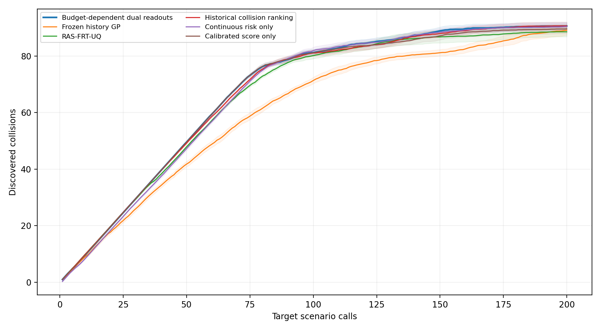

# 历史响应引导的预算条件化风险测试

20 个新 Sobol 场景池的锁定确认结果通过预先登记的成功标准：平均累计碰撞发现数相对冻结主方法提高 **11.12%**，相对 RAS-FRT-UQ 提高 **2.26%**。

## 方法与参数

两个场景族分别训练历史响应网络：4→64→128→64→12，隐藏层为 SiLU，输出六个历史 SUT 的风险和六个碰撞辅助分数。风险头使用 sigmoid；损失为风险加权 MSE（权重 1+4R）加 0.1 倍碰撞 BCE。2048 个共享历史坐标按空间划分为训练 1638、验证 410，共有六来源的 12288 条响应。五个训练种子为 11、23、37、53、71；400 轮、批量 128、AdamW 学习率 0.001、权重衰减 0.0001，每 10 轮用历史验证集选择检查点。

**来源权重 w 是固定的机制组均衡规则。** reactive、delay、limited、predictive 四组各占 1/4，组内平均，按历史来源顺序得到 (1/8,1/8,1/8,1/8,1/4,1/4)。两个 GP 的初始均值分别为 Σwₖrₖ(x) 和 Σwₖcₖ(x)。该规则避免成员数量较多的组占比过大，但没有估计哪个历史来源适合当前目标；w 不由目标反馈更新，也没有单独实验支持这组权重最优。当前方法尚未实现附件建议的来源可信度后验。

核保留完整六维历史风险响应向量，不先进行加权平均。核为 0.25²×[0.9 Matérn-5/2(历史响应距离，长度 0.05)+0.1 Matérn-5/2(归一化物理参数距离，长度 0.2)]。响应距离除以 √6；两个场景族间协方差为零。历史网络、来源权重和核参数在目标测试期间冻结。

GP 有连续风险和校准分数两个回归输出，分别维护条件均值，共享条件协方差。一次查询只接收目标连续风险 R，再生成 g_f(R)=sigmoid(a_fR+b_f)，以 [R,g_f(R)] 更新两个输出。校准只使用历史训练坐标的风险与真实碰撞标签：切入 (a,b)=(30.911232,−22.678113)，急刹 (31.230847,−24.695261)。sigmoid 用在校准反馈上，没有套在 GP 外面；校准分数也没有被证明是新 SUT 的真实碰撞概率。工作回归正则方差为 0.05。

已查询 t 次、预算 B=200 时，αₜ=1−t/B，下一点最大化：

```text
A_t(x) = (1−α_t) E[clip(R(x),0,1)] + α_t E[clip(C(x),0,1)]
```

期望由 GP 的均值和标准差共同计算。早期侧重校准分数，随后增加连续风险输出的权重。目标反馈通过 GP 修正历史均值附近的预测，没有改变来源权重。最终方法不包含来源后验或多步前瞻。

## 实验设置与指标

实际仿真器为 highway-env 1.9.1；运行环境为 conda metadrive、PyTorch 2.5.0+cu118、RTX 4090 D。两车道、12 s、20 Hz、ego 初速 25 m/s；固定目标 FVDM 期望速度 23 m/s、最大制动 8 m/s²、停车间距 8 m、感知延迟 0.15 s、敏感度 0.5、速度增益 0.8、转换间距 8 m。

|场景族|四个可变参数及范围|
|---|---|
|切入|初始间距 8–60 m；前车速度 15–25 m/s；切入时间 1.5–3 s；开始时间 0.5–2 s|
|前车急刹|初始间距 8–70 m；前车速度 15–25 m/s；制动减速度 0.5–7 m/s²；开始时间 0.5–2 s|

每个确认池包含每族 1024 个候选，共 2048 个；20 池使用不同 Sobol 种子，与历史、原始目标池及第一轮确认坐标不重叠。五个冻结模型均衡使用，每个模型对应四池；每方法每池查询 200 次。RAS 接收查询点的二值碰撞，其他方法只接收连续风险。独立统计单位为场景池。这里只改变场景坐标，没有更换目标控制器类型。

Fₙ 表示前 n 次查询发现的真实碰撞数。主指标为 (1/200)Σₜ₌₁²⁰⁰Fₜ，活动字段名为 `mean_cumulative_collisions`。它衡量发现速度和数量，原字段 `discovery_auc` 的数值保持一致；没有百分比归一化，即使 F200 找齐碰撞，也不等于 100%。

**Risk QDScore 仅为次级评价指标。** 每个场景族的四维参数各划分四格，共 2×4⁴=512 格；每格保存已查询样本的最大 max(R−0.5,0)，再求和。它同时反映风险强度和参数空间覆盖，不参与当前方法的选点、GP 更新、预算分配或主成功判定。高风险 R>0.5 与真实碰撞分别评价；参数网格覆盖不等同于事故机制覆盖。冻结的 `mixed_acquisition` 消融曾将 QD 用于选点，其结果继续保留；当前主方法没有采用该选点规则。

## 20 池确认结果

以下为均值 ± 池间样本标准差。

|方法|F10|F50|F100|F200|平均累计碰撞发现数|
|---|---:|---:|---:|---:|---:|
|预算条件化双输出 GP|9.65 ± 0.49|49.60 ± 0.50|81.20 ± 2.59|90.60 ± 3.02|67.670 ± 1.458|
|冻结历史引导 GP|9.05 ± 1.28|41.80 ± 2.19|71.35 ± 2.56|89.10 ± 3.93|60.899 ± 1.836|
|RAS-FRT-UQ|9.95 ± 0.22|47.90 ± 0.79|80.15 ± 2.50|88.55 ± 3.97|66.173 ± 2.006|
|神经历史碰撞固定排序|9.90 ± 0.31|49.20 ± 0.89|81.05 ± 2.50|90.65 ± 3.12|67.247 ± 1.555|
|单独连续风险输出|8.40 ± 0.75|47.25 ± 1.52|81.90 ± 2.67|90.40 ± 2.89|66.888 ± 1.441|
|单独校准分数输出|9.65 ± 0.49|49.60 ± 0.50|81.15 ± 2.28|89.60 ± 3.63|67.152 ± 1.555|

|新方法减对照|主指标差值|成对 bootstrap 95% CI|轮内 Holm p|多轮校正 p|
|---|---:|---:|---:|---:|
|冻结历史引导 GP|6.771|[6.287, 7.229]|0.00000381|0.00002289|
|RAS-FRT-UQ|1.497|[0.894, 2.184]|0.00002861|0.00017166|

主检验为双侧精确成对符号翻转；两个主比较作 Holm 校正，第二轮阈值为 0.05/(2×3)=0.008333。表中多轮校正 p 为轮内 p×6。成功条件要求两个主比较均为显著正增益、相对 RAS 的主指标增益至少为 1，且两个 F200 成对差的 95% CI 下界均不低于 −1。符号翻转检验使用零假设下成对差符号可交换的假设。

新方法相对 冻结历史引导 GP 的 F200 差为 +1.50，95% CI [0.80, 2.30]。
新方法相对 RAS-FRT-UQ 的 F200 差为 +2.05，95% CI [1.00, 3.25]。

|方法|F200 碰撞参数格数|F200 Risk QDScore|
|---|---:|---:|
|预算条件化双输出 GP|48.70 ± 2.62|25.330 ± 1.272|
|冻结历史引导 GP|47.30 ± 2.87|24.457 ± 1.407|
|RAS-FRT-UQ|46.90 ± 3.14|24.335 ± 1.549|
|神经历史碰撞固定排序|48.80 ± 2.65|25.345 ± 1.251|
|单独连续风险输出|48.55 ± 2.52|25.258 ± 1.202|
|单独校准分数输出|47.80 ± 3.30|24.655 ± 1.670|



阴影为逐点近似 95% 标准误区间。新方法的主指标在六个确认配置中最高；F10、F100、F200 与 QDScore 各有其他配置取得更高均值。其余八个外部基线没有在新池上重跑，因此优势结论对应登记的两个主对照。新池只测量被查询的候选，没有全池碰撞总数与全池召回率。

组件比较只作为次级证据：

|新方法减组件对照|主指标差值|成对 95% CI|
|---|---:|---:|
|神经历史碰撞固定排序|0.423|[0.168, 0.659]|
|单独连续风险输出|0.782|[0.513, 1.022]|
|单独校准分数输出|0.518|[0.329, 0.720]|

## 原始池的完整现有对照

原始 2048 候选池已用于开发，全部测量得到 84 个碰撞、46 个碰撞参数格。下表保留九个基线、冻结主方法及六个既有消融，另列新方法的五种子复核。数值为均值 ± 五种子样本标准差；该表不计入新池确认统计。

|方法|F10|F30|F50|F100|F150|F200|平均累计碰撞发现数|
|---|---:|---:|---:|---:|---:|---:|---:|
|新方法|9.40 ± 0.55|29.40 ± 0.55|49.40 ± 0.55|78.20 ± 0.84|83.00 ± 1.22|84.00 ± 0.00|64.167 ± 0.542|
|冻结历史引导 GP|8.20 ± 0.45|23.00 ± 1.00|39.60 ± 0.55|65.80 ± 0.45|77.60 ± 2.30|84.00 ± 0.00|57.563 ± 0.500|
|Uniform random|0.20 ± 0.45|0.80 ± 0.84|2.60 ± 1.67|3.80 ± 2.28|6.20 ± 2.17|8.20 ± 2.17|4.163 ± 1.626|
|Farthest-first|1.20 ± 0.84|3.00 ± 1.00|4.00 ± 1.58|6.40 ± 1.67|8.20 ± 1.79|10.40 ± 1.14|6.118 ± 1.040|
|历史 kNN 排序|9.00 ± 0.00|25.00 ± 0.00|44.00 ± 0.00|62.00 ± 0.00|69.00 ± 0.00|72.00 ± 0.00|53.290 ± 0.000|
|GP-UCB|0.40 ± 0.55|5.60 ± 3.13|9.60 ± 2.07|14.00 ± 3.24|18.40 ± 2.70|24.00 ± 3.94|13.183 ± 2.316|
|GP-EI|0.40 ± 0.55|9.40 ± 6.43|21.20 ± 6.14|44.80 ± 4.44|54.80 ± 4.09|68.80 ± 2.68|38.849 ± 2.963|
|RF surrogate BO|0.40 ± 0.55|6.40 ± 5.03|14.60 ± 10.36|40.40 ± 16.94|60.00 ± 10.93|68.40 ± 3.78|37.858 ± 9.108|
|BOP-Elites|0.40 ± 0.55|9.80 ± 6.50|20.40 ± 6.02|32.60 ± 1.52|39.20 ± 2.59|45.40 ± 0.89|28.671 ± 2.698|
|BAS|0.40 ± 0.55|0.40 ± 0.55|0.80 ± 0.84|2.20 ± 0.84|4.20 ± 0.84|6.80 ± 2.05|2.620 ± 0.256|
|RAS-FRT-UQ|9.60 ± 0.55|29.00 ± 0.00|48.00 ± 0.00|73.20 ± 1.30|78.40 ± 4.93|82.40 ± 0.55|61.628 ± 1.372|
|冻结消融：紧支撑多尺度核|9.00 ± 0.00|25.00 ± 0.00|38.00 ± 0.00|71.00 ± 0.00|81.00 ± 0.00|83.00 ± 0.00|59.513 ± 0.019|
|冻结消融：紧支撑固定多尺度核|9.00 ± 0.00|24.00 ± 0.00|39.80 ± 0.45|69.00 ± 0.00|81.00 ± 0.00|83.00 ± 0.00|59.610 ± 0.015|
|冻结消融：紧支撑单尺度核|9.00 ± 0.00|23.00 ± 0.00|39.00 ± 0.00|70.00 ± 0.00|81.00 ± 0.00|83.00 ± 0.00|59.206 ± 0.011|
|冻结消融：混合 QD/风险采集|8.20 ± 0.45|23.20 ± 0.84|37.60 ± 1.52|67.00 ± 1.22|77.00 ± 2.83|83.80 ± 0.45|57.100 ± 0.643|
|冻结消融：单一历史来源|8.00 ± 0.00|25.00 ± 0.00|41.20 ± 0.45|70.00 ± 0.00|73.60 ± 0.55|80.00 ± 2.24|56.572 ± 0.283|
|冻结消融：常数先验|3.00 ± 2.92|7.80 ± 6.46|13.40 ± 11.01|22.20 ± 23.40|23.40 ± 24.01|25.40 ± 27.32|18.142 ± 18.225|

原始冻结逐种子记录还包括碰撞召回率、碰撞格召回率、切入与急刹碰撞数、Risk QDScore；完整数据见 [comparison_summary.json](../../results/history_guided_testing/comparison_summary.json)。

## 预测与组留出诊断

固定随机反馈点诊断在原始池上使用 10、20、50、100 个相同反馈点，评估未查询候选；下表为五种子与四个反馈规模的平均，不用于确认成功判定。

|模型|总体风险 RMSE|高风险 RMSE|高风险 AP|
|---|---:|---:|---:|
|历史 kNN 先验|0.1343|0.2050|0.6884|
|冻结反馈模型|0.0916|0.2223|0.7636|
|神经历史风险先验|0.1308|0.1528|0.8203|
|新方法风险输出|0.0982|0.1482|0.8360|

完整机制组留出从网络梯度、检查点选择和校准中同时排除待测组，使用固定开发超参数、410 个验证坐标和 200 次预算；它是机制诊断，没有被计作六次独立盲测。

|排除组|待测历史 SUT|池内碰撞数|F50|F100|F200|
|---|---|---:|---:|---:|---:|
|reactive|idm_reactive|20|20|20|20|
|reactive|fvdm_reactive|28|27|27|28|
|delay|idm_delayed|42|36|42|42|
|delay|fvdm_delayed|117|49|84|117|
|limited|idm_limited|135|49|90|135|
|predictive|idm_predictive|17|17|17|17|

## 主链、归档与运行

|位置|职责|
|---|---|
|`config.py`|固定实验参数与目录|
|`history_model.py`、`calibration.py`|历史响应网络与历史风险校准|
|`kernel.py`、`session.py`|历史响应核、两个 GP 输出和顺序选点|
|`scenarios.py`、`experiment.py`|确认池生成、查询隔离与物理执行|
|`evaluate.py`、`original_pool.py`|确认统计、原始池对照|
|`prediction_diagnostics.py`、`group_validation.py`|预测与机制组留出诊断|
|`report.py`、`run.py`、`verify.py`、`test_method.py`|报告、统一入口、独立证据核验和测试|
|`results/models/`|五个锁定历史模型|
|`results/final_confirmation/`|事前配置、20 池场景、真实查询记录、选择序列、统计和曲线|
|`results/original_pool/`|新方法在原始池的五种子记录|
|`results/prediction_diagnostics.json`、`group_validation.json`、`verification.json`|诊断与核验记录|
|`archives/baseline.zip`、`baseline_manifest.json`|原始方法和实验冻结快照|
|`archives/development.zip`、`development_summary.json`、`cleanup.json`|清理前完整快照、开发摘要和清理清单|

```powershell
conda activate metadrive
python -B -m research.history_response_testing.run
```

统一入口复用已保存模型和选择序列，重新生成统计与报告；缺少的确认序列按锁定配置执行。组留出训练在结果缺失时执行。完整证据核验单独运行：

```powershell
python -B -m research.history_response_testing.verify
python -B -m pytest -q -p no:cacheprovider research/history_response_testing/test_method.py tests/history_guided_testing
```

开发阶段共保存 499 次回放。第一轮 10 池单输出方法对 RAS 的主指标差为 0.8015，Holm p=0.07422，未通过成功标准，随后转为开发数据。最终确认另外使用 20 个新坐标池。淘汰分支包括来源后验与 ENS 原型，完整源码、试验及第一轮数据均在归档中。

第一轮确认执行 3330 次独立物理查询，后续开发新增 306 次；最终确认执行 6710 次，对应各方法合计 24000 次查询。物理缓存只减少重复执行，各方法仍各计 200 次预算。

清理前快照逐文件验证 812 个文件后，从活动目录移除 611 个旧分支、重复封装和开发结果文件。快照 ZIP 内保留原始目录名 `research/response_hypothesis_testing/`；恢复时解压到独立空目录，再按清单提取所需文件。

锁定协议中的旧源码名、模型文件中的 `emulator`、场景 ID 中的 `fresh_confirmation` 和方法键 `candidate`/`main` 保留为原始记录标识。活动代码没有旧包名导入、转发模块或兼容分支。

独立核验记录：原始冻结文件 176 个保持不变；12000 次选点与已保存序列逐点一致，6 次物理复跑的风险和碰撞一致。清理后的检查状态见 [cleanup.json](archives/cleanup.json)。

工程约束与研究取舍参考 [编码规范](../../docs/style.md) 和 [附件论文评估](../../docs/Attachment_Paper_Review_and_Research_Directions.md)。
