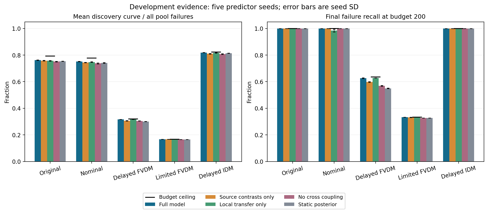
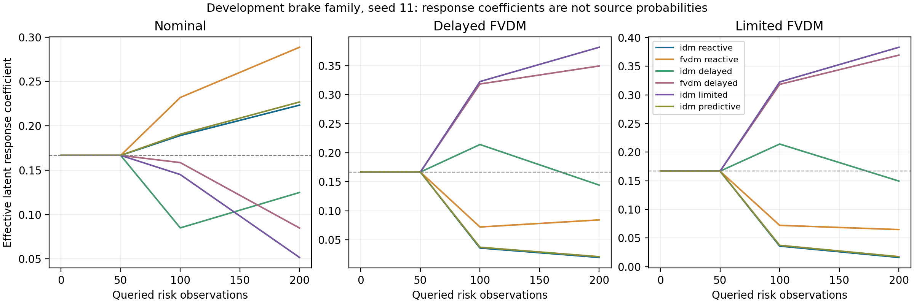

# 目标响应适配与失效发现

第一轮冻结实现是**历史任务学习的联合风险—失效 GP，利用目标风险反馈更新响应系数与局部差异，按后验失效概率选例**。该轮独立确认未通过；本目录继续开展学习初始均值、响应映射与预算相关训练的开发。原始方法、此前最佳方法及第一轮锁定输入保持冻结。

本方法取消手工机制组权重，但仍有历史数据给出的初始先验。在线变化的是响应系数后验和目标函数后验；不能声称没有初始化，也不能把响应系数解释为控制器身份概率。

## 当前方法

完整公式、可辨识条件和证据范围见 [方法设计](design.md)。

- 历史预测器分别保留六个系统的风险预测和碰撞概率预测。
- 风险使用 logit 坐标，碰撞概率使用 probit 潜在坐标；截断常量为 1e-4。
- 联合模型包含共享的历史响应对比系数、风险局部差异，以及不能被风险反馈直接消除的独立失效差异。
- 局部风险—失效加载函数使用 softplus，系数由历史元任务学习。
- 新目标在线只反馈已查询场景的连续风险；不生成第二条伪碰撞观测。
- 当前候选直接选择后验失效概率最大的未测候选，200 次预算内不重复。前瞻和来源身份混合模型是开发对照，未进入当前锁定候选。
- Risk QDScore 和参数格覆盖仅用于附加评价，不参与当前训练、选点或主要验收。

## 学习与实验设置

历史数据为 2048 个共享场景坐标、六个历史系统，共 12288 条风险与碰撞响应。每个场景族的历史网络结构为 4–64–128–64–12，使用 SiLU；保留原有五个网络种子 11、23、37、53、71。

元训练在历史任务上采样 10、30、60、100 条风险上下文，以未进入上下文的历史碰撞标签做离线监督。查询集含 192 个平衡正负样本；概率损失按真实历史发生率修正。损失为排序损失加 0.1 倍概率损失，Adam 学习率 0.01。当前参数来自 logit 方案第 600 步检查点。整组历史留出排除的是预测器训练中的目标机制组；六个历史任务的真实响应仍用于元参数训练，因此该对照不属于独立元测试。

物理实验实际使用 highway-env 1.9.1：两车道、12 秒闭环、20 Hz，两个场景族各 1024 个候选。`metadrive` 是 GPU 环境名。确认实验改变 IDM/FVDM 的制动能力、期望间距和感知延迟，其他物理设置沿用冻结基线。

当前标量参数为：来源协方差幅度 eta=0.03305、风险局部标准差 1.36123、独立失效局部标准差 0.35573、风险工作观测方差 2.75557、响应距离核长度 0.58364、经验灵敏度正则 1.35026。加载系数和失效均值偏置的完整数值见锁定协议。目标控制器类型及真实制动、间距、延迟参数不提供给选择器。

## 两个同等重要的主要指标

平均累计真实碰撞数为 `mean(F1,...,F200)`，同时反映发现数量和发现时机。最终召回率为 `F200/完整池真实失效数`。两者分别验收，不能以加权总分掩盖其中一个指标退步。

同时报告 F50、F100、F200、遗漏数量、是否找全和找全所需查询数。候选池失效总数超过 200 时，全召回在该预算下不可实现，因此另报 `F200/min(200,失效总数)`。即使最终找全，发现曲线面积通常仍低于 100%，因为前面的查询尚未找全。

若池中有 N>0 个失效，预算为 B，则归一化发现面积的理想上限为 `mean(min(t,N), t=1..B)/N`。原始 N=84、B=200 时，上限也只有 79.25%；这是逐次查询的计数约束，不是分类 ROC-AUC。最终召回率的理想上限为 `min(B,N)/N`。

## 完整开发池结果

下表为五个历史网络种子的平均值，单元格为“平均累计真实碰撞数 / F200”。这些池已经用于方法选择，不能作为独立显著性证据。

| 方法 | 名义目标（90 个失效） | 延迟 FVDM（315） | 受限制 FVDM（601） | 延迟 IDM（72） |
|---|---:|---:|---:|---:|
| 当前候选 | 67.692 / 90.0 | 99.714 / 197.2 | 100.500 / 200.0 | 58.954 / 72.0 |
| 此前最佳 | 67.276 / 89.6 | 97.810 / 194.6 | 99.942 / 198.2 | 58.873 / 72.0 |
| 冻结原始方法 | 60.607 / 90.0 | 92.130 / 185.8 | 95.501 / 192.2 | 55.010 / 72.0 |
| RAS-FRT-UQ | 66.645 / 89.2 | 92.577 / 181.0 | 97.573 / 190.2 | 58.169 / 72.0 |
| 固定历史碰撞排序 | 66.861 / 90.0 | 94.703 / 175.0 | 99.518 / 197.0 | 58.483 / 72.0 |

原始 84 失效池上，当前候选为 64.079 / 84，此前最佳为 64.167 / 84。原始池的早期发现尚无优势，不能宣称所有目标都更好。原始方法的全部外部 baseline 结果保留在 [冻结研究目录](../history_response_testing/README.md)。

## 组件对照

以下对照固定当前学习参数，移除指定结构后不重新训练。五个池、五个网络种子、五个配置，共 125 次运行；单元格同上。

| 配置 | 原始池 | 名义目标 | 延迟 FVDM | 受限制 FVDM | 延迟 IDM |
|---|---:|---:|---:|---:|---:|
| 完整模型 | 64.079 / 84.0 | 67.692 / 90.0 | 99.714 / 197.2 | 100.500 / 200.0 | 58.954 / 72.0 |
| 仅来源对比 | 63.717 / 84.0 | 66.984 / 90.0 | 96.487 / 188.4 | 100.466 / 199.4 | 58.329 / 72.0 |
| 仅局部迁移 | 63.599 / 84.0 | 67.295 / 88.6 | 100.054 / 198.0 | 100.500 / 200.0 | 58.807 / 72.0 |
| 移除风险—失效交叉项 | 63.120 / 84.0 | 66.374 / 90.0 | 96.035 / 179.4 | 99.439 / 197.0 | 58.157 / 72.0 |
| 不更新初始后验 | 63.341 / 84.0 | 66.701 / 90.0 | 94.695 / 173.2 | 99.496 / 197.0 | 58.633 / 72.0 |

局部迁移改善延迟 FVDM 的最终发现；来源对比帮助名义目标减少遗漏。仅局部迁移在延迟 FVDM 上略优于完整模型，因此不能把组件作用表述为对每个目标都单调有益。

响应系数的均值、标准差和协方差轨迹保存在 `results/response_coefficients/`。例如名义目标刹车族的 FVDM reactive 系数由 1/6 更新为约 0.289；受限制 FVDM 的同族 IDM limited 系数更新为约 0.383。这些是潜在响应的函数系数，不是来源身份可信度。

## 独立确认

算法、参数、来源模型与统计协议已在任何新目标结果产生前锁定。确认协议为 24 个新 SUT 参数组合，IDM/FVDM 各 12 个，每个组合两个新的 2048 候选池，共 98304 次完整物理测量。

主要比较为此前最佳、冻结原始方法和 RAS-FRT-UQ；固定历史碰撞排序是附加对照。以 SUT 参数组合为统计单位，先平均两个池和五个网络种子，不能把 240 个内部重复当作独立系统。

六个主要配对检验使用精确双侧符号翻转和 Holm 校正。本轮 alpha=0.025；成功要求两个指标相对三个主要对照均显著提高，且相对此前最佳的两项配对 bootstrap 95% 区间下界均大于零。重复尝试按第 r 轮 0.05/2^r 分配检验额度。未成功的确认数据只能转为开发数据，下一轮使用新参数与新坐标。

选择器隔离运行，只接收历史预测、候选坐标和自己的已查询反馈。完整目标风险及碰撞由评价进程持有，不能用于选点。[锁定协议](results/confirmation/protocol.json) 和输入归档位于 `results/confirmation/`。

第一轮确认已经完成，未通过双主要指标验收。相对此前最佳，归一化发现面积差为 −0.06084 个百分点，最终召回差为 +0.08614 个百分点；两项 Holm p 均为 0.61353，bootstrap 区间均包含零。相对冻结原始方法和 RAS 的两项指标均显著改善，但不足以达到本轮目标。该队列现转为开发数据，下一轮须取新参数组合与新坐标；不能重用它宣称新方法独立显著。

联合模型与贝叶斯更新本身不是新的通用理论；研究价值须落实到风险反馈如何迁移失效结构，以及该机制在独立目标上的发现收益。

## 入口与结果索引

```powershell
conda activate metadrive
python -B -m research.response_adaptive_testing.confirmation
```

| 入口 | 职责 | 结果目录 |
|---|---|---|
| `train` | 历史元任务学习，包含正加载约束 | `results/models/monotone_transfer/` |
| `measure_development` | 完整开发池物理测量 | `results/development_pools/` |
| `pool_comparison` | 开发池主要对照 | `results/development_pools/` |
| `learned_development` | 学习参数与正加载方案对照 | `results/learned_development/` |
| `component_controls` | 固定参数的结构移除对照 | `results/component_controls/` |
| `explain_weights` | 响应系数后验轨迹 | `results/response_coefficients/` |
| `confirmation` | 锁定、完整测量、隔离选点、统计评价 | `results/confirmation/` |
| `audit_confirmation` | 冻结输入、坐标、完整响应数据和物理复跑核验 | `results/confirmation_audit/` |
| `audit_statistics` | 独立重建主要指标、精确检验、bootstrap 与成功判定 | `results/confirmation_audit/statistics.json` |
| `report_confirmation` | 完整确认表、逐目标结果与发现曲线，需核验完成后运行 | `results/confirmation_report.md` |
| `plot_development` | 组件与响应系数开发图 | `results/figures/` |
| `initial_prior` | 学习初始历史均值的开发对照，当前确认候选保持锁定 | `results/initial_prior/` |
| `static_controls` | 新确认池上的固定初始后验与学习均值排序，附加诊断 | `results/confirmation_static_controls/` |
| `cohort_development` | 仅在完整确认未通过后，检验学习均值及结构对照 | `results/cohort_development/` |
| `outcome_feedback` | 真实碰撞反馈与风险联合反馈开发对照，不属于本轮风险反馈确认 | `results/outcome_feedback/` |
| `train_projection` | 在失败队列的十六训练参数组合上学习初始均值与响应映射 | `results/response_projection/` |
| `evaluate_projection` | 八个留出开发参数组合的五网络种子验证 | `results/response_projection/validation_summary.json` |
| `train_budget` | 使用训练任务的真实选例轨迹，比较普通排序监督与预算加权监督 | `results/budget_training/` |
| `evaluate_budget` | 八个留出开发参数组合上比较均值与局部加载学习 | `results/budget_training/validation_summary.json` |
| `cohort_budget` | 在完整开发队列中复核已选检查点、普通排序、固定排序与仅局部适配 | `results/budget_training/cohort_summary.json` |

`model.py` 与 `session.py` 是第一轮冻结方法核心。当前活动模块的 37 项数学、条件更新、反馈隔离、初始均值、统计复算、可辨识边界、实际失效反馈、响应映射与预算训练测试通过；停用分支的测试随源码归档。176 个原始冻结文件保持不变。

开发组件图同时画出两个指标的预算上限，误差棒为五个预测器种子的标准差，不是独立 SUT 的置信区间。响应系数图只展示开发目标的刹车族、种子 11。

初始均值对照比较仅学习失效潜在均值与同时学习风险、失效均值。均值系数在各族和各响应坐标中用 softmax 参数化；训练整组留出任务时屏蔽被排除来源。当前联合核、局部加载和工作观测方差保持固定，因此该对照直接检验初始参考均值的作用。两项新增测试核对了等权初始化等价性和来源排除的数值、梯度隔离。

同时学习两个均值的配置另加 0.1 倍风险上下文 Mahalanobis 损失；该配置与仅学习失效均值的配置有这两个差异。

该对照已完成两次历史训练、六个检查点和 250 次开发运行。第 600 步仅学习失效均值的方案在五个池上均不降低第一轮锁定候选的两个指标；它是开发方案，尚未独立确认，没有替换第一轮实现。

| 配置 | 原始池 | 名义目标 | 延迟 FVDM | 受限制 FVDM | 延迟 IDM |
|---|---:|---:|---:|---:|---:|
| 本轮锁定候选 | 64.079 / 84.0 | 67.692 / 90.0 | 99.714 / 197.2 | 100.500 / 200.0 | 58.954 / 72.0 |
| 学习失效均值后在线适配 | 64.530 / 84.0 | 68.109 / 90.0 | 100.300 / 198.6 | 100.500 / 200.0 | 59.005 / 72.0 |
| 学习失效均值后固定排序 | 64.891 / 84.0 | 68.296 / 90.0 | 96.268 / 179.8 | 99.657 / 197.0 | 58.813 / 72.0 |
| 学习失效均值，仅局部迁移 | 64.202 / 84.0 | 67.789 / 89.0 | 100.411 / 199.2 | 100.500 / 200.0 | 58.825 / 72.0 |
| 同时学习两个均值后在线适配 | 64.250 / 84.0 | 67.675 / 89.4 | 100.386 / 198.6 | 100.500 / 200.0 | 59.009 / 72.0 |

固定排序在原始池和名义池的早期发现更好，但在延迟 FVDM 上比在线适配少发现 18.8 个失效。来源对比帮助名义池找全，但仅局部迁移在延迟 FVDM 上略优。因此收益来自更合适的初始排序与目标反馈共同作用，不能说任何在线更新或组件都会改善所有目标。移除交叉结构也会改变先验方差；固定初始后验的对照才直接隔离反馈更新的作用。

学习失效均值的初始系数由历史监督得到，不再手工指定来源适用性。目标反馈后有效失效系数为“学习初始系数 + 来源响应对比的后验修正”，另有局部 GP 差异。初始 softmax 系数虽然非负且和为 1，仍是潜在响应均值的函数系数，不是目标控制器身份概率。

新确认池另做固定初始后验和学习均值固定排序的附加诊断。全部顺序在访问目标响应前确定，再记录各自 200 条风险反馈并评价真实碰撞；两个策略在原始池的 200 次顺序已与开发记录逐点核对。它们不改变主要检验或本轮候选。

48 个完整物理响应池已核验，额外 192 次物理复跑全部一致。独立统计核验用半集合求和与二分查找计算精确符号翻转概率，用重采样多项计数计算配对 bootstrap；该实现已通过三项与显式枚举比较的测试，用于复算全部主要指标、反馈和成功判定。

风险 logit 截断端点另做过区间观测对照：单步高斯区间矩的数值积分与半正定性测试通过，共 7 项；连续更新使用高斯矩近似，读出也相应为近似。50 次开发运行未形成双指标稳定优势，学习均值配置在两个 FVDM 池上降低最终发现数。分支源码、测试和全部结果已逐文件核对后归档到 [censored_risk.zip](archives/censored_risk.zip)，并从活动目录移除。

更早的手工参数筛选、校准与前瞻开发分支已归档到 [historical_screening.zip](archives/historical_screening.zip)，共 1900 个条目逐文件核对。八个停用脚本及八个旧结果目录已从活动目录删除；归档同时保存当时的全部模块源码以便复现。清理后 195 个锁定输入重新核验一致。当前确认链和完整物理响应库保持可直接运行。

`history_validation.py` 保留整组来源排除的预测器准备函数，供历史元训练调用；依赖旧筛选结果的运行入口及未使用的风险校准已随筛选流程停用，原实现保存在上述归档中。

来源身份混合、相关前瞻和旧整组开发比较已归档到 [source_hypotheses.zip](archives/source_hypotheses.zip)，1075 个条目逐文件核对。四份脚本、四个旧结果目录以及九个参数化测试用例从活动链移除。历史组排除的预测器权重仍供训练调用，当前响应系数方法与本轮锁定输入保持不变。

历史与旧开发目标联合训练已完成并停用。共十一任务，初始失效均值和迁移参数同时学习，加入零反馈及 160 条反馈阶段；固定 1200 步、Adam 学习率 0.003、种子 20261008，未使用本轮新目标队列。75 次训练池检查中，名义池最终发现 89 个，低于已选均值方案的 90 个；延迟 FVDM 为 197.8，低于 198.6，原始池早期面积也下降。因此不进入下一候选。三份分支源码、两项通过的训练边界测试及全部结果已核对后归档到 [joint_transfer_learning.zip](archives/joint_transfer_learning.zip)，并从活动目录移除。四组排除预测器的风险和碰撞预测已与清理前实现逐数组核对一致。

现有物理执行每次同时记录连续风险和真实碰撞，另在五个旧开发池上检验真实失效反馈。两个策略共享初始学习均值和联合核：一个只用真实碰撞更新，另一个用风险加真实碰撞更新；每方法仍为 200 次查询。二值 probit 观测的一步高斯矩为精确值，但连续过滤及之后的概率读出使用高斯近似。八项数值积分、协方差半正定性和反馈隔离测试通过。该分支反馈信息不同于当前锁定候选，不能把其对风险-only 方法的增益全部解释为算法贡献；不改本轮候选、统计协议或预算。

该对照已完成 50 次开发运行。只使用真实碰撞的策略在五个池上均不低于联合反馈策略的两项指标，延迟 FVDM 最终发现 199.8 个，联合反馈为 199.0 个。这个结果支持保留真实碰撞更新作为强对照，同时要求进一步验证风险反馈是否带来额外收益。

学习初始均值的已有方案在失败队列上另完成 720 次开发运行。完整模型相对此前最佳的归一化面积差仍为 −0.01361 个百分点，最终召回差为 +0.09429 个百分点；仅局部迁移为 +0.00355、+0.06526 个百分点。两者尚不能作为明显优势的新候选。因此继续检验来源风险对比到失效对比的学习映射，保持风险边缘过程与局部参数不变，在十六训练、八验证参数组合上分别比较只学习均值与同时学习映射。

响应映射的八个检查点与组件配置已完成 640 次留出开发运行。下表均为相对此前最佳的配对均值差，单位为百分点；不是独立确认结果。

| 配置 | 归一化发现面积差 | 最终召回差 |
|---|---:|---:|
| 只学习初始均值，400 步 | +0.13076 | +0.18113 |
| 学习均值与映射，400 步 | +0.10573 | +0.20271 |
| 保留联合训练的均值，移除映射 | +0.14945 | +0.17496 |
| 保留映射，替换为均值对照的均值 | +0.08704 | +0.20579 |

相同均值下的映射组件提高最终召回，却降低早期发现面积，因此不能把它直接定为主链。完整检查点与逐目标差值见 [映射开发结果](results/response_projection/validation_comparison.json)。

下一组开发使用十六个训练参数组合、每组合两个池和两个来源网络种子，保存 0、10、30、60、100、160 次查询后的真实风险上下文，共 384 个上下文。选例轨迹由固定的学习均值模型产生，生成轨迹时不使用目标碰撞；训练监督只使用训练组合中的真实碰撞。三个对照比较沿轨迹的普通排序损失、按剩余预算加权的排序损失，以及进一步学习局部加载。八个开发验证组合用于选检查点，不能替代新一轮独立确认。此处的轨迹来自一个冻结行为策略，不声称是每个训练检查点各自的在策略轨迹。

预算训练已完成三次拟合、九个检查点和 720 次留出开发运行。200 步预算加权均值相对此前最佳的面积差为 +0.16498 个百分点，召回差为 +0.17496 个百分点；匹配普通排序对照分别为 +0.15357、+0.16514。进一步学习加载的 200 步方案面积提高至 +0.18217，但召回仅 +0.11051，因此没有采用加载改动。

已选预算加权均值另完成 960 次完整队列组件复核。合并全部 24 个组合，面积差只有 +0.03067 个百分点，召回差 +0.09911；训练组合的面积差为 −0.03648 个百分点。固定排序相对此前最佳为 −0.95167、−1.74646，说明反馈对整体有用；仅局部适配为 +0.02770、+0.04003。完整队列没有支持稳定且明显的双指标优势，暂不启动昂贵的下一轮确认。逐组合结果及训练／验证划分保存在 [预算开发结果](results/budget_training/cohort_comparison.json)。

候选的简洁实现已经整理到 [预算响应测试目录](../budget_response_testing/README.md)，十次完整运行的 2000 条查询及一项反馈顺序检查通过。该目录尚未锁定独立确认协议，不能把代码收敛解释为候选已取得优势。

风险参考均值与协方差另做了真实风险似然估计，并将失效迁移单独拟合。风险预测负对数密度由 1.89705 改善至 1.65552，但后续 720 次失效发现开发没有超过预算均值方案；改善风险预测并未自动改善失效发现。该分支五个脚本／测试及全部结果共 975 个条目已逐文件核对，保存在 [risk_prior_learning.zip](archives/risk_prior_learning.zip)，活动代码和结果目录已移除。

下一方向已在 [行为状态条件测试目录](../behavior_response_testing/README.md) 实施：以历史行为配置监督条件风险／失效网络，目标仅用已查询风险推断行为状态后验，且该状态跨两个场景族共享。其新增历史数据与配置要求已明确，匹配信息的固定排序、离散来源适配及此前最佳算法对照同时保留；当前未取得新一轮独立显著性结论。




