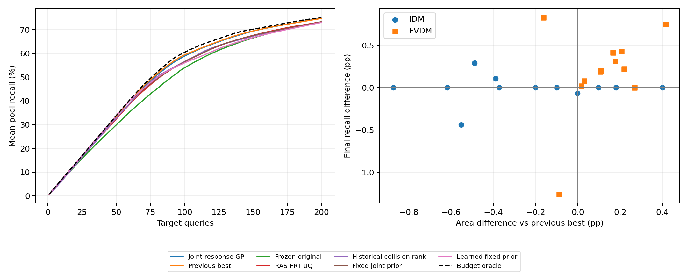

# 完整独立确认结果

本轮预登记双主要指标验收：**未通过**。

24 个 IDM/FVDM 参数组合，每组合两个独立 2048 候选池，五个冻结历史网络种子，每方法 200 次不重复查询。下表先对每个参数组合的十个内部重复取均值，再报告 24 个组合的均值 ± 样本标准差。两个百分比为完整池归一化发现面积和最终召回率。

|方法|发现面积 (%)|最终召回 (%)|F50|F100|F200|遗漏数|找全比例 (%)|
|---|---:|---:|---:|---:|---:|---:|---:|
|联合风险—失效 GP|50.597 ± 27.341|74.836 ± 30.993|49.962 ± 0.101|93.025 ± 9.940|145.121 ± 52.340|138.296 ± 183.328|50.417 ± 48.676|
|此前最佳|50.658 ± 27.478|74.750 ± 31.104|49.771 ± 0.446|93.421 ± 9.905|144.625 ± 51.817|138.792 ± 184.035|50.417 ± 48.676|
|冻结原始方法|47.480 ± 25.591|73.321 ± 31.040|45.496 ± 2.578|86.025 ± 9.486|140.737 ± 48.819|142.679 ± 185.011|37.083 ± 48.944|
|RAS-FRT-UQ|49.145 ± 26.774|73.279 ± 31.464|48.704 ± 1.456|90.021 ± 10.149|139.796 ± 47.474|143.621 ± 186.822|39.583 ± 42.578|
|历史碰撞固定排序|49.168 ± 26.453|73.209 ± 30.543|49.175 ± 1.594|90.475 ± 10.632|141.508 ± 50.291|141.908 ± 183.228|22.917 ± 40.269|
|联合 GP 初始后验固定排序|49.364 ± 26.672|73.232 ± 30.688|49.992 ± 0.041|90.487 ± 11.294|141.283 ± 49.887|142.133 ± 183.535|27.917 ± 41.387|
|学习失效均值后固定排序|49.036 ± 26.449|73.046 ± 30.458|49.996 ± 0.020|90.025 ± 11.091|141.096 ± 50.084|142.321 ± 183.512|26.250 ± 37.278|

最后两个固定排序是附加诊断；学习均值在线方案没有参加本轮主要确认。未测目标响应仅用于事后完整评价，选择器只获得自己的已查询反馈。

## 预登记的六项主要比较

差值单位为百分点；配对 bootstrap 在 IDM/FVDM 类型内重采样。六项精确双侧符号翻转检验使用 Holm 校正，轮内阈值为 0.025。

|对照|主要指标|候选减对照|95% CI|精确 p|Holm p|
|---|---|---:|---:|---:|---:|
|此前最佳|发现面积|-0.0608|[-0.1715, +0.0462]|0.38657105|0.61352539|
|此前最佳|最终召回|+0.0861|[-0.0797, +0.2162]|0.3067627|0.61352539|
|冻结原始方法|发现面积|+3.1171|[+2.6028, +3.6847]|1.1920929e-07|7.1525574e-07|
|冻结原始方法|最终召回|+1.5156|[+0.7609, +2.4675]|3.0517578e-05|9.1552734e-05|
|RAS-FRT-UQ|发现面积|+1.4527|[+1.1348, +1.8263]|1.1920929e-07|7.1525574e-07|
|RAS-FRT-UQ|最终召回|+1.5568|[+0.9041, +2.4232]|1.9073486e-06|7.6293945e-06|

## 各目标参数组合

单元格为“发现面积百分比 / 最终召回百分比”。

|目标|联合风险—失效 GP|此前最佳|冻结原始方法|RAS-FRT-UQ|历史碰撞固定排序|联合 GP 初始后验固定排序|学习失效均值后固定排序|
|---|---:|---:|---:|---:|---:|---:|---:|
|idm_00|74.165 / 100.000|74.555 / 99.896|70.659 / 100.000|73.010 / 99.896|72.263 / 99.619|72.084 / 99.524|72.078 / 99.524|
|idm_01|64.111 / 99.716|64.113 / 99.785|59.175 / 97.479|61.503 / 99.714|62.837 / 97.560|63.211 / 97.631|60.019 / 94.684|
|idm_02|71.244 / 100.000|72.117 / 100.000|66.619 / 99.911|69.513 / 99.456|69.303 / 99.008|69.378 / 99.093|68.559 / 99.274|
|idm_03|82.259 / 100.000|81.857 / 100.000|79.243 / 100.000|80.996 / 99.714|79.696 / 99.859|81.054 / 100.000|81.326 / 100.000|
|idm_04|79.696 / 100.000|79.516 / 100.000|76.631 / 100.000|78.579 / 100.000|76.133 / 98.873|77.334 / 99.494|77.990 / 99.873|
|idm_05|76.009 / 100.000|75.911 / 100.000|70.510 / 98.918|74.025 / 99.450|72.030 / 97.807|72.260 / 99.018|72.409 / 99.667|
|idm_06|76.450 / 100.000|76.823 / 100.000|71.444 / 100.000|74.851 / 99.022|75.828 / 100.000|75.216 / 100.000|75.169 / 99.457|
|idm_07|63.596 / 99.928|64.084 / 99.640|57.347 / 97.402|61.494 / 99.783|61.511 / 97.255|62.225 / 97.469|59.143 / 95.451|
|idm_08|71.514 / 100.000|72.133 / 100.000|65.926 / 100.000|69.892 / 99.804|68.109 / 97.526|68.421 / 97.589|68.185 / 97.456|
|idm_09|76.082 / 100.000|76.182 / 100.000|72.489 / 100.000|74.433 / 100.000|73.308 / 99.894|73.108 / 100.000|72.993 / 99.222|
|idm_10|63.168 / 99.562|63.719 / 100.000|57.964 / 96.311|60.223 / 97.547|61.953 / 97.089|62.430 / 97.301|58.802 / 93.594|
|idm_11|77.467 / 100.000|77.667 / 100.000|71.970 / 100.000|75.244 / 100.000|77.175 / 100.000|77.492 / 100.000|76.938 / 99.785|
|fvdm_00|19.803 / 39.409|19.637 / 38.996|18.990 / 38.070|19.297 / 37.596|19.698 / 39.015|19.690 / 38.739|19.684 / 38.541|
|fvdm_01|15.803 / 31.449|15.627 / 31.136|15.265 / 30.614|15.492 / 29.940|15.541 / 30.978|15.560 / 30.946|15.573 / 30.898|
|fvdm_02|84.255 / 100.000|83.988 / 100.000|79.740 / 100.000|82.249 / 100.000|83.024 / 100.000|84.169 / 100.000|84.171 / 100.000|
|fvdm_03|14.440 / 28.736|14.335 / 28.549|13.974 / 27.988|14.154 / 27.327|14.211 / 28.319|14.241 / 28.319|14.255 / 28.319|
|fvdm_04|51.930 / 95.710|52.093 / 94.882|46.402 / 85.709|48.060 / 85.487|47.343 / 83.307|46.966 / 82.603|49.106 / 85.920|
|fvdm_05|15.854 / 31.550|15.824 / 31.471|15.337 / 30.722|15.614 / 30.146|15.787 / 31.392|15.795 / 31.392|15.803 / 31.392|
|fvdm_06|16.865 / 33.563|16.757 / 33.362|16.065 / 32.388|16.490 / 32.135|16.670 / 33.144|16.683 / 33.110|16.694 / 33.093|
|fvdm_07|36.634 / 71.593|36.723 / 72.852|34.524 / 64.889|34.104 / 65.333|35.567 / 65.815|35.505 / 65.593|36.074 / 67.630|
|fvdm_08|18.680 / 37.156|18.663 / 37.138|18.029 / 36.097|18.227 / 35.316|18.638 / 36.896|18.603 / 36.561|18.586 / 36.431|
|fvdm_09|20.863 / 41.516|20.447 / 40.768|19.781 / 39.958|20.283 / 39.481|20.381 / 39.793|20.367 / 39.481|20.368 / 39.211|
|fvdm_10|18.701 / 37.217|18.495 / 36.787|17.803 / 35.854|18.247 / 35.559|18.562 / 36.881|18.559 / 36.694|18.550 / 36.657|
|fvdm_11|24.744 / 48.963|24.527 / 48.741|23.635 / 47.384|23.489 / 46.000|24.458 / 46.988|24.390 / 47.013|24.396 / 47.038|

## 原始池完整现有 baseline

以下保持冻结目录的原始结果，不能与新目标队列混为同一次比较。

原始 2048 候选池已用于开发，全部测量得到 84 个碰撞、46 个碰撞参数格。下表保留九个基线、冻结主方法及六个既有消融，另列新方法的五种子复核。数值为均值 ± 五种子样本标准差；该表不计入新池确认统计。

|方法|F10|F30|F50|F100|F150|F200|平均累计碰撞发现数|
|---|---:|---:|---:|---:|---:|---:|---:|
|新方法|9.40 ± 0.55|29.40 ± 0.55|49.40 ± 0.55|78.20 ± 0.84|83.00 ± 1.22|84.00 ± 0.00|64.167 ± 0.542|
|冻结历史引导 GP|8.20 ± 0.45|23.00 ± 1.00|39.60 ± 0.55|65.80 ± 0.45|77.60 ± 2.30|84.00 ± 0.00|57.563 ± 0.500|
|Uniform random|0.20 ± 0.45|0.80 ± 0.84|2.60 ± 1.67|3.80 ± 2.28|6.20 ± 2.17|8.20 ± 2.17|4.163 ± 1.626|
|Farthest-first|1.20 ± 0.84|3.00 ± 1.00|4.00 ± 1.58|6.40 ± 1.67|8.20 ± 1.79|10.40 ± 1.14|6.118 ± 1.040|
|历史 kNN 排序|9.00 ± 0.00|25.00 ± 0.00|44.00 ± 0.00|62.00 ± 0.00|69.00 ± 0.00|72.00 ± 0.00|53.290 ± 0.000|
|GP-UCB|0.40 ± 0.55|5.60 ± 3.13|9.60 ± 2.07|14.00 ± 3.24|18.40 ± 2.70|24.00 ± 3.94|13.183 ± 2.316|
|GP-EI|0.40 ± 0.55|9.40 ± 6.43|21.20 ± 6.14|44.80 ± 4.44|54.80 ± 4.09|68.80 ± 2.68|38.849 ± 2.963|
|RF surrogate BO|0.40 ± 0.55|6.40 ± 5.03|14.60 ± 10.36|40.40 ± 16.94|60.00 ± 10.93|68.40 ± 3.78|37.858 ± 9.108|
|BOP-Elites|0.40 ± 0.55|9.80 ± 6.50|20.40 ± 6.02|32.60 ± 1.52|39.20 ± 2.59|45.40 ± 0.89|28.671 ± 2.698|
|BAS|0.40 ± 0.55|0.40 ± 0.55|0.80 ± 0.84|2.20 ± 0.84|4.20 ± 0.84|6.80 ± 2.05|2.620 ± 0.256|
|RAS-FRT-UQ|9.60 ± 0.55|29.00 ± 0.00|48.00 ± 0.00|73.20 ± 1.30|78.40 ± 4.93|82.40 ± 0.55|61.628 ± 1.372|
|冻结消融：紧支撑多尺度核|9.00 ± 0.00|25.00 ± 0.00|38.00 ± 0.00|71.00 ± 0.00|81.00 ± 0.00|83.00 ± 0.00|59.513 ± 0.019|
|冻结消融：紧支撑固定多尺度核|9.00 ± 0.00|24.00 ± 0.00|39.80 ± 0.45|69.00 ± 0.00|81.00 ± 0.00|83.00 ± 0.00|59.610 ± 0.015|
|冻结消融：紧支撑单尺度核|9.00 ± 0.00|23.00 ± 0.00|39.00 ± 0.00|70.00 ± 0.00|81.00 ± 0.00|83.00 ± 0.00|59.206 ± 0.011|
|冻结消融：混合 QD/风险采集|8.20 ± 0.45|23.20 ± 0.84|37.60 ± 1.52|67.00 ± 1.22|77.00 ± 2.83|83.80 ± 0.45|57.100 ± 0.643|
|冻结消融：单一历史来源|8.00 ± 0.00|25.00 ± 0.00|41.20 ± 0.45|70.00 ± 0.00|73.60 ± 0.55|80.00 ± 2.24|56.572 ± 0.283|
|冻结消融：常数先验|3.00 ± 2.92|7.80 ± 6.46|13.40 ± 11.01|22.20 ± 23.40|23.40 ± 24.01|25.40 ± 27.32|18.142 ± 18.225|

原始冻结逐种子记录还包括碰撞召回率、碰撞格召回率、切入与急刹碰撞数、Risk QDScore；完整数据见 [comparison_summary.json](../../results/history_guided_testing/comparison_summary.json)。

## 核验与范围

完整物理测量 98304 条，额外物理复跑 192 条；主要选择器的 240000 条反馈逐项核验。半集合求和复算精确检验，多项计数复算 bootstrap，均与主要评价一致。原始 176 个冻结文件保持不变。

结果范围为声明参数区间内的 IDM/FVDM、当前仿真器及两个有限候选场景族。符号翻转检验依赖零假设下配对差符号可交换。性能结果不能单独证明方法新颖性或连续场景空间中的全部失效覆盖。

