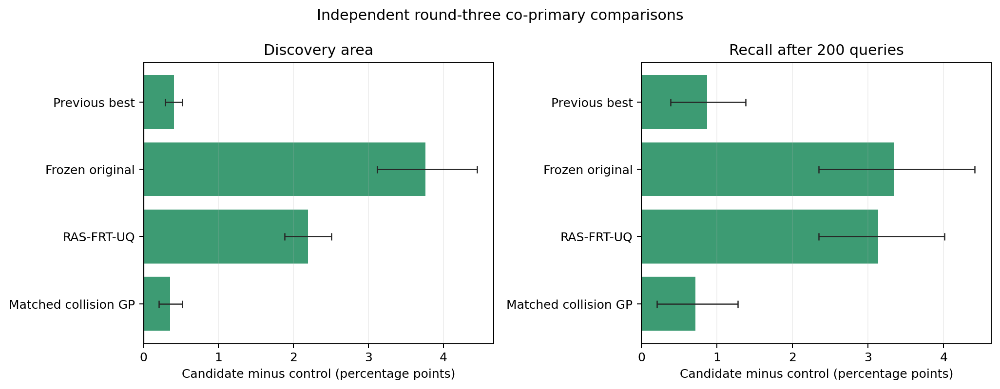

# 风险残差条件化方法：第三轮独立确认

**共同主指标验收：未通过**。

本轮包含 48 个新 SUT 配置、每配置两个独立 2048 场景池、五个冻结预测器种子和每策略 200 次不重复查询。完整物理测量 196,608 次；选择器披露 672,000 次。

## 全部方法对比

| 方法 | 发现面积 (%) | 200 次召回 (%) | F50 | F100 | F150 | F200 | 平均漏失 | 全发现率 (%) |
|---|---:|---:|---:|---:|---:|---:|---:|---:|
| Risk-conditioned candidate | 50.966 ± 22.887 | 80.301 ± 24.757 | 49.99 | 93.50 | 127.52 | 154.73 | 85.56 | 39.38 |
| Collision-only decoder ablation | 51.056 ± 22.880 | 80.179 ± 24.575 | 49.98 | 94.00 | 127.88 | 154.68 | 85.61 | 38.12 |
| Behavior-posterior candidate | 51.013 ± 22.921 | 80.005 ± 24.656 | 49.99 | 94.05 | 127.63 | 154.26 | 86.03 | 41.67 |
| Previous best | 50.561 ± 22.744 | 79.434 ± 24.456 | 49.80 | 92.70 | 126.51 | 152.85 | 87.45 | 33.54 |
| Frozen original | 47.204 ± 21.060 | 76.957 ± 23.973 | 45.76 | 86.02 | 119.82 | 147.44 | 92.85 | 22.92 |
| RAS-FRT-UQ | 48.773 ± 22.450 | 77.165 ± 24.888 | 48.77 | 89.18 | 120.71 | 146.81 | 93.48 | 23.75 |
| Matched collision GP | 50.613 ± 22.816 | 79.585 ± 24.490 | 50.00 | 92.73 | 126.69 | 153.28 | 87.01 | 39.17 |

发现面积刻画整个查询过程；终点召回衡量 200 次预算内找到的失效比例。零失效池按预注册约定计面积 0、召回 1。

## 共同主指标检验

差值均为新候选减对照，单位为百分点；每项对四个主对照进行八项 Holm 校正。

| 主对照 | 发现面积差 (95% CI) | Holm p | 终点召回差 (95% CI) | Holm p |
|---|---:|---:|---:|---:|
| Previous best | +0.405 pp [+0.286 pp, +0.516 pp] | 2.643e-06 | +0.868 pp [+0.389 pp, +1.383 pp] | 0.00227563 |
| Frozen original | +3.762 pp [+3.115 pp, +4.448 pp] | 5.68434e-14 | +3.345 pp [+2.348 pp, +4.412 pp] | 1.81899e-11 |
| RAS-FRT-UQ | +2.193 pp [+1.881 pp, +2.508 pp] | 5.68434e-14 | +3.137 pp [+2.347 pp, +4.011 pp] | 2.72848e-12 |
| Matched collision GP | +0.352 pp [+0.202 pp, +0.518 pp] | 3.77705e-05 | +0.716 pp [+0.207 pp, +1.275 pp] | 0.0185345 |

## 机制消融

消融比较为描述性配置级 bootstrap 区间，不属于成功门槛或校正后的主检验。

| 对照 | 面积差 (95% 描述区间) | 召回差 (95% 描述区间) |
|---|---:|---:|
| Behavior-posterior candidate | -0.047 pp [-0.171 pp, +0.108 pp] | +0.296 pp [-0.172 pp, +0.949 pp] |
| Collision-only decoder ablation | -0.091 pp [-0.163 pp, -0.022 pp] | +0.122 pp [-0.123 pp, +0.421 pp] |

## 复现与边界

独立物理审计覆盖全部 96 个完整池，另对 384 个场景逐项重跑并匹配风险值和碰撞标签。查询序列、逐条反馈、两项主指标、精确检验和 bootstrap 均由独立审计重建。

训练出的风险残差解码器只使用此前解封的 48 个开发配置，并在本轮新目标测量前冻结。线上选择器仅获得本次查询的连续风险；RAS-FRT-UQ 只获得其规定的碰撞反馈。结论范围限于本仿真器、声明的 IDM/FVDM 参数范围和两类有限场景池。

详细逐配置和逐运行结果见 `confirmation/summary.json`；锁定输入和物理审计见 `confirmation_audit/summary.json`。
