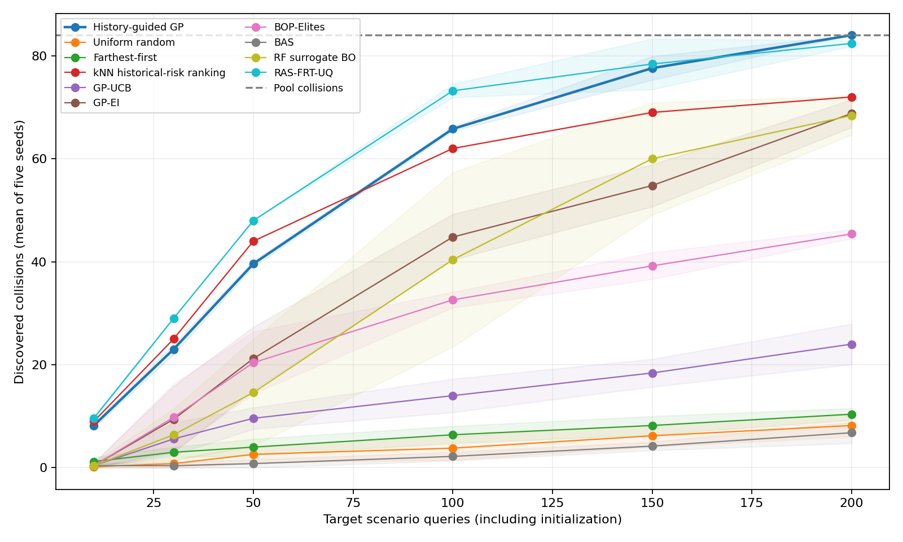

# 历史引导风险测试：方法与实验

在 highway-env 的独立目标场景库中，历史引导风险测试用 200 次查询发现全部 84 个碰撞，并覆盖全部 46 个碰撞参数单元；五个随机种子均达到这一结果。目标反馈使连续风险预测 RMSE 相对历史先验降低 31.76%。方法利用已有驾驶算法的实测风险定位危险区域，再用少量新算法反馈修正历史经验。

## 1. 测试方法

输入是一个驾驶规划/控制算法和一组候选场景。测试器每次选择一个场景，执行仿真，获得连续风险，再更新下一次选择。核心由历史风险先验、相似场景之间的反馈校正和预期风险选例组成。

1. **建立历史先验。** 对每个历史算法取场景参数的八个最近邻，以高斯距离权重估计风险；先在同一机制组内平均，再对四个机制组等权平均，得到目标场景的初始风险估计。
2. **学习反馈传播。** 将历史算法轮流视为待测对象，排除其所属机制组，用其余组建立先验，再用当前对象的少量实测风险学习差异 GP。核由局部通道和三个 Matérn 尺度组成，场景尺度门调整各尺度权重，两类场景分别建模。
3. **逐次修正并选例。** 新算法每反馈一个风险值，GP 更新历史先验与实际风险的差异，并按后验预期风险选择尚未测试的场景，直到用完 200 次预算。离线学到的核参数在线冻结。

默认核由五个种子的历史验证 RMSE 选择，使用不作紧支撑截断的多尺度核。纯风险采集在开发比较后固定，随后生成并实测最终目标场景库。最终目标响应用于测试和评价，未参与训练、检查点或组件选型。

## 2. 实验设置

研究对象是驾驶规划与控制算法的场景响应。当前实测平台为 highway-env 1.9.1，Conda 运行环境名为 metadrive。每段仿真持续 12 s、频率 20 Hz、双车道，ego 初速 25 m/s。

|场景库|切入|前车急刹|用途|
|---|---:|---:|---|
|历史库|1024|1024|六个历史算法共享坐标；共 12,288 条实测响应|
|目标库|1024|1024|独立 Sobol 坐标；评估新目标算法的测试效率|

历史库仅按场景坐标划分训练 1638 / 验证 410，六个来源共用约 80%/20% 划分。实验组织采用历史库与目标库两部分；历史验证通过跨机制组迁移选择模型。

|场景|参数范围|
|---|---|
|切入|净间距 8–60 m，前车速度 15–25 m/s，切入时间尺度 1.5–3 s，事件开始 0.5–2 s|
|前车急刹|净间距 8–70 m，前车速度 15–25 m/s，减速度 0.5–7 m/s²，事件开始 0.5–2 s|

**目标算法为 FVDM 纵向速度规划/跟驰算法。** 它根据车身净间距决定期望速度，并用与前车的速度差修正加速度。目标期望速度 23 m/s、最大制动 8 m/s²、停车间距 8 m、连续感知延迟 0.15 s；灵敏度 0.5、速度差增益 0.8、间距过渡尺度 8 m。切入车和急刹前车按场景脚本运动，目标算法根据观测状态驾驶 ego。

历史源在控制规律、观测延迟、制动能力和预测机制上形成差异，共同使用期望速度 23 m/s、停车间距 6 m：

|历史源|机制差异|历史库碰撞数 / 2048|
|---|---|---:|
|常规 IDM|直接响应，最大制动 6 m/s²|80|
|常规 FVDM|直接响应，最大制动 6 m/s²|126|
|延迟 IDM|观测延迟 0.6 s，最大制动 6 m/s²|169|
|延迟 FVDM|观测延迟 0.6 s，最大制动 6 m/s²|518|
|制动受限 IDM|最大制动 3 m/s²|652|
|预测制动 IDM|2 s 匀速预测与 TTC 触发制动，最大制动 6 m/s²|57|

每个训练种子对每种参考核训练 1600 步，每 200 步验证一次并保留最佳检查点；种子为 11、23、37、53、71。核选择只使用历史验证。

风险 R 为 TTC、DRAC、车身间距三项归一化风险的均方根，再取整段轨迹峰值。TTC、DRAC、间距尺度分别为 1.5 s、3 m/s²、1 m；R>0.5 为高风险。碰撞由模拟器独立判定。每种方法每个种子有 200 次场景查询预算，初始化计入预算。RAS-FRT-UQ 每次收到所查询场景的二值碰撞结果；其余方法收到连续风险。所有方法都无法读取未查询场景的目标标签，选例结束后统一评价碰撞发现。

## 3. 与常用基线比较

目标库包含 84 个碰撞（切入 66，急刹 18）、146 个高风险场景。覆盖评价将每个物理参数等分四段，形成两类各 256 个参数单元。Fq 表示 q 次查询发现的碰撞数，表中为五种子的均值 ± 样本标准差。平均发现曲线面积是前 200 次查询累计碰撞数的均值，越高表示整体发现越早。

|方法|F10|F50|F100|F200|平均发现曲线面积|
|---|---:|---:|---:|---:|---:|
|历史引导风险测试|8.2 ± 0.4|39.6 ± 0.5|65.8 ± 0.4|84.0 ± 0.0|57.56|
|Uniform random|0.2 ± 0.4|2.6 ± 1.7|3.8 ± 2.3|8.2 ± 2.2|4.16|
|Farthest-first|1.2 ± 0.8|4.0 ± 1.6|6.4 ± 1.7|10.4 ± 1.1|6.12|
|kNN historical-risk ranking|9.0 ± 0.0|44.0 ± 0.0|62.0 ± 0.0|72.0 ± 0.0|53.29|
|GP-UCB|0.4 ± 0.5|9.6 ± 2.1|14.0 ± 3.2|24.0 ± 3.9|13.18|
|GP-EI|0.4 ± 0.5|21.2 ± 6.1|44.8 ± 4.4|68.8 ± 2.7|38.85|
|BOP-Elites|0.4 ± 0.5|20.4 ± 6.0|32.6 ± 1.5|45.4 ± 0.9|28.67|
|BAS|0.4 ± 0.5|0.8 ± 0.8|2.2 ± 0.8|6.8 ± 2.0|2.62|
|RF surrogate BO|0.4 ± 0.5|14.6 ± 10.4|40.4 ± 16.9|68.4 ± 3.8|37.86|
|RAS-FRT-UQ|9.6 ± 0.5|48.0 ± 0.0|73.2 ± 1.3|82.4 ± 0.5|61.63|

本文方法在 F200 的碰撞召回率和碰撞单元覆盖率均为 100%，风险 QDScore 为 24.360。200 次查询占目标库的 9.77%。

**与 RAS-FRT-UQ 的直接比较。** RAS 在 F50、F100 分别发现 48.0、73.2 个碰撞，高于本文的 39.6、65.8；平均发现曲线面积为 61.63，也高于本文的 57.56。在 200 次预算时，本文找到全部 84 个，RAS 平均找到 82.4 个。RAS 找全 66 个切入碰撞，但急刹碰撞平均发现 16.4 / 18 个。这组结果支持本文在给定预算下的完整发现优势，RAS 在较小预算下的发现速度更好。

比较覆盖随机抽样、最远优先空间覆盖、固定历史排序、GP-UCB、GP-EI、RF 代理优化、BOP-Elites、BAS 和 RAS-FRT-UQ。GP/RF 基线共用各种子的 10 个随机初始点。GP 使用 Matérn-5/2 核；RF 使用 50 棵深度上限 10 的树、删除折 Jackknife 方差与 EI。BOP-Elites 在已知场景参数单元上计算档案改进，BAS 采用单保真阈值事件方差下降。这些基线均在同一固定候选库上运行，实现与文献依据见 [方法说明](../../methods/history_guided_testing/README.md)。

**RAS-FRT-UQ 统一适配。** 使用相同六源历史库和相同 1638/410 场景划分，分别训练切入、急刹四维响应编码器，每个编码器有六个历史碰撞预测头。网络沿用原 4→64→128→64→32 结构，Adam 学习率 0.001、批量 128，训练 300 轮，每 10 轮按历史验证 BCE 选择检查点。历史响应相似度和物理核在不同场景类型间置零。相似度尺度 0.3/0.25、校正正则项 0.1，以及原覆盖、参数单元和信息增益权重均固定。当前比较是原方法在统一数据上的适配，原 S01 模型与数据保存在可恢复归档中，见 [归档说明](../../archives/README.md)。

RAS 的二值碰撞反馈与本文的连续风险反馈信息量不同。这张表比较各测试方法完整流程在相同场景调用预算下的发现效率；连续反馈带来的收益包含在完整方法比较中。RAS 训练记录见 [models/ras_frt_uq](models/ras_frt_uq/)，五种子轨迹见 comparison/ras_frt_uq_*.json。

离线历史成本为 12,288 条实测响应，本文方法、历史排序和 RAS 共同使用这些数据；其余七个基线从目标反馈开始建模。在线比较按同样的 200 次场景查询计算，物理测量成本单独记录在 [physical_cost.json](physical_cost.json)。



## 4. 组件实验

组件实验与主方法共享候选库、种子和查询预算。单源与常数先验对照使用相同的历史训练核，用于检验先验内容；核对照各自独立选择历史验证检查点。

|组件对照|F10|F50|F100|F200|平均发现曲线面积|
|---|---:|---:|---:|---:|---:|
|历史引导风险测试|8.2 ± 0.4|39.6 ± 0.5|65.8 ± 0.4|84.0 ± 0.0|57.56|
|常数先验|3.0 ± 2.9|13.4 ± 11.0|22.2 ± 23.4|25.4 ± 27.3|18.14|
|单源历史先验|8.0 ± 0.0|41.2 ± 0.4|70.0 ± 0.0|80.0 ± 2.2|56.57|
|混合 QD/风险采集|8.2 ± 0.4|37.6 ± 1.5|67.0 ± 1.2|83.8 ± 0.4|57.10|
|紧支撑多尺度核|9.0 ± 0.0|38.0 ± 0.0|71.0 ± 0.0|83.0 ± 0.0|59.51|
|紧支撑固定多尺度核|9.0 ± 0.0|39.8 ± 0.4|69.0 ± 0.0|83.0 ± 0.0|59.61|
|紧支撑单尺度核|9.0 ± 0.0|39.0 ± 0.0|70.0 ± 0.0|83.0 ± 0.0|59.21|

反馈校正另用共同的随机场景顺序检验，分别在 10、20、50、100 次反馈后预测尚未查询的场景；下表汇总五种子与四个反馈预算。RMSE 越低越好，高风险 AP 越高越好。高风险 RMSE 只在 R>0.5 的场景上计算。

|反馈模型|风险 RMSE|高风险 AP|高风险 RMSE|
|---|---:|---:|---:|
|历史先验（无反馈）|0.1343|0.6884|0.2050|
|本文反馈模型|0.0916|0.7636|0.2223|
|紧支撑多尺度核|0.1131|0.7249|0.2046|
|紧支撑固定多尺度核|0.1167|0.7225|0.2038|
|紧支撑单尺度核|0.1190|0.7165|0.2037|

当前组件证据支持以下设计：

- **历史风险先验定位危险区域。** F50 从常数先验的 13.4 提高到本文的 39.6；多源先验的 F200 为 84.0，单源为 80.0。
- **目标反馈修正历史差异。** F200 从固定历史排序的 72.0 提高到 84.0，风险 RMSE 降低 31.76%。
- **反馈保留距离衰减并扩大传播范围。** 取消紧支撑截断后，风险 RMSE 从 0.1131 降至 0.0916，F200 达到全覆盖。
- **多尺度与尺度门改善风险拟合。** 在同一紧支撑设置下，单尺度、固定多尺度、带尺度门多尺度的 RMSE 依次为 0.1190、0.1167、0.1131。这组对照隔离了紧支撑模型内的作用，主方法内的单独贡献仍由后续同结构消融检验。
- **纯风险选例足以完成本任务。** 混合 QD 采集的 F200 为 83.8，纯风险采集为 84.0，因此默认使用更简洁的纯风险策略。

当前选择以 200 次预算的完整发现与总体风险校正为依据。RAS 的早期发现和曲线面积更高；紧支撑核在 F100 和平均发现曲线面积上更高；本文反馈模型的高风险幅值 RMSE 也高于历史先验。主结果体现固定预算下的完整发现与总体风险预测提升，各预算和尾部指标见上表。

## 5. 复现与结果索引

激活环境后运行唯一入口：

```powershell
conda activate metadrive
python -B -m methods.history_guided_testing.run
python -B -m pytest -q -p no:cacheprovider
```

主链验证包括选择与反馈机制测试；迁移后的 12 次历史物理回放与保存风险、碰撞标签完全一致，实际测试会话也完成了逐次选例与预算核验。当前结果使用独立的新场景坐标，五个种子描述训练与选例随机性。

完整统计见 [comparison_summary.json](comparison_summary.json)、[feedback_metrics.json](feedback_metrics.json)，设置见 [protocol.json](protocol.json)，核选择见 [models/selection.json](models/selection.json)。主链整理与清理状态见 [cleanup.json](cleanup.json)，开发阶段的关键负结果保留在 [development_summary.json](development_summary.json)。
