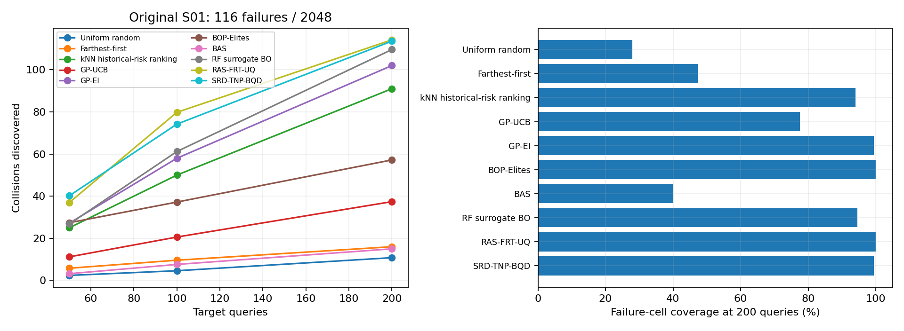

# 当前 SRD-TNP-BQD 与九个基线

默认本文方法已收敛为匹配历史源、独立均值读出、联合均值校准、冻结 h／差异核和原混合采集。
A/D 各 2048 个 S01 cut-in 场景；原五个 IDM 源与 fvdm_safety_speed_23_mps 目标保持不变。
完整 D 真值为 116 次碰撞、33 个碰撞 cell。每条轨迹预算 200，五种子均值；kNN 为一次确定性运行。

|方法|F50|F100|F200|碰撞召回@200|碰撞 cell 覆盖@200|风险 QDScore@200|
|---|---:|---:|---:|---:|---:|---:|
|Uniform random|2.40|4.60|10.80|9.31%|27.88%|4.70|
|Farthest-first|5.80|9.60|16.00|13.79%|47.27%|6.97|
|kNN historical-risk ranking|25.00|50.00|91.00|78.45%|93.94%|16.31|
|GP-UCB|11.20|20.60|37.40|32.24%|77.58%|12.18|
|GP-EI|27.20|58.00|102.00|87.93%|99.39%|16.78|
|BOP-Elites|27.40|37.20|57.20|49.31%|100.00%|17.09|
|BAS|3.20|7.60|15.00|12.93%|40.00%|7.28|
|RF surrogate BO|26.80|61.20|109.60|94.48%|94.55%|16.29|
|RAS-FRT-UQ|37.00|79.80|114.20|98.45%|100.00%|17.24|
|SRD-TNP-BQD|40.20|74.20|113.60|97.93%|99.39%|17.19|

新主线使用原 A 上补充的 2048 条匹配源响应；原九个基线仍使用原历史条件。
本文 F50 高于九个正式基线；F100 和最终碰撞召回仍略低于 RAS-FRT-UQ。
RAS-FRT-UQ 保留原二值碰撞反馈、模型和融合权重；五种子各 200 次选例与 Git 原记录完全一致。
本文和其余八个基线使用连续风险反馈，碰撞标签只用于评价；因此与 RAS 的比较不能单独证明连续反馈的贡献。
第一批结果与旧消融仅作为[历史参照](../reference/first_batch/README.md)保留，不混作当前主线的消融。
BAS 使用全候选池的预期 Bernoulli 方差下降，事件为 R>0.5。RF surrogate BO 使用 RF、十折 Jackknife 和 EI。
RF 参数预先固定；固定池枚举替代论文的连续 DE 搜索，未执行论文的 TPE 调参。两者均为明确披露的候选池适配。
原 D 曾参与 RAS 融合开发，当前成绩属于同库开发证据，不能解释为独立盲测结论。
当前表复用 46 条已完成轨迹，共 9200 次计费回放；此次整理没有新增物理执行或训练。
原源准备 10240 次、补充源 2048 次、D 真值 2048 次物理执行分别披露。新主线当前为固定池回放结果；旧在线复核属于第一批。

[逐种子指标](per_seed.json) · [当前核验](verification.json) · [历史开发摘要](../reference/development_history.json)
· [基线实现、出处与适配范围](../../../methods/srd_tnp_bqd/README.md)
