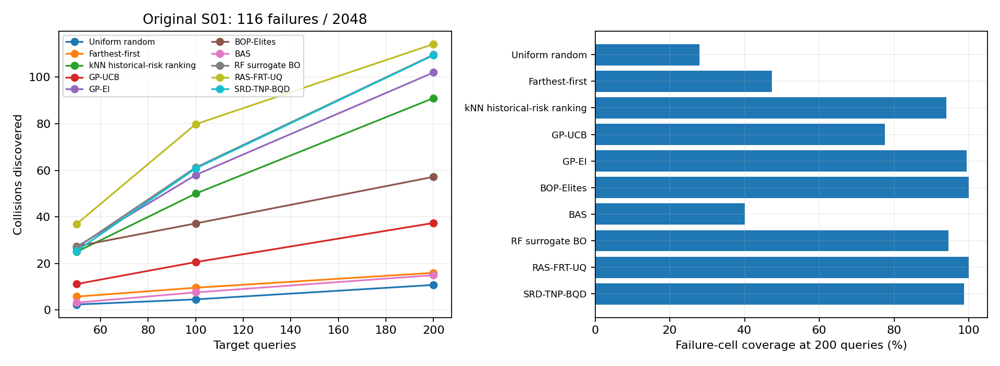

# 第一批冻结比较

这是此前原五源条件下的第一批结果，当前默认结果见[当前比较](../../../comparison/README.md)。

[全部方法指标](comparison.csv) · [原三项消融](ablation.csv) · [逐种子指标](per_seed.json) · [汇总](summary.json) · [原轨迹核验](restoration_verification.json) · [第一批在线复核](online_verification.json)

第一批 F50/F100/F200为25.4/60.8/109.4，召回94.31%、失效 cell 覆盖98.79%。原九个基线的完整运行记录由当前 comparison/runs 共用；第一批及旧消融的完整记录分别在上级 runs／controls 目录，避免复制相同结果。

